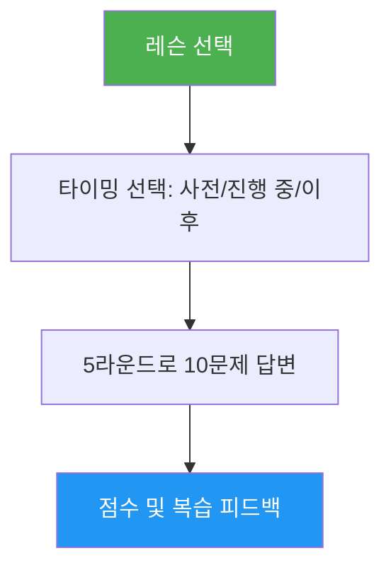

# Lesson Quiz

> 특정 Claude Code 레슨에 대한 이해도를 10개의 문제로 검증하는 인터랙티브 퀴즈. 문제별 피드백과 맞춤형 복습 안내를 제공합니다.

## 주요 기능

- 레슨당 개념 이해와 실전 응용을 혼합한 10문제
- 10개 레슨 전체 커버 (01-Slash Commands ~ 10-CLI)
- 세 가지 타이밍 모드: 사전 테스트, 진도 확인, 숙달 검증
- 문제별 피드백 — 정답 및 해설 포함
- 레슨의 특정 섹션을 가리키는 맞춤형 복습 권장
- 모든 레슨에 걸쳐 `references/question-bank.md`에 100문제 수록

## 사용 시점

| 이렇게 말하면... | 스킬이... |
|---|---|
| "hooks 퀴즈 내줘" | Lesson 06: Hooks 10문제 퀴즈를 실행합니다 |
| "lesson quiz 03" | Lesson 03: Skills 지식을 테스트합니다 |
| "MCP 이해했는지 확인해줘" | Lesson 05: MCP 이해도를 평가합니다 |
| "연습 퀴즈" | 레슨을 선택하게 한 뒤 퀴즈를 진행합니다 |

## 동작 방식



## 사용법

```
/lesson-quiz [레슨명 또는 번호]
```

예시:
```
/lesson-quiz hooks
/lesson-quiz 03
/lesson-quiz advanced-features
/lesson-quiz           # (레슨 선택 안내)
```

## 출력

### 점수 리포트
- 10점 만점 총점과 등급 (Mastered / Proficient / Developing / Beginning)
- 문제 카테고리별 분석 (개념 이해 vs 실전 응용)

### 문제별 피드백
오답 문제마다:
- 내 답변과 정답 비교
- 정답이 맞는 이유 설명
- 복습할 레슨의 구체적인 섹션 안내

### 타이밍 맞춤형 안내
- **사전 테스트**: 기준선 설정, 학습 시 집중할 영역 강조
- **진행 중**: 이해한 내용과 재학습이 필요한 내용 파악
- **이후**: 숙달 확인 또는 남은 취약점 파악

## 리소스

| 경로 | 설명 |
|---|---|
| `references/question-bank.md` | 레슨당 10문제씩 총 100문제 — 정답, 해설, 복습 포인터 포함 |
