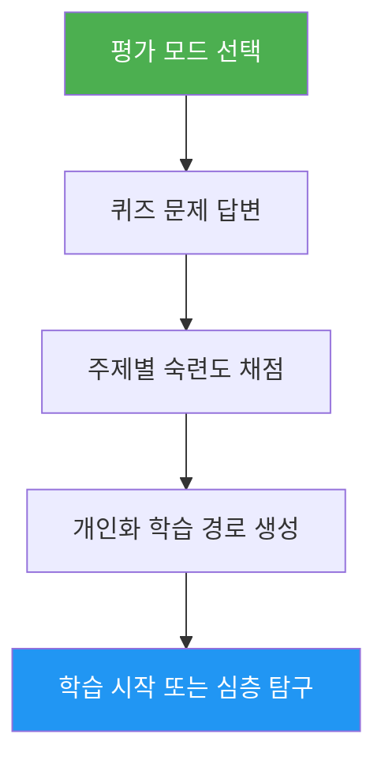

# Self-Assessment & Learning Path Advisor

> Claude Code 숙련도를 종합 평가하고 10개 기능 영역의 기술 격차를 파악하여 개인화된 학습 경로를 생성하는 자가 진단 도구.

## 주요 기능

- 두 가지 평가 모드: 빠른 평가 (8문제, 2분) 및 심층 평가 (5라운드, 5분)
- 10개 기능 영역 평가: Slash Commands, Memory, Skills, Hooks, MCP, Subagents, Checkpoints, Advanced Features, Plugins, CLI
- 주제별 점수 및 숙달 수준 (None / Basic / Proficient)
- 의존성을 고려한 우선순위 기반 격차 분석
- 구체적인 실습과 성공 기준이 포함된 개인화 학습 경로
- 후속 액션: 학습 시작, 심층 탐구, 실습 프로젝트, 재시험

## 사용 시점

| 이렇게 말하면... | 스킬이... |
|---|---|
| "내 수준 평가해줘" | 평가 퀴즈를 실행하고 수준을 파악합니다 |
| "어디서 시작해야 해" | 경험을 평가하고 시작점을 제안합니다 |
| "내 기술 확인해줘" | 전체 10개 영역에 대한 상세 기술 프로필을 생성합니다 |
| "다음에 뭘 배워야 해" | 격차를 파악하고 우선순위가 정해진 학습 경로를 구성합니다 |

## 동작 방식



## 평가 모드

### 빠른 평가 (~2분)
- 2라운드로 진행되는 예/아니오 경험 질문 8개
- 전체 수준 판정: Beginner / Intermediate / Advanced
- 튜토리얼 링크가 포함된 구체적인 격차 목록
- 최적 대상: 처음 사용자, 빠른 체크인

### 심층 평가 (~5분)
- 10개 기능 영역을 2개씩 다루는 5라운드 질문 (라운드당 2 주제)
- 주제별 채점 (각 0-2점, 총 20점)
- 강점 영역, 우선 격차, 복습 항목이 포함된 숙달 테이블
- 단계와 시간 예상이 포함된 의존성 기반 학습 경로
- 격차 주제를 결합한 실습 프로젝트 추천
- 최적 대상: 레벨업을 원하는 경험자, 정기적인 기술 점검

## 사용법

```
/self-assessment
```

## 출력

### 기술 프로필 테이블
주제별 점수, 숙달 수준, 상태(Learn / Review / Mastered)를 표시합니다.

### 개인화 학습 경로
- 의존성 순서에 따른 단계별 구성
- 각 주제에 포함: 튜토리얼 링크, 집중 영역, 핵심 실습, 성공 기준
- 이미 숙달한 주제는 제외하여 시간 추정 조정
- 여러 격차 영역을 결합한 실습 프로젝트

### 후속 액션
결과 확인 후 선택:
- 안내된 실습으로 첫 번째 격차 튜토리얼 시작
- 특정 격차 영역 심층 탐구
- 격차를 커버하는 실습 프로젝트 설정
- 다른 평가 모드로 재시험
