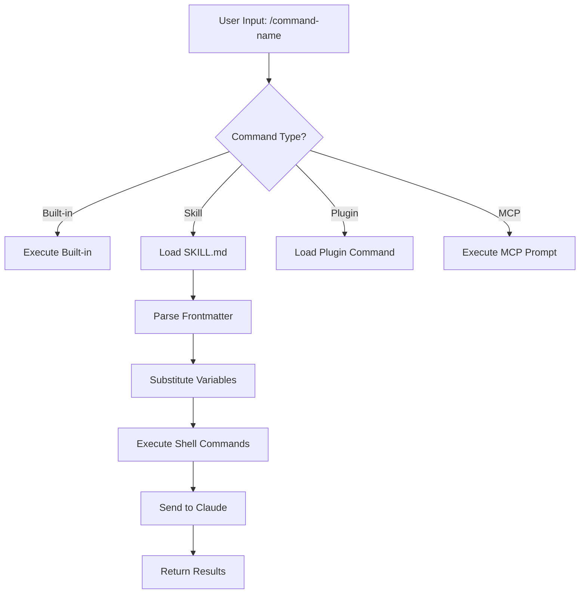
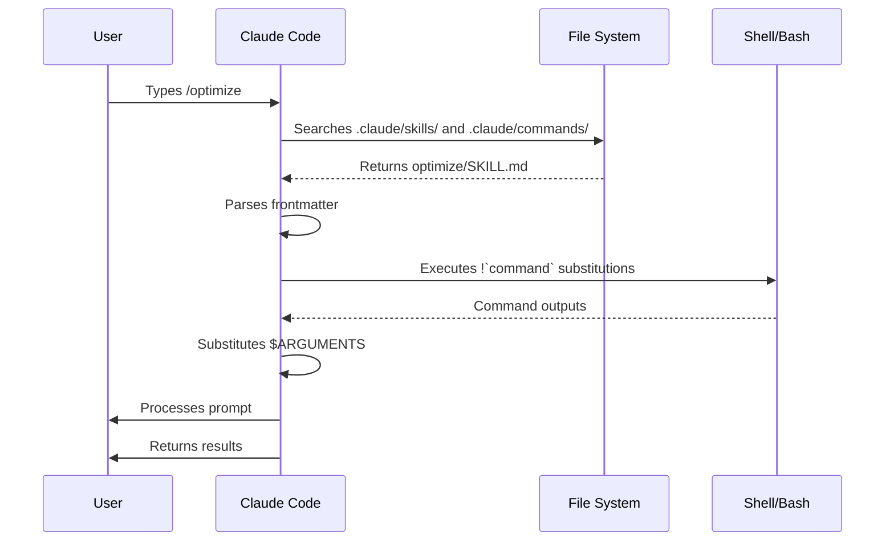

<picture>
  <source media="(prefers-color-scheme: dark)" srcset="../resources/logos/claude-howto-logo-dark.svg">
  
</picture>

# Slash Commands

## 개요

Slash commands는 대화형 세션에서 Claude의 동작을 제어하는 단축키입니다. 몇 가지 유형으로 나뉩니다:

- **내장 명령어**: Claude Code가 제공하는 명령어 (`/help`, `/clear`, `/model`)
- **Skills**: `SKILL.md` 파일로 생성하는 사용자 정의 명령어 (`/optimize`, `/pr`)
- **Plugin 명령어**: 설치된 plugin이 제공하는 명령어 (`/frontend-design:frontend-design`)
- **MCP prompts**: MCP 서버가 제공하는 명령어 (`/mcp__github__list_prs`)

> **참고**: 커스텀 slash commands는 skills로 통합되었습니다. `.claude/commands/`의 파일도 여전히 동작하지만, skills(`.claude/skills/`)가 현재 권장 방식입니다. 둘 다 `/command-name` 단축키를 생성합니다. 전체 참고 문서는 [Skills 가이드](../03-skills/)를 확인하세요.

## 내장 명령어 참조

내장 명령어는 자주 사용하는 동작의 단축키입니다. **55개 이상의 내장 명령어**와 **5개의 번들 skill**을 사용할 수 있습니다. Claude Code에서 `/`를 입력하면 전체 목록을 볼 수 있으며, `/` 뒤에 글자를 입력하면 필터링됩니다.

| 명령어 | 용도 |
|---------|---------|
| `/add-dir <path>` | 작업 디렉토리 추가 |
| `/agents` | 에이전트 설정 관리 |
| `/branch [name]` | 대화를 새 세션으로 분기 (별칭: `/fork`). 참고: v2.1.77에서 `/fork`가 `/branch`로 이름 변경됨 |
| `/btw <question>` | 히스토리에 추가하지 않는 부가 질문 |
| `/chrome` | Chrome 브라우저 통합 설정 |
| `/clear` | 대화 초기화 (별칭: `/reset`, `/new`) |
| `/color [color\|default]` | 프롬프트 바 색상 설정 |
| `/compact [instructions]` | 선택적 포커스 지시와 함께 대화 압축 |
| `/config` | 설정 열기 (별칭: `/settings`) |
| `/context` | 컨텍스트 사용량을 컬러 그리드로 시각화 |
| `/copy [N]` | 어시스턴트 응답을 클립보드에 복사; `w`는 파일로 저장 |
| `/cost` | 토큰 사용량 통계 표시 |
| `/desktop` | Desktop 앱에서 계속하기 (별칭: `/app`) |
| `/diff` | 커밋되지 않은 변경사항에 대한 대화형 diff 뷰어 |
| `/doctor` | 설치 상태 진단 |
| `/effort [low\|medium\|high\|max\|auto]` | 노력 수준 설정. `max`는 Opus 4.6 필요 |
| `/exit` | REPL 종료 (별칭: `/quit`) |
| `/export [filename]` | 현재 대화를 파일 또는 클립보드로 내보내기 |
| `/extra-usage` | 속도 제한을 위한 추가 사용량 설정 |
| `/fast [on\|off]` | 빠른 모드 토글 |
| `/feedback` | 피드백 제출 (별칭: `/bug`) |
| `/help` | 도움말 표시 |
| `/hooks` | Hook 설정 보기 |
| `/ide` | IDE 통합 관리 |
| `/init` | `CLAUDE.md` 초기화. 대화형 흐름을 위해 `CLAUDE_CODE_NEW_INIT=true` 설정 |
| `/insights` | 세션 분석 보고서 생성 |
| `/install-github-app` | GitHub Actions 앱 설정 |
| `/install-slack-app` | Slack 앱 설치 |
| `/keybindings` | 키바인딩 설정 열기 |
| `/login` | Anthropic 계정 전환 |
| `/logout` | Anthropic 계정에서 로그아웃 |
| `/mcp` | MCP 서버 및 OAuth 관리 |
| `/memory` | `CLAUDE.md` 편집, 자동 메모리 토글 |
| `/mobile` | 모바일 앱 QR 코드 (별칭: `/ios`, `/android`) |
| `/model [model]` | 좌우 화살표로 노력 수준을 조절하며 모델 선택 |
| `/passes` | Claude Code 무료 1주일 공유 |
| `/permissions` | 권한 보기/수정 (별칭: `/allowed-tools`) |
| `/plan [description]` | 계획 모드 진입 |
| `/plugin` | Plugin 관리 |
| `/pr-comments [PR]` | GitHub PR 댓글 가져오기 |
| `/privacy-settings` | 개인정보 설정 (Pro/Max 전용) |
| `/release-notes` | 변경 사항 보기 |
| `/reload-plugins` | 활성 plugin 다시 로드 |
| `/remote-control` | claude.ai에서 원격 제어 (별칭: `/rc`) |
| `/remote-env` | 기본 원격 환경 설정 |
| `/rename [name]` | 세션 이름 변경 |
| `/resume [session]` | 대화 재개 (별칭: `/continue`) |
| `/review` | **사용 중단됨** — 대신 `code-review` plugin을 설치하세요 |
| `/rewind` | 대화 및/또는 코드 되감기 (별칭: `/checkpoint`) |
| `/sandbox` | 샌드박스 모드 토글 |
| `/schedule [description]` | 예약 작업 생성/관리 |
| `/security-review` | 브랜치에서 보안 취약점 분석 |
| `/skills` | 사용 가능한 skills 목록 |
| `/stats` | 일별 사용량, 세션, 연속 기록 시각화 |
| `/status` | 버전, 모델, 계정 표시 |
| `/statusline` | 상태 표시줄 설정 |
| `/tasks` | 백그라운드 작업 목록/관리 |
| `/terminal-setup` | 터미널 키바인딩 설정 |
| `/theme` | 색상 테마 변경 |
| `/vim` | Vim/일반 모드 토글 |
| `/voice` | 푸시투토크 음성 받아쓰기 토글 |

### 번들 Skills

Claude Code에 포함되어 slash commands처럼 호출되는 skills입니다:

| Skill | 용도 |
|-------|---------|
| `/batch <instruction>` | worktrees를 활용한 대규모 병렬 변경 오케스트레이션 |
| `/claude-api` | 프로젝트 언어에 맞는 Claude API 레퍼런스 로드 |
| `/debug [description]` | 디버그 로깅 활성화 |
| `/loop [interval] <prompt>` | 일정 간격으로 프롬프트를 반복 실행 |
| `/simplify [focus]` | 변경된 파일의 코드 품질 검토 |

### 사용 중단된 명령어

| 명령어 | 상태 |
|---------|--------|
| `/review` | 사용 중단됨 — `code-review` plugin으로 대체 |
| `/output-style` | v2.1.73부터 사용 중단됨 |
| `/fork` | `/branch`로 이름 변경됨 (별칭은 여전히 동작, v2.1.77) |

### 최근 변경 사항

- `/fork`가 `/branch`로 이름 변경되고 `/fork`는 별칭으로 유지됨 (v2.1.77)
- `/output-style` 사용 중단됨 (v2.1.73)
- `/review`가 `code-review` plugin에 의해 대체되어 사용 중단됨
- `/effort` 명령어 추가, `max` 수준은 Opus 4.6 필요
- `/voice` 명령어 추가 — 푸시투토크 음성 받아쓰기
- `/schedule` 명령어 추가 — 예약 작업 생성/관리
- `/color` 명령어 추가 — 프롬프트 바 커스터마이징
- `/model` 선택기에서 원시 모델 ID 대신 사람이 읽기 쉬운 레이블(예: "Sonnet 4.6") 표시
- `/resume`에서 `/continue` 별칭 지원
- MCP prompts를 `/mcp__<server>__<prompt>` 명령어로 사용 가능 ([MCP Prompts as Commands](#mcp-prompts-as-commands) 참조)

## 커스텀 명령어 (현재는 Skills)

커스텀 slash commands는 **skills로 통합**되었습니다. 두 방식 모두 `/command-name`으로 호출할 수 있는 명령어를 생성합니다:

| 방식 | 위치 | 상태 |
|----------|----------|--------|
| **Skills (권장)** | `.claude/skills/<name>/SKILL.md` | 현재 표준 |
| **레거시 Commands** | `.claude/commands/<name>.md` | 여전히 동작 |

같은 이름의 skill과 command가 공존하면 **skill이 우선**합니다. 예를 들어, `.claude/commands/review.md`와 `.claude/skills/review/SKILL.md`가 모두 존재하는 경우 skill 버전이 사용됩니다.

### 마이그레이션 방법

기존의 `.claude/commands/` 파일은 변경 없이 계속 동작합니다. skills로 마이그레이션하려면:

**이전 (Command):**
```
.claude/commands/optimize.md
```

**이후 (Skill):**
```
.claude/skills/optimize/SKILL.md
```

### Skills를 사용하는 이유

Skills는 레거시 commands 대비 추가 기능을 제공합니다:

- **디렉토리 구조**: 스크립트, 템플릿, 참조 파일 번들링
- **자동 호출**: 관련 상황에서 Claude가 skills를 자동으로 트리거 가능
- **호출 제어**: 사용자, Claude, 또는 둘 다 호출 가능 여부 설정
- **Subagent 실행**: `context: fork`로 격리된 컨텍스트에서 skills 실행
- **점진적 공개**: 필요할 때만 추가 파일 로드

### 커스텀 명령어를 Skill로 생성하기

`SKILL.md` 파일이 있는 디렉토리를 생성합니다:

```bash
mkdir -p .claude/skills/my-command
```

**파일:** `.claude/skills/my-command/SKILL.md`

```yaml
---
name: my-command
description: 이 명령어가 하는 일과 사용 시기
---

# My Command

이 명령어가 호출될 때 Claude가 따를 지시사항입니다.

1. 첫 번째 단계
2. 두 번째 단계
3. 세 번째 단계
```

### Frontmatter 참조

| 필드 | 용도 | 기본값 |
|-------|---------|---------|
| `name` | 명령어 이름 (`/name`이 됨) | 디렉토리 이름 |
| `description` | 간단한 설명 (Claude가 언제 사용할지 파악하는 데 도움) | 첫 번째 단락 |
| `argument-hint` | 자동완성을 위한 예상 인수 | 없음 |
| `allowed-tools` | 권한 없이 명령어가 사용할 수 있는 도구 | 상속 |
| `model` | 사용할 특정 모델 | 상속 |
| `disable-model-invocation` | `true`이면 Claude가 호출 불가 (사용자만 가능) | `false` |
| `user-invocable` | `false`이면 `/` 메뉴에서 숨김 | `true` |
| `context` | 격리된 subagent로 실행하려면 `fork`로 설정 | 없음 |
| `agent` | `context: fork` 사용 시 에이전트 유형 | `general-purpose` |
| `hooks` | Skill 범위의 hooks (PreToolUse, PostToolUse, Stop) | 없음 |

### 인수

명령어는 인수를 받을 수 있습니다:

**`$ARGUMENTS`로 모든 인수 받기:**

```yaml
---
name: fix-issue
description: GitHub 이슈 번호로 이슈 수정
---

Fix issue #$ARGUMENTS following our coding standards
```

사용법: `/fix-issue 123` → `$ARGUMENTS`는 "123"이 됨

**`$0`, `$1` 등으로 개별 인수 받기:**

```yaml
---
name: review-pr
description: 우선순위와 함께 PR 리뷰
---

Review PR #$0 with priority $1
```

사용법: `/review-pr 456 high` → `$0`="456", `$1`="high"

### Shell 명령어를 통한 동적 컨텍스트

`` !`command` ``를 사용하여 프롬프트 전에 bash 명령어를 실행합니다:

```yaml
---
name: commit
description: 컨텍스트와 함께 git 커밋 생성
allowed-tools: Bash(git *)
---

## Context

- Current git status: !`git status`
- Current git diff: !`git diff HEAD`
- Current branch: !`git branch --show-current`
- Recent commits: !`git log --oneline -5`

## Your task

Based on the above changes, create a single git commit.
```

### 파일 참조

`@`을 사용하여 파일 내용을 포함시킵니다:

```markdown
Review the implementation in @src/utils/helpers.js
Compare @src/old-version.js with @src/new-version.js
```

## Plugin 명령어

Plugin이 커스텀 명령어를 제공할 수 있습니다:

```
/plugin-name:command-name
```

또는 이름 충돌이 없는 경우 단순히 `/command-name`으로 사용 가능합니다.

**예시:**
```bash
/frontend-design:frontend-design
/commit-commands:commit
```

## MCP Prompts as Commands

MCP 서버는 prompts를 slash commands로 노출할 수 있습니다:

```
/mcp__<server-name>__<prompt-name> [arguments]
```

**예시:**
```bash
/mcp__github__list_prs
/mcp__github__pr_review 456
/mcp__jira__create_issue "Bug title" high
```

### MCP 권한 문법

권한에서 MCP 서버 접근을 제어합니다:

- `mcp__github` - GitHub MCP 서버 전체 접근
- `mcp__github__*` - 모든 도구에 대한 와일드카드 접근
- `mcp__github__get_issue` - 특정 도구 접근

## Command 아키텍처



## Command 라이프사이클



## 이 폴더의 예시 명령어

아래 예시 명령어들은 skills 또는 레거시 commands로 설치할 수 있습니다.

### 1. `/optimize` - 코드 최적화

성능 문제, 메모리 누수, 최적화 기회를 코드에서 분석합니다.

**사용법:**
```
/optimize
[코드를 붙여넣으세요]
```

### 2. `/pr` - Pull Request 준비

린팅, 테스트, 커밋 포맷 등 PR 준비 체크리스트를 안내합니다.

**사용법:**
```
/pr
```

**스크린샷:**


### 3. `/generate-api-docs` - API 문서 생성기

소스 코드에서 종합적인 API 문서를 생성합니다.

**사용법:**
```
/generate-api-docs
```

### 4. `/commit` - 컨텍스트가 포함된 Git Commit

저장소의 동적 컨텍스트와 함께 git 커밋을 생성합니다.

**사용법:**
```
/commit [선택적 메시지]
```

### 5. `/push-all` - Stage, Commit, Push

모든 변경사항을 스테이징하고, 커밋을 생성하고, 안전 확인 후 원격에 push합니다.

**사용법:**
```
/push-all
```

**안전 확인 항목:**
- 시크릿: `.env*`, `*.key`, `*.pem`, `credentials.json`
- API 키: 실제 키와 플레이스홀더 구분
- 대용량 파일: Git LFS 없이 `>10MB`
- 빌드 아티팩트: `node_modules/`, `dist/`, `__pycache__/`

### 6. `/doc-refactor` - 문서 재구조화

프로젝트 문서를 명확성과 접근성을 위해 재구조화합니다.

**사용법:**
```
/doc-refactor
```

### 7. `/setup-ci-cd` - CI/CD 파이프라인 설정

품질 보증을 위한 pre-commit hooks와 GitHub Actions를 구현합니다.

**사용법:**
```
/setup-ci-cd
```

### 8. `/unit-test-expand` - 테스트 커버리지 확장

테스트되지 않은 브랜치와 엣지 케이스를 대상으로 테스트 커버리지를 늘립니다.

**사용법:**
```
/unit-test-expand
```

## 설치

### Skills로 설치 (권장)

skills 디렉토리에 복사합니다:

```bash
# skills 디렉토리 생성
mkdir -p .claude/skills

# 각 명령어 파일에 대해 skill 디렉토리 생성
for cmd in optimize pr commit; do
  mkdir -p .claude/skills/$cmd
  cp 01-slash-commands/$cmd.md .claude/skills/$cmd/SKILL.md
done
```

### 레거시 Commands로 설치

commands 디렉토리에 복사합니다:

```bash
# 프로젝트 전체 (팀)
mkdir -p .claude/commands
cp 01-slash-commands/*.md .claude/commands/

# 개인 사용
mkdir -p ~/.claude/commands
cp 01-slash-commands/*.md ~/.claude/commands/
```

## 나만의 명령어 만들기

### Skill 템플릿 (권장)

`.claude/skills/my-command/SKILL.md`를 생성합니다:

```yaml
---
name: my-command
description: 이 명령어가 하는 일. [트리거 조건]일 때 사용합니다.
argument-hint: [optional-args]
allowed-tools: Bash(npm *), Read, Grep
---

# Command Title

## Context

- Current branch: !`git branch --show-current`
- Related files: @package.json

## Instructions

1. 첫 번째 단계
2. 인수를 포함한 두 번째 단계: $ARGUMENTS
3. 세 번째 단계

## Output Format

- 응답 형식 지정 방법
- 포함할 내용
```

### 사용자 전용 명령어 (자동 호출 없음)

Claude가 자동으로 트리거해서는 안 되는 부작용이 있는 명령어의 경우:

```yaml
---
name: deploy
description: 프로덕션에 배포
disable-model-invocation: true
allowed-tools: Bash(npm *), Bash(git *)
---

Deploy the application to production:

1. Run tests
2. Build application
3. Push to deployment target
4. Verify deployment
```

## 모범 사례

| 권장 사항 | 지양 사항 |
|------|---------|
| 명확하고 행동 지향적인 이름 사용 | 일회성 작업을 위한 명령어 생성 |
| 트리거 조건이 포함된 `description` 작성 | 명령어에 복잡한 로직 구현 |
| 명령어를 단일 작업에 집중 | 민감한 정보 하드코딩 |
| 부작용이 있는 명령어에 `disable-model-invocation` 사용 | description 필드 생략 |
| 동적 컨텍스트를 위해 `!` 접두사 사용 | Claude가 현재 상태를 안다고 가정 |
| 관련 파일을 skill 디렉토리에 정리 | 모든 것을 하나의 파일에 넣기 |

## 문제 해결

### 명령어를 찾을 수 없는 경우

**해결 방법:**
- 파일이 `.claude/skills/<name>/SKILL.md` 또는 `.claude/commands/<name>.md`에 있는지 확인
- frontmatter의 `name` 필드가 예상 명령어 이름과 일치하는지 확인
- Claude Code 세션 재시작
- `/help`로 사용 가능한 명령어 확인

### 명령어가 예상대로 실행되지 않는 경우

**해결 방법:**
- 더 구체적인 지시사항 추가
- skill 파일에 예시 포함
- bash 명령어 사용 시 `allowed-tools` 확인
- 먼저 간단한 입력으로 테스트

### Skill과 Command 충돌

같은 이름이 모두 존재하면 **skill이 우선**합니다. 하나를 제거하거나 이름을 변경하세요.

## 관련 가이드

- **[Skills](../03-skills/)** - skills 전체 참조 (자동 호출 기능)
- **[Memory](../02-memory/)** - CLAUDE.md를 활용한 영속적 컨텍스트
- **[Subagents](../04-subagents/)** - 위임된 AI 에이전트
- **[Plugins](../07-plugins/)** - 번들 명령어 모음
- **[Hooks](../06-hooks/)** - 이벤트 기반 자동화

## 추가 리소스

- [공식 대화형 모드 문서](https://code.claude.com/docs/en/interactive-mode) - 내장 명령어 참조
- [공식 Skills 문서](https://code.claude.com/docs/en/skills) - 전체 skills 참조
- [CLI 참조](https://code.claude.com/docs/en/cli-reference) - 명령행 옵션

---

*[Claude How To](../) 가이드 시리즈의 일부입니다*
