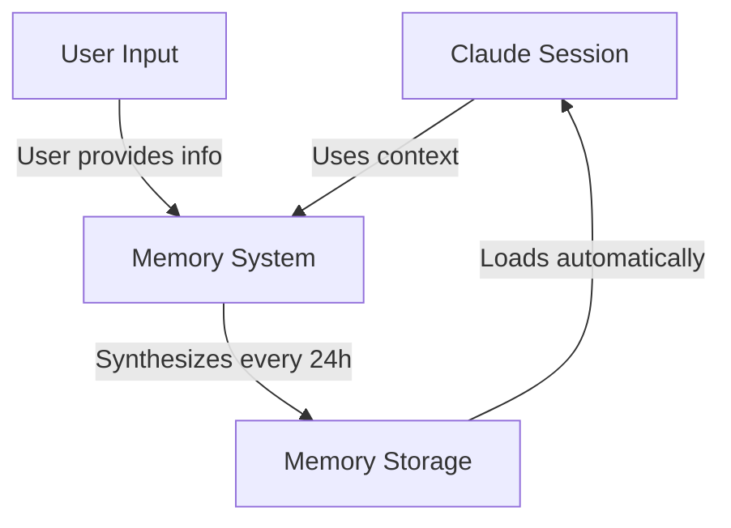
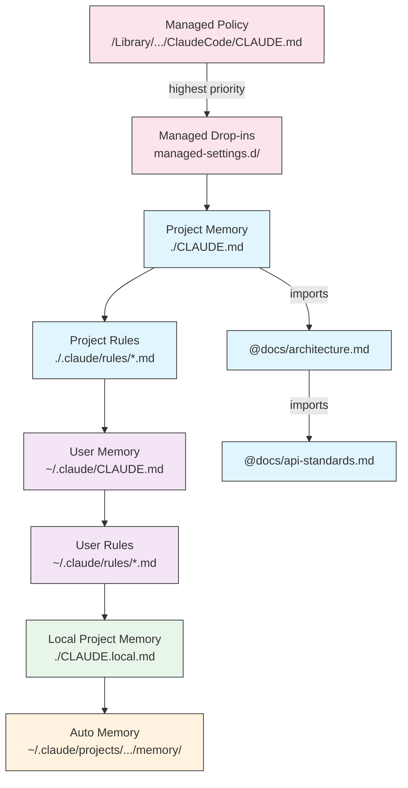
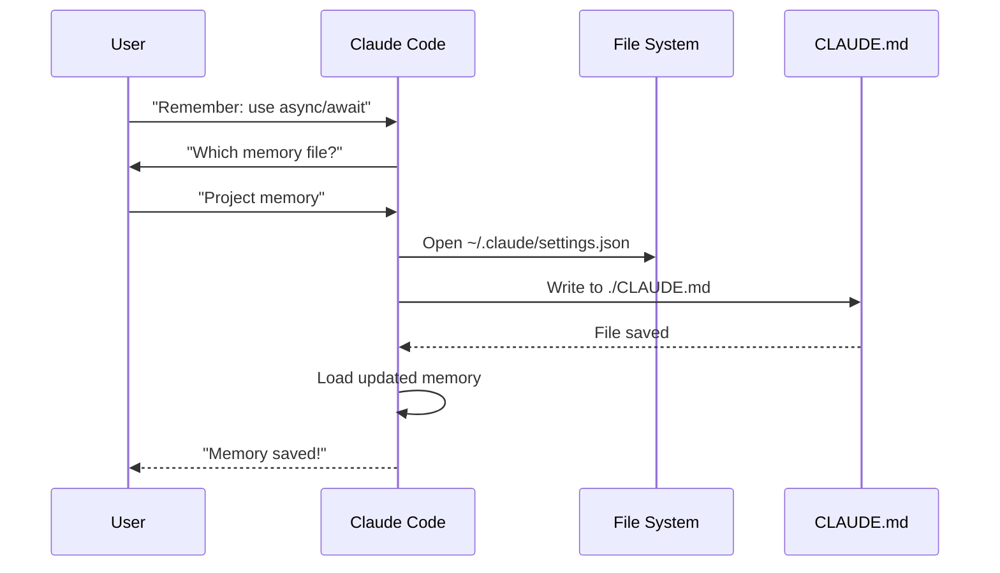
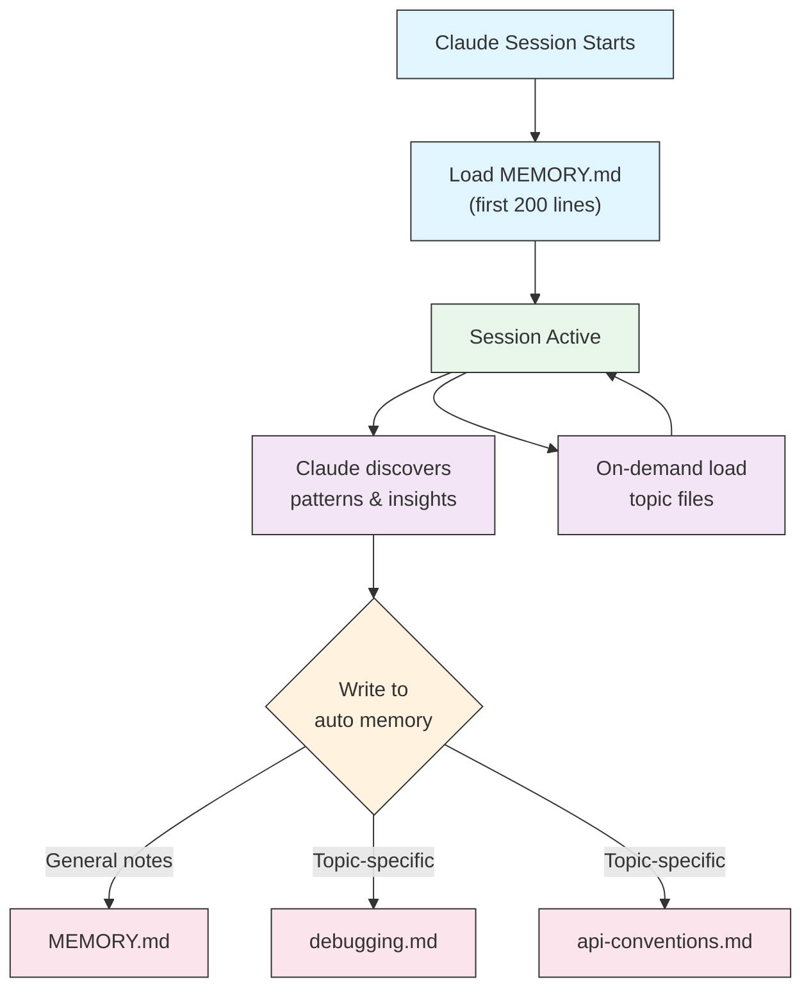

<picture>
  <source media="(prefers-color-scheme: dark)" srcset="../resources/logos/claude-howto-logo-dark.svg">
  
</picture>

# 메모리 가이드

메모리는 Claude가 세션과 대화 전반에 걸쳐 컨텍스트를 유지할 수 있게 해줍니다. 두 가지 형태로 존재합니다: claude.ai의 자동 합성, 그리고 Claude Code의 파일시스템 기반 CLAUDE.md입니다.

## 개요

Claude Code의 메모리는 여러 세션과 대화에 걸쳐 지속되는 컨텍스트를 제공합니다. 일시적인 컨텍스트 창과 달리, 메모리 파일을 사용하면 다음이 가능합니다:

- 팀 전체에 프로젝트 표준 공유
- 개인 개발 선호 사항 저장
- 디렉토리별 규칙 및 설정 유지
- 외부 문서 가져오기
- 프로젝트의 일부로 메모리를 버전 관리

메모리 시스템은 전역 개인 설정부터 특정 하위 디렉토리까지 여러 수준에서 작동하며, Claude가 기억하는 것과 그 지식을 적용하는 방식을 세밀하게 제어할 수 있습니다.

## 메모리 명령어 빠른 참조

| 명령어 | 용도 | 사용법 | 사용 시기 |
|---------|---------|-------|-------------|
| `/init` | 프로젝트 메모리 초기화 | `/init` | 새 프로젝트 시작, 최초 CLAUDE.md 설정 |
| `/memory` | 에디터에서 메모리 파일 편집 | `/memory` | 광범위한 업데이트, 재구성, 내용 검토 |
| `#` 접두어 | 빠른 한 줄 메모리 추가 | `# 규칙 내용` | 대화 중 빠른 규칙 추가 |
| `# new rule into memory` | 명시적 메모리 추가 | `# new rule into memory<br/>상세 규칙` | 복잡한 여러 줄 규칙 추가 |
| `# remember this` | 자연어 메모리 | `# remember this<br/>지시 내용` | 대화형 메모리 업데이트 |
| `@path/to/file` | 외부 콘텐츠 가져오기 | `@README.md` 또는 `@docs/api.md` | CLAUDE.md에서 기존 문서 참조 |

## 빠른 시작: 메모리 초기화

### `/init` 명령어

`/init` 명령어는 Claude Code에서 프로젝트 메모리를 설정하는 가장 빠른 방법입니다. 기초 프로젝트 문서로 CLAUDE.md 파일을 초기화합니다.

**사용법:**

```bash
/init
```

**수행 내용:**

- 프로젝트에 새 CLAUDE.md 파일 생성 (일반적으로 `./CLAUDE.md` 또는 `./.claude/CLAUDE.md`)
- 프로젝트 규칙 및 가이드라인 수립
- 세션 간 컨텍스트 지속성을 위한 기반 설정
- 프로젝트 표준 문서화를 위한 템플릿 구조 제공

**향상된 대화형 모드:** `CLAUDE_CODE_NEW_INIT=true`로 설정하면 프로젝트 설정을 단계별로 안내하는 다단계 대화형 흐름을 활성화할 수 있습니다:

```bash
CLAUDE_CODE_NEW_INIT=true claude
/init
```

**`/init` 사용 시기:**

- Claude Code로 새 프로젝트를 시작할 때
- 팀 코딩 표준 및 규칙을 수립할 때
- 코드베이스 구조에 대한 문서를 만들 때
- 협업 개발을 위한 메모리 계층 구조를 설정할 때

**예시 워크플로우:**

```markdown
# 프로젝트 디렉토리에서
/init

# Claude가 다음과 같은 구조로 CLAUDE.md를 생성합니다:
# Project Configuration
## Project Overview
- Name: Your Project
- Tech Stack: [Your technologies]
- Team Size: [Number of developers]

## Development Standards
- Code style preferences
- Testing requirements
- Git workflow conventions
```

### `#`로 빠른 메모리 업데이트

대화 중 언제든지 메시지를 `#`으로 시작하여 메모리에 정보를 빠르게 추가할 수 있습니다:

**문법:**

```markdown
# 메모리 규칙 또는 지시 내용
```

**예시:**

```markdown
# Always use TypeScript strict mode in this project

# Prefer async/await over promise chains

# Run npm test before every commit

# Use kebab-case for file names
```

**작동 방식:**

1. 메시지를 `#` 뒤에 규칙을 붙여 시작
2. Claude가 이를 메모리 업데이트 요청으로 인식
3. Claude가 업데이트할 메모리 파일 선택을 요청 (프로젝트 또는 개인)
4. 규칙이 적절한 CLAUDE.md 파일에 추가됨
5. 이후 세션에서 이 컨텍스트가 자동으로 로드됨

**대체 패턴:**

```markdown
# new rule into memory
Always validate user input with Zod schemas

# remember this
Use semantic versioning for all releases

# add to memory
Database migrations must be reversible
```

### `/memory` 명령어

`/memory` 명령어는 Claude Code 세션 내에서 CLAUDE.md 메모리 파일을 직접 편집할 수 있는 접근 권한을 제공합니다. 시스템 에디터에서 메모리 파일을 열어 포괄적인 편집이 가능합니다.

**사용법:**

```bash
/memory
```

**수행 내용:**

- 시스템 기본 에디터에서 메모리 파일 열기
- 광범위한 추가, 수정, 재구성 가능
- 계층 구조의 모든 메모리 파일에 직접 접근
- 세션 간 지속 컨텍스트 관리 가능

**`/memory` 사용 시기:**

- 기존 메모리 내용 검토
- 프로젝트 표준에 대한 광범위한 업데이트
- 메모리 구조 재구성
- 상세 문서 또는 가이드라인 추가
- 프로젝트 발전에 따른 메모리 유지 및 업데이트

**비교: `/memory` vs `/init`**

| 항목 | `/memory` | `/init` |
|--------|-----------|---------|
| **용도** | 기존 메모리 파일 편집 | 새 CLAUDE.md 초기화 |
| **사용 시기** | 프로젝트 컨텍스트 업데이트/수정 | 새 프로젝트 시작 |
| **동작** | 변경을 위한 에디터 열기 | 시작 템플릿 생성 |
| **워크플로우** | 지속적 유지보수 | 1회 설정 |

**예시 워크플로우:**

```markdown
# 편집을 위해 메모리 열기
/memory

# Claude가 선택지를 제시합니다:
# 1. Managed Policy Memory
# 2. Project Memory (./CLAUDE.md)
# 3. User Memory (~/.claude/CLAUDE.md)
# 4. Local Project Memory

# 옵션 2 선택 (Project Memory)
# 기본 에디터가 ./CLAUDE.md 내용과 함께 열림

# 변경 후 저장하고 에디터 종료
# Claude가 업데이트된 메모리를 자동으로 리로드
```

**메모리 가져오기 사용:**

CLAUDE.md 파일은 외부 콘텐츠를 포함하기 위한 `@path/to/file` 문법을 지원합니다:

```markdown
# Project Documentation
See @README.md for project overview
See @package.json for available npm commands
See @docs/architecture.md for system design

# 절대 경로를 사용하여 홈 디렉토리에서 가져오기
@~/.claude/my-project-instructions.md
```

**가져오기 기능:**

- 상대 경로와 절대 경로 모두 지원 (예: `@docs/api.md` 또는 `@~/.claude/my-project-instructions.md`)
- 최대 깊이 5의 재귀 가져오기 지원
- 외부 위치에서 처음 가져올 때는 보안을 위한 승인 대화상자가 표시됨
- 가져오기 지시문은 마크다운 코드 범위나 코드 블록 내부에서는 평가되지 않음 (예시에서 문서화해도 안전)
- 기존 문서를 참조하여 중복을 방지
- 참조된 콘텐츠를 Claude의 컨텍스트에 자동으로 포함

## 메모리 아키텍처

Claude Code의 메모리는 각기 다른 목적을 위한 계층적 시스템을 따릅니다:



## Claude Code의 메모리 계층 구조

Claude Code는 다단계 계층적 메모리 시스템을 사용합니다. 메모리 파일은 Claude Code 실행 시 자동으로 로드되며, 상위 레벨 파일이 우선순위를 가집니다.

**전체 메모리 계층 구조 (우선순위 순서):**

1. **Managed Policy** - 조직 전체 지침
   - macOS: `/Library/Application Support/ClaudeCode/CLAUDE.md`
   - Linux/WSL: `/etc/claude-code/CLAUDE.md`
   - Windows: `C:\Program Files\ClaudeCode\CLAUDE.md`

2. **Managed Drop-ins** - 알파벳순으로 병합되는 정책 파일 (v2.1.83+)
   - Managed Policy CLAUDE.md 옆의 `managed-settings.d/` 디렉토리
   - 모듈형 정책 관리를 위해 알파벳 순서로 파일이 병합됨

3. **Project Memory** - 팀 공유 컨텍스트 (버전 관리됨)
   - `./.claude/CLAUDE.md` 또는 `./CLAUDE.md` (저장소 루트)

4. **Project Rules** - 모듈형, 주제별 프로젝트 지침
   - `./.claude/rules/*.md`

5. **User Memory** - 개인 설정 (모든 프로젝트)
   - `~/.claude/CLAUDE.md`

6. **User-Level Rules** - 개인 규칙 (모든 프로젝트)
   - `~/.claude/rules/*.md`

7. **Local Project Memory** - 개인 프로젝트별 설정
   - `./CLAUDE.local.md`

> **참고**: `CLAUDE.local.md`는 2026년 3월 기준 [공식 문서](https://code.claude.com/docs/en/memory)에 언급되어 있지 않습니다. 레거시 기능으로 여전히 작동할 수 있습니다. 새 프로젝트에서는 `~/.claude/CLAUDE.md` (사용자 레벨) 또는 `.claude/rules/` (프로젝트 레벨, 경로 범위 지정)를 사용하는 것을 권장합니다.

8. **Auto Memory** - Claude의 자동 메모 및 학습 내용
   - `~/.claude/projects/<project>/memory/`

**메모리 검색 동작:**

Claude는 다음 순서로 메모리 파일을 검색하며, 앞선 위치가 우선합니다:



## `claudeMdExcludes`로 CLAUDE.md 파일 제외하기

대형 모노레포에서 일부 CLAUDE.md 파일이 현재 작업과 관련 없을 수 있습니다. `claudeMdExcludes` 설정을 사용하면 특정 CLAUDE.md 파일이 컨텍스트에 로드되지 않도록 건너뛸 수 있습니다:

```jsonc
// ~/.claude/settings.json 또는 .claude/settings.json에서
{
  "claudeMdExcludes": [
    "packages/legacy-app/CLAUDE.md",
    "vendors/**/CLAUDE.md"
  ]
}
```

패턴은 프로젝트 루트 기준 상대 경로로 매칭됩니다. 다음과 같은 경우에 특히 유용합니다:

- 일부만 관련 있는 여러 서브 프로젝트가 있는 모노레포
- 벤더 또는 서드파티 CLAUDE.md 파일이 포함된 저장소
- 오래되거나 관련 없는 지침을 제외하여 Claude의 컨텍스트 창 노이즈 줄이기

## 설정 파일 계층 구조

Claude Code 설정(`autoMemoryDirectory`, `claudeMdExcludes` 등 모든 설정)은 5단계 계층 구조에서 결정되며, 상위 레벨이 우선합니다:

| 레벨 | 위치 | 범위 |
|-------|----------|-------|
| 1 (최우선) | Managed policy (시스템 레벨) | 조직 전체 적용 |
| 2 | `managed-settings.d/` (v2.1.83+) | 모듈형 정책 드롭인, 알파벳순 병합 |
| 3 | `~/.claude/settings.json` | 사용자 설정 |
| 4 | `.claude/settings.json` | 프로젝트 레벨 (git에 커밋됨) |
| 5 (최저) | `.claude/settings.local.json` | 로컬 재정의 (git 무시) |

**플랫폼별 설정 (v2.1.51+):**

설정은 다음을 통해서도 구성할 수 있습니다:
- **macOS**: Property list (plist) 파일
- **Windows**: Windows Registry

이 플랫폼 네이티브 방식은 JSON 설정 파일과 함께 읽히며 동일한 우선순위 규칙을 따릅니다.

## 모듈형 규칙 시스템

`.claude/rules/` 디렉토리 구조를 사용하여 경로별로 정리된 규칙을 만들 수 있습니다. 규칙은 프로젝트 레벨과 사용자 레벨 모두에서 정의할 수 있습니다:

```
your-project/
├── .claude/
│   ├── CLAUDE.md
│   └── rules/
│       ├── code-style.md
│       ├── testing.md
│       ├── security.md
│       └── api/                  # 하위 디렉토리 지원
│           ├── conventions.md
│           └── validation.md

~/.claude/
├── CLAUDE.md
└── rules/                        # 사용자 레벨 규칙 (모든 프로젝트)
    ├── personal-style.md
    └── preferred-patterns.md
```

규칙은 하위 디렉토리를 포함하여 `rules/` 디렉토리 내에서 재귀적으로 검색됩니다. `~/.claude/rules/`의 사용자 레벨 규칙은 프로젝트 레벨 규칙보다 먼저 로드되어, 프로젝트가 재정의할 수 있는 개인 기본값을 설정할 수 있습니다.

### YAML Frontmatter를 이용한 경로별 규칙

특정 파일 경로에만 적용되는 규칙을 정의합니다:

```markdown
---
paths: src/api/**/*.ts
---

# API 개발 규칙

- 모든 API 엔드포인트에 입력 유효성 검사 포함 필수
- 스키마 유효성 검사에 Zod 사용
- 모든 파라미터와 응답 타입 문서화
- 모든 작업에 오류 처리 포함
```

**Glob 패턴 예시:**

- `**/*.ts` - 모든 TypeScript 파일
- `src/**/*` - src/ 하위의 모든 파일
- `src/**/*.{ts,tsx}` - 여러 확장자
- `{src,lib}/**/*.ts, tests/**/*.test.ts` - 여러 패턴

### 하위 디렉토리와 심볼릭 링크

`.claude/rules/`의 규칙은 두 가지 조직화 기능을 지원합니다:

- **하위 디렉토리**: 규칙이 재귀적으로 검색되므로 주제별 폴더로 정리할 수 있습니다 (예: `rules/api/`, `rules/testing/`, `rules/security/`)
- **심볼릭 링크**: 여러 프로젝트에서 규칙을 공유하기 위해 심볼릭 링크를 지원합니다. 예를 들어, 중앙 위치의 공유 규칙 파일을 각 프로젝트의 `.claude/rules/` 디렉토리에 심볼릭 링크로 연결할 수 있습니다.

## 메모리 위치 표

| 위치 | 범위 | 우선순위 | 공유 여부 | 접근 | 최적 용도 |
|----------|-------|----------|--------|--------|----------|
| `/Library/Application Support/ClaudeCode/CLAUDE.md` (macOS) | Managed Policy | 1 (최우선) | 조직 | 시스템 | 회사 전체 정책 |
| `/etc/claude-code/CLAUDE.md` (Linux/WSL) | Managed Policy | 1 (최우선) | 조직 | 시스템 | 조직 표준 |
| `C:\Program Files\ClaudeCode\CLAUDE.md` (Windows) | Managed Policy | 1 (최우선) | 조직 | 시스템 | 기업 가이드라인 |
| `managed-settings.d/*.md` (policy 옆) | Managed Drop-ins | 1.5 | 조직 | 시스템 | 모듈형 정책 파일 (v2.1.83+) |
| `./CLAUDE.md` 또는 `./.claude/CLAUDE.md` | Project Memory | 2 | 팀 | Git | 팀 표준, 공유 아키텍처 |
| `./.claude/rules/*.md` | Project Rules | 3 | 팀 | Git | 경로별, 모듈형 규칙 |
| `~/.claude/CLAUDE.md` | User Memory | 4 | 개인 | Filesystem | 개인 설정 (모든 프로젝트) |
| `~/.claude/rules/*.md` | User Rules | 5 | 개인 | Filesystem | 개인 규칙 (모든 프로젝트) |
| `./CLAUDE.local.md` | Project Local | 6 | 개인 | Git (무시됨) | 개인 프로젝트별 설정 |
| `~/.claude/projects/<project>/memory/` | Auto Memory | 7 (최저) | 개인 | Filesystem | Claude의 자동 메모 및 학습 내용 |

## 메모리 업데이트 생명주기

Claude Code 세션에서 메모리 업데이트가 흘러가는 과정:



## Auto Memory

Auto memory는 Claude가 프로젝트 작업 중 학습한 내용, 패턴, 인사이트를 자동으로 기록하는 지속 디렉토리입니다. 직접 작성하고 유지하는 CLAUDE.md 파일과 달리, auto memory는 세션 중 Claude 자신이 작성합니다.

### Auto Memory 작동 방식

- **위치**: `~/.claude/projects/<project>/memory/`
- **진입점**: `MEMORY.md`가 auto memory 디렉토리의 메인 파일 역할
- **주제 파일**: 특정 주제를 위한 선택적 추가 파일 (예: `debugging.md`, `api-conventions.md`)
- **로딩 동작**: `MEMORY.md`의 첫 200줄이 세션 시작 시 시스템 프롬프트에 로드됨. 주제 파일은 시작 시가 아닌 필요 시 로드됨
- **읽기/쓰기**: Claude가 세션 중 패턴과 프로젝트별 지식을 발견하면서 메모리 파일을 읽고 씀

### Auto Memory 아키텍처



### Auto Memory 디렉토리 구조

```
~/.claude/projects/<project>/memory/
├── MEMORY.md              # 진입점 (시작 시 첫 200줄 로드)
├── debugging.md           # 주제 파일 (필요 시 로드)
├── api-conventions.md     # 주제 파일 (필요 시 로드)
└── testing-patterns.md    # 주제 파일 (필요 시 로드)
```

### 버전 요구 사항

Auto memory는 **Claude Code v2.1.59 이상**이 필요합니다. 이전 버전을 사용 중이라면 먼저 업그레이드하세요:

```bash
npm install -g @anthropic-ai/claude-code@latest
```

### 커스텀 Auto Memory 디렉토리

기본적으로 auto memory는 `~/.claude/projects/<project>/memory/`에 저장됩니다. `autoMemoryDirectory` 설정(**v2.1.74**부터 사용 가능)을 통해 이 위치를 변경할 수 있습니다:

```jsonc
// ~/.claude/settings.json 또는 .claude/settings.local.json에서 (사용자/로컬 설정에서만)
{
  "autoMemoryDirectory": "/path/to/custom/memory/directory"
}
```

> **참고**: `autoMemoryDirectory`는 사용자 레벨(`~/.claude/settings.json`) 또는 로컬 설정(`.claude/settings.local.json`)에서만 설정 가능하며, 프로젝트 또는 Managed Policy 설정에서는 사용할 수 없습니다.

다음과 같은 경우에 유용합니다:

- 공유 또는 동기화된 위치에 auto memory 저장
- 기본 Claude 설정 디렉토리에서 auto memory 분리
- 기본 계층 구조 외부의 프로젝트별 경로 사용

### 워크트리 및 저장소 공유

동일한 git 저장소 내의 모든 워크트리와 하위 디렉토리는 단일 auto memory 디렉토리를 공유합니다. 즉, 워크트리 간 전환하거나 동일 저장소의 다른 하위 디렉토리에서 작업할 때 동일한 메모리 파일을 읽고 씁니다.

### Subagent 메모리

Subagent(Task 또는 병렬 실행과 같은 도구를 통해 생성됨)는 자체 메모리 컨텍스트를 가질 수 있습니다. subagent 정의의 `memory` frontmatter 필드를 사용하여 로드할 메모리 범위를 지정합니다:

```yaml
memory: user      # 사용자 레벨 메모리만 로드
memory: project   # 프로젝트 레벨 메모리만 로드
memory: local     # 로컬 메모리만 로드
```

이를 통해 subagent가 전체 메모리 계층 구조를 상속받는 대신 집중된 컨텍스트로 동작할 수 있습니다.

### Auto Memory 제어

Auto memory는 `CLAUDE_CODE_DISABLE_AUTO_MEMORY` 환경 변수로 제어할 수 있습니다:

| 값 | 동작 |
|-------|----------|
| `0` | Auto memory 강제 **활성화** |
| `1` | Auto memory 강제 **비활성화** |
| *(미설정)* | 기본 동작 (auto memory 활성화됨) |

```bash
# 세션에서 auto memory 비활성화
CLAUDE_CODE_DISABLE_AUTO_MEMORY=1 claude

# Auto memory 명시적 강제 활성화
CLAUDE_CODE_DISABLE_AUTO_MEMORY=0 claude
```

## `--add-dir`로 추가 디렉토리 지정

`--add-dir` 플래그를 사용하면 Claude Code가 현재 작업 디렉토리 외의 추가 디렉토리에서 CLAUDE.md 파일을 로드할 수 있습니다. 다른 디렉토리의 컨텍스트가 필요한 모노레포나 멀티 프로젝트 환경에 유용합니다.

이 기능을 활성화하려면 환경 변수를 설정합니다:

```bash
CLAUDE_CODE_ADDITIONAL_DIRECTORIES_CLAUDE_MD=1
```

그런 다음 플래그와 함께 Claude Code를 실행합니다:

```bash
claude --add-dir /path/to/other/project
```

Claude는 현재 작업 디렉토리의 메모리 파일과 함께 지정된 추가 디렉토리에서 CLAUDE.md를 로드합니다.

## 실용적인 예시

### 예시 1: 프로젝트 메모리 구조

**파일:** `./CLAUDE.md`

```markdown
# Project Configuration

## Project Overview
- **Name**: E-commerce Platform
- **Tech Stack**: Node.js, PostgreSQL, React 18, Docker
- **Team Size**: 5 developers
- **Deadline**: Q4 2025

## Architecture
@docs/architecture.md
@docs/api-standards.md
@docs/database-schema.md

## Development Standards

### Code Style
- Use Prettier for formatting
- Use ESLint with airbnb config
- Maximum line length: 100 characters
- Use 2-space indentation

### Naming Conventions
- **Files**: kebab-case (user-controller.js)
- **Classes**: PascalCase (UserService)
- **Functions/Variables**: camelCase (getUserById)
- **Constants**: UPPER_SNAKE_CASE (API_BASE_URL)
- **Database Tables**: snake_case (user_accounts)

### Git Workflow
- Branch names: `feature/description` or `fix/description`
- Commit messages: Follow conventional commits
- PR required before merge
- All CI/CD checks must pass
- Minimum 1 approval required

### Testing Requirements
- Minimum 80% code coverage
- All critical paths must have tests
- Use Jest for unit tests
- Use Cypress for E2E tests
- Test filenames: `*.test.ts` or `*.spec.ts`

### API Standards
- RESTful endpoints only
- JSON request/response
- Use HTTP status codes correctly
- Version API endpoints: `/api/v1/`
- Document all endpoints with examples

### Database
- Use migrations for schema changes
- Never hardcode credentials
- Use connection pooling
- Enable query logging in development
- Regular backups required

### Deployment
- Docker-based deployment
- Kubernetes orchestration
- Blue-green deployment strategy
- Automatic rollback on failure
- Database migrations run before deploy

## Common Commands

| Command | Purpose |
|---------|---------|
| `npm run dev` | Start development server |
| `npm test` | Run test suite |
| `npm run lint` | Check code style |
| `npm run build` | Build for production |
| `npm run migrate` | Run database migrations |

## Team Contacts
- Tech Lead: Sarah Chen (@sarah.chen)
- Product Manager: Mike Johnson (@mike.j)
- DevOps: Alex Kim (@alex.k)

## Known Issues & Workarounds
- PostgreSQL connection pooling limited to 20 during peak hours
- Workaround: Implement query queuing
- Safari 14 compatibility issues with async generators
- Workaround: Use Babel transpiler

## Related Projects
- Analytics Dashboard: `/projects/analytics`
- Mobile App: `/projects/mobile`
- Admin Panel: `/projects/admin`
```

### 예시 2: 디렉토리별 메모리

**파일:** `./src/api/CLAUDE.md`

```markdown
# API Module Standards

This file overrides root CLAUDE.md for everything in /src/api/

## API-Specific Standards

### Request Validation
- Use Zod for schema validation
- Always validate input
- Return 400 with validation errors
- Include field-level error details

### Authentication
- All endpoints require JWT token
- Token in Authorization header
- Token expires after 24 hours
- Implement refresh token mechanism

### Response Format

All responses must follow this structure:

```json
{
  "success": true,
  "data": { /* actual data */ },
  "timestamp": "2025-11-06T10:30:00Z",
  "version": "1.0"
}
```

Error responses:
```json
{
  "success": false,
  "error": {
    "code": "VALIDATION_ERROR",
    "message": "User message",
    "details": { /* field errors */ }
  },
  "timestamp": "2025-11-06T10:30:00Z"
}
```

### Pagination
- Use cursor-based pagination (not offset)
- Include `hasMore` boolean
- Limit max page size to 100
- Default page size: 20

### Rate Limiting
- 1000 requests per hour for authenticated users
- 100 requests per hour for public endpoints
- Return 429 when exceeded
- Include retry-after header

### Caching
- Use Redis for session caching
- Cache duration: 5 minutes default
- Invalidate on write operations
- Tag cache keys with resource type
```

### 예시 3: 개인 메모리

**파일:** `~/.claude/CLAUDE.md`

```markdown
# My Development Preferences

## About Me
- **Experience Level**: 8 years full-stack development
- **Preferred Languages**: TypeScript, Python
- **Communication Style**: Direct, with examples
- **Learning Style**: Visual diagrams with code

## Code Preferences

### Error Handling
I prefer explicit error handling with try-catch blocks and meaningful error messages.
Avoid generic errors. Always log errors for debugging.

### Comments
Use comments for WHY, not WHAT. Code should be self-documenting.
Comments should explain business logic or non-obvious decisions.

### Testing
I prefer TDD (test-driven development).
Write tests first, then implementation.
Focus on behavior, not implementation details.

### Architecture
I prefer modular, loosely-coupled design.
Use dependency injection for testability.
Separate concerns (Controllers, Services, Repositories).

## Debugging Preferences
- Use console.log with prefix: `[DEBUG]`
- Include context: function name, relevant variables
- Use stack traces when available
- Always include timestamps in logs

## Communication
- Explain complex concepts with diagrams
- Show concrete examples before explaining theory
- Include before/after code snippets
- Summarize key points at the end

## Project Organization
I organize my projects as:

   project/
   ├── src/
   │   ├── api/
   │   ├── services/
   │   ├── models/
   │   └── utils/
   ├── tests/
   ├── docs/
   └── docker/

## Tooling
- **IDE**: VS Code with vim keybindings
- **Terminal**: Zsh with Oh-My-Zsh
- **Format**: Prettier (100 char line length)
- **Linter**: ESLint with airbnb config
- **Test Framework**: Jest with React Testing Library
```

_테스트_
Claude에게 새 규칙 저장 요청


어디에도 `Claude.md` 파일이 없어서 Claude가 규칙을 저장하지 않았습니다. 이후 Claude에게 위치를 확인하도록 요청했습니다.


### 예시 4: 세션 중 메모리 업데이트

활성 Claude Code 세션 중에 새 규칙을 메모리에 추가할 수 있습니다. 두 가지 방법이 있습니다:

#### 방법 1: 직접 요청

```markdown
User: Remember that I prefer using React hooks instead of class components
     for all new components.

Claude: I'm adding that to your memory. Which memory file should this go in?
        1. Project memory (./CLAUDE.md)
        2. Personal memory (~/.claude/CLAUDE.md)

User: Project memory

Claude: ✅ Memory saved!

Added to ./CLAUDE.md:
---

### Component Development
- Use functional components with React Hooks
- Prefer hooks over class components
- Custom hooks for reusable logic
- Use useCallback for event handlers
- Use useMemo for expensive computations
```

#### 방법 2: "# new rule into memory" 패턴 사용

"# new rule into memory" 명시적 패턴을 사용하여 메모리 업데이트를 트리거할 수도 있습니다:

```markdown
User: # new rule into memory
      Always validate user input with Zod schemas before processing.

Claude: I'm saving this rule to memory. Which memory file should I use?
        1. Project memory (./CLAUDE.md)
        2. Personal memory (~/.claude/CLAUDE.md)

User: Project memory

Claude: ✅ Memory saved!

Added to ./CLAUDE.md:
---

### Input Validation
- Always validate user input with Zod schemas before processing
- Define schemas at the top of each API handler file
- Return 400 status with validation errors
```

#### 메모리 추가 팁

- 규칙은 구체적이고 실행 가능하게 작성
- 관련 규칙은 섹션 헤더 아래 함께 그룹화
- 내용을 중복하지 말고 기존 섹션 업데이트
- 적절한 메모리 범위 선택 (프로젝트 vs. 개인)

## 메모리 기능 비교

| 기능 | Claude Web/Desktop | Claude Code (CLAUDE.md) |
|---------|-------------------|------------------------|
| 자동 합성 | ✅ 24시간마다 | ❌ 수동 |
| 프로젝트 간 공유 | ✅ 공유됨 | ❌ 프로젝트별 |
| 팀 접근 | ✅ 공유 프로젝트 | ✅ Git 추적 |
| 검색 가능 | ✅ 내장 | ✅ `/memory`를 통해 |
| 편집 가능 | ✅ 채팅 내 | ✅ 직접 파일 편집 |
| 가져오기/내보내기 | ✅ 지원 | ✅ 복사/붙여넣기 |
| 지속성 | ✅ 24시간+ | ✅ 무기한 |

### Claude Web/Desktop의 메모리

#### 메모리 합성 타임라인


**메모리 요약 예시:**

```markdown
## Claude's Memory of User

### Professional Background
- Senior full-stack developer with 8 years experience
- Focus on TypeScript/Node.js backends and React frontends
- Active open source contributor
- Interested in AI and machine learning

### Project Context
- Currently building e-commerce platform
- Tech stack: Node.js, PostgreSQL, React 18, Docker
- Working with team of 5 developers
- Using CI/CD and blue-green deployments

### Communication Preferences
- Prefers direct, concise explanations
- Likes visual diagrams and examples
- Appreciates code snippets
- Explains business logic in comments

### Current Goals
- Improve API performance
- Increase test coverage to 90%
- Implement caching strategy
- Document architecture
```

## 모범 사례

### Do's - 포함할 내용

- **구체적이고 상세하게**: 막연한 지침보다 명확하고 자세한 지시사항 사용
  - ✅ 좋음: "Use 2-space indentation for all JavaScript files"
  - ❌ 피할 것: "Follow best practices"

- **체계적으로 유지**: 명확한 마크다운 섹션과 헤딩으로 메모리 파일 구성

- **적절한 계층 레벨 활용**:
  - **Managed policy**: 회사 전체 정책, 보안 표준, 규정 준수 요구사항
  - **Project memory**: 팀 표준, 아키텍처, 코딩 규칙 (git에 커밋)
  - **User memory**: 개인 설정, 의사소통 스타일, 도구 선택
  - **Directory memory**: 모듈별 규칙 및 재정의

- **가져오기 활용**: 기존 문서 참조에 `@path/to/file` 문법 사용
  - 최대 5단계 재귀 중첩 지원
  - 메모리 파일 간 중복 방지
  - 예시: `See @README.md for project overview`

- **자주 사용하는 명령어 문서화**: 반복적으로 사용하는 명령어를 포함하여 시간 절약

- **프로젝트 메모리 버전 관리**: 팀 혜택을 위해 프로젝트 레벨 CLAUDE.md 파일을 git에 커밋

- **주기적으로 검토**: 프로젝트 발전과 요구사항 변화에 따라 메모리 정기 업데이트

- **구체적인 예시 제공**: 코드 스니펫과 구체적인 시나리오 포함

### Don'ts - 피할 내용

- **비밀정보 저장 금지**: API 키, 비밀번호, 토큰, 자격증명 절대 포함 금지

- **민감한 데이터 금지**: PII, 개인 정보, 독점 비밀 금지

- **내용 중복 금지**: 기존 문서 참조에 복사 대신 가져오기(`@path`) 사용

- **모호한 표현 금지**: "follow best practices"나 "write good code" 같은 일반적인 문장 피하기

- **지나치게 길게 작성 금지**: 개별 메모리 파일은 집중적이고 500줄 이하로 유지

- **과도한 정리 금지**: 계층 구조를 전략적으로 사용; 과도한 하위 디렉토리 재정의 만들지 않기

- **업데이트 잊지 않기**: 오래된 메모리는 혼란과 구식 관행을 초래할 수 있음

- **중첩 한계 초과 금지**: 메모리 가져오기는 최대 5단계 중첩까지만 지원

### 메모리 관리 팁

**올바른 메모리 레벨 선택:**

| 사용 사례 | 메모리 레벨 | 이유 |
|----------|-------------|-----------|
| 회사 보안 정책 | Managed Policy | 조직 전체 모든 프로젝트에 적용 |
| 팀 코드 스타일 가이드 | Project | git을 통해 팀과 공유 |
| 선호하는 에디터 단축키 | User | 개인 설정, 공유 불필요 |
| API 모듈 표준 | Directory | 해당 모듈에만 특정 |

**빠른 업데이트 워크플로우:**

1. 단일 규칙의 경우: 대화에서 `#` 접두어 사용
2. 여러 변경의 경우: `/memory`로 에디터 열기
3. 초기 설정의 경우: `/init`으로 템플릿 생성

**가져오기 모범 사례:**

```markdown
# 좋음: 기존 문서 참조
@README.md
@docs/architecture.md
@package.json

# 피할 것: 다른 곳에 있는 내용 복사
# README 내용을 CLAUDE.md에 복사하는 대신, 그냥 가져오기
```

## 설치 지침

### 프로젝트 메모리 설정

#### 방법 1: `/init` 명령어 사용 (권장)

프로젝트 메모리를 설정하는 가장 빠른 방법:

1. **프로젝트 디렉토리로 이동:**
   ```bash
   cd /path/to/your/project
   ```

2. **Claude Code에서 init 명령어 실행:**
   ```bash
   /init
   ```

3. **Claude가 CLAUDE.md를 템플릿 구조로 생성 및 채움**

4. **생성된 파일을 프로젝트 필요에 맞게 커스터마이징**

5. **git에 커밋:**
   ```bash
   git add CLAUDE.md
   git commit -m "Initialize project memory with /init"
   ```

#### 방법 2: 수동 생성

수동 설정을 원한다면:

1. **프로젝트 루트에 CLAUDE.md 생성:**
   ```bash
   cd /path/to/your/project
   touch CLAUDE.md
   ```

2. **프로젝트 표준 추가:**
   ```bash
   cat > CLAUDE.md << 'EOF'
   # Project Configuration

   ## Project Overview
   - **Name**: Your Project Name
   - **Tech Stack**: List your technologies
   - **Team Size**: Number of developers

   ## Development Standards
   - Your coding standards
   - Naming conventions
   - Testing requirements
   EOF
   ```

3. **git에 커밋:**
   ```bash
   git add CLAUDE.md
   git commit -m "Add project memory configuration"
   ```

#### 방법 3: `#`로 빠른 업데이트

CLAUDE.md가 있으면 대화 중 빠르게 규칙 추가:

```markdown
# Use semantic versioning for all releases

# Always run tests before committing

# Prefer composition over inheritance
```

Claude가 업데이트할 메모리 파일을 선택하도록 안내합니다.

### 개인 메모리 설정

1. **~/.claude 디렉토리 생성:**
   ```bash
   mkdir -p ~/.claude
   ```

2. **개인 CLAUDE.md 생성:**
   ```bash
   touch ~/.claude/CLAUDE.md
   ```

3. **설정 추가:**
   ```bash
   cat > ~/.claude/CLAUDE.md << 'EOF'
   # My Development Preferences

   ## About Me
   - Experience Level: [Your level]
   - Preferred Languages: [Your languages]
   - Communication Style: [Your style]

   ## Code Preferences
   - [Your preferences]
   EOF
   ```

### 디렉토리별 메모리 설정

1. **특정 디렉토리에 메모리 생성:**
   ```bash
   mkdir -p /path/to/directory/.claude
   touch /path/to/directory/CLAUDE.md
   ```

2. **디렉토리별 규칙 추가:**
   ```bash
   cat > /path/to/directory/CLAUDE.md << 'EOF'
   # [Directory Name] Standards

   This file overrides root CLAUDE.md for this directory.

   ## [Specific Standards]
   EOF
   ```

3. **버전 관리에 커밋:**
   ```bash
   git add /path/to/directory/CLAUDE.md
   git commit -m "Add [directory] memory configuration"
   ```

### 설정 확인

1. **메모리 위치 확인:**
   ```bash
   # 프로젝트 루트 메모리
   ls -la ./CLAUDE.md

   # 개인 메모리
   ls -la ~/.claude/CLAUDE.md
   ```

2. **Claude Code가 세션 시작 시 이 파일들을 자동으로 로드**

3. **프로젝트에서 새 세션을 시작하여 Claude Code로 테스트**

## 공식 문서

최신 정보를 위해 공식 Claude Code 문서를 참조하세요:

- **[Memory Documentation](https://code.claude.com/docs/en/memory)** - 완전한 메모리 시스템 레퍼런스
- **[Slash Commands Reference](https://code.claude.com/docs/en/interactive-mode)** - `/init` 및 `/memory`를 포함한 모든 내장 명령어
- **[CLI Reference](https://code.claude.com/docs/en/cli-reference)** - 커맨드라인 인터페이스 문서

### 공식 문서의 주요 기술 세부 사항

**메모리 로딩:**

- 모든 메모리 파일은 Claude Code 실행 시 자동으로 로드됨
- Claude가 현재 작업 디렉토리에서 상위 방향으로 탐색하여 CLAUDE.md 파일 검색
- 하위 트리 파일은 해당 디렉토리 접근 시 컨텍스트에 맞게 검색 및 로드됨

**가져오기 문법:**

- `@path/to/file`을 사용하여 외부 콘텐츠 포함 (예: `@~/.claude/my-project-instructions.md`)
- 상대 경로와 절대 경로 모두 지원
- 최대 깊이 5의 재귀 가져오기 지원
- 외부 가져오기 최초 시 승인 대화상자 표시
- 마크다운 코드 범위나 코드 블록 내부에서는 평가되지 않음
- 참조된 콘텐츠를 Claude의 컨텍스트에 자동 포함

**메모리 계층 우선순위:**

1. Managed Policy (최우선)
2. Managed Drop-ins (`managed-settings.d/`, v2.1.83+)
3. Project Memory
4. Project Rules (`.claude/rules/`)
5. User Memory
6. User-Level Rules (`~/.claude/rules/`)
7. Local Project Memory
8. Auto Memory (최저 우선순위)

## 관련 개념 링크

### 통합 포인트
- [MCP Protocol](../05-mcp/) - 메모리와 함께하는 라이브 데이터 접근
- [Slash Commands](../01-slash-commands/) - 세션별 단축키
- [Skills](../03-skills/) - 메모리 컨텍스트를 활용한 자동화 워크플로우

### 관련 Claude 기능
- [Claude Web Memory](https://claude.ai) - 자동 합성
- [Official Memory Docs](https://code.claude.com/docs/en/memory) - Anthropic 문서
