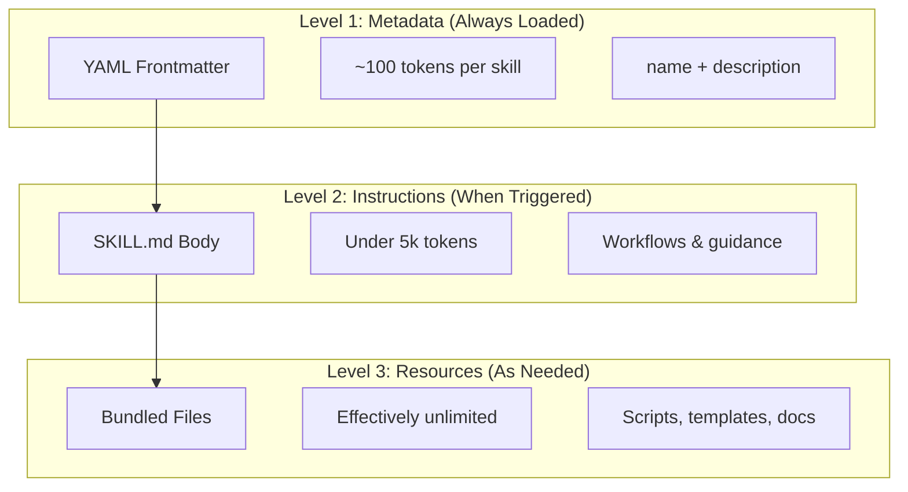
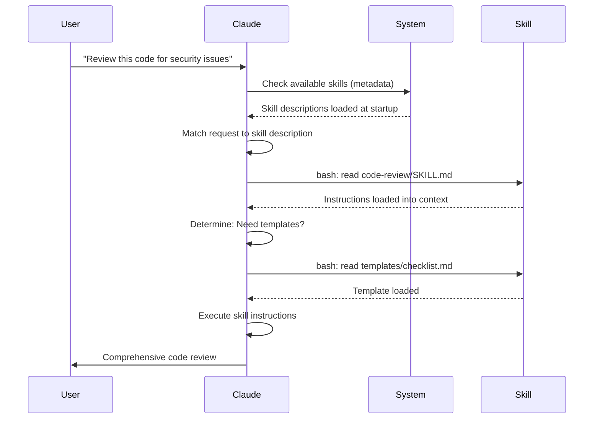

<picture>
  <source media="(prefers-color-scheme: dark)" srcset="../resources/logos/claude-howto-logo-dark.svg">
  
</picture>

# Agent Skills 가이드

Agent Skills는 Claude의 기능을 확장하는, 재사용 가능한 파일 시스템 기반 기능입니다. 도메인별 전문 지식, 워크플로우, 모범 사례를 Claude가 관련 상황에 자동으로 활용할 수 있는 검색 가능한 컴포넌트로 패키징합니다.

## 개요

**Agent Skills**는 범용 에이전트를 전문가로 변환하는 모듈식 기능입니다. 일회성 작업을 위한 대화 수준 지침인 프롬프트와 달리, Skills는 필요 시 로드되어 여러 대화에서 동일한 안내를 반복적으로 제공할 필요가 없습니다.

### 주요 장점

- **Claude 전문화**: 도메인별 작업에 맞게 기능을 조정
- **반복 제거**: 한 번 만들면 대화 전반에 걸쳐 자동으로 사용
- **기능 조합**: Skills를 결합하여 복잡한 워크플로우 구성
- **워크플로우 확장**: 여러 프로젝트와 팀에 걸쳐 skills 재사용
- **품질 유지**: 모범 사례를 워크플로우에 직접 내장

Skills는 여러 AI 도구에서 작동하는 [Agent Skills](https://agentskills.io) 오픈 표준을 따릅니다. Claude Code는 호출 제어, subagent 실행, 동적 컨텍스트 주입 같은 추가 기능으로 이 표준을 확장합니다.

> **참고**: 커스텀 슬래시 명령어가 skills로 통합되었습니다. `.claude/commands/` 파일은 계속 동작하며 동일한 frontmatter 필드를 지원합니다. 새로운 개발에는 Skills 사용을 권장합니다. 동일한 경로에 양쪽이 모두 존재하는 경우(예: `.claude/commands/review.md`와 `.claude/skills/review/SKILL.md`), skill이 우선합니다.

## Skills의 동작 방식: 점진적 공개

Skills는 **점진적 공개(progressive disclosure)** 아키텍처를 활용합니다. Claude는 미리 컨텍스트를 소비하는 대신, 필요에 따라 단계적으로 정보를 로드합니다. 이를 통해 효율적인 컨텍스트 관리와 무제한 확장성을 동시에 실현합니다.

### 세 가지 로딩 단계



| 단계 | 로드 시점 | 토큰 비용 | 내용 |
|-------|------------|------------|---------|
| **Level 1: 메타데이터** | 항상 (시작 시) | Skill당 ~100 토큰 | YAML frontmatter의 `name`과 `description` |
| **Level 2: 지침** | Skill 트리거 시 | 5k 토큰 미만 | 지침과 안내가 담긴 SKILL.md 본문 |
| **Level 3+: 리소스** | 필요 시 | 사실상 무제한 | 컨텍스트에 내용을 로드하지 않고 bash로 실행되는 번들 파일 |

즉, Skills를 많이 설치해도 컨텍스트 페널티가 없습니다. 실제로 트리거되기 전까지 Claude는 각 Skill의 존재와 사용 시점만 파악합니다.

## Skill 로딩 프로세스



## Skill 유형 및 위치

| 유형 | 위치 | 범위 | 공유 여부 | 적합한 용도 |
|------|----------|-------|--------|----------|
| **엔터프라이즈** | 관리형 설정 | 전체 조직 사용자 | 예 | 조직 전체 표준 |
| **개인** | `~/.claude/skills/<skill-name>/SKILL.md` | 개인 | 아니오 | 개인 워크플로우 |
| **프로젝트** | `.claude/skills/<skill-name>/SKILL.md` | 팀 | 예 (git 통해) | 팀 표준 |
| **플러그인** | `<plugin>/skills/<skill-name>/SKILL.md` | 활성화된 곳 | 상황에 따라 다름 | 플러그인에 번들 |

동일한 이름의 skills가 여러 레벨에 걸쳐 존재할 경우, 우선순위가 높은 위치가 적용됩니다: **엔터프라이즈 > 개인 > 프로젝트**. 플러그인 skills는 `plugin-name:skill-name` 네임스페이스를 사용하므로 충돌이 발생하지 않습니다.

### 자동 검색

**중첩 디렉토리**: 하위 디렉토리의 파일을 작업할 때, Claude Code는 중첩된 `.claude/skills/` 디렉토리에서 skills를 자동으로 검색합니다. 예를 들어, `packages/frontend/`의 파일을 편집 중이라면 Claude Code는 `packages/frontend/.claude/skills/`에서도 skills를 찾습니다. 이는 각 패키지가 자체 skills를 보유하는 모노레포 설정을 지원합니다.

**`--add-dir` 디렉토리**: `--add-dir`로 추가된 디렉토리의 Skills는 실시간 변경 감지와 함께 자동으로 로드됩니다. 해당 디렉토리의 skill 파일을 수정하면 Claude Code를 재시작하지 않아도 즉시 반영됩니다.

**설명 버짓**: Skill 설명(Level 1 메타데이터)은 **컨텍스트 윈도우의 2%** (대체 값: **16,000자**)로 제한됩니다. Skills가 많이 설치된 경우 일부가 제외될 수 있습니다. `/context`를 실행하여 경고를 확인하세요. `SLASH_COMMAND_TOOL_CHAR_BUDGET` 환경 변수로 버짓을 재정의할 수 있습니다.

## 커스텀 Skills 만들기

### 기본 디렉토리 구조

```
my-skill/
├── SKILL.md           # 메인 지침 (필수)
├── template.md        # Claude가 채울 템플릿
├── examples/
│   └── sample.md      # 예상 형식을 보여주는 예시 출력
└── scripts/
    └── validate.sh    # Claude가 실행할 수 있는 스크립트
```

### SKILL.md 형식

```yaml
---
name: your-skill-name
description: Brief description of what this Skill does and when to use it
---

# Your Skill Name

## Instructions
Provide clear, step-by-step guidance for Claude.

## Examples
Show concrete examples of using this Skill.
```

### 필수 필드

- **name**: 소문자, 숫자, 하이픈만 허용 (최대 64자). "anthropic" 또는 "claude" 포함 불가.
- **description**: Skill이 하는 일과 사용 시점 (최대 1024자). Claude가 skill을 언제 활성화할지 파악하기 위한 핵심 필드입니다.

### 선택적 Frontmatter 필드

```yaml
---
name: my-skill
description: What this skill does and when to use it
argument-hint: "[filename] [format]"        # 자동완성 힌트
disable-model-invocation: true              # 사용자만 호출 가능
user-invocable: false                       # 슬래시 메뉴에서 숨김
allowed-tools: Read, Grep, Glob             # 도구 접근 제한
model: opus                                 # 사용할 특정 모델
effort: high                                # effort 수준 재정의 (low, medium, high, max)
context: fork                               # 격리된 subagent에서 실행
agent: Explore                              # 에이전트 유형 (context: fork와 함께 사용)
shell: bash                                 # 명령어 실행 shell: bash (기본값) 또는 powershell
hooks:                                      # skill 범위 hooks
  PreToolUse:
    - matcher: "Bash"
      hooks:
        - type: command
          command: "./scripts/validate.sh"
---
```

| 필드 | 설명 |
|-------|-------------|
| `name` | 소문자, 숫자, 하이픈만 허용 (최대 64자). "anthropic" 또는 "claude" 포함 불가. |
| `description` | Skill이 하는 일과 사용 시점 (최대 1024자). 자동 호출 매칭의 핵심. |
| `argument-hint` | `/` 자동완성 메뉴에 표시되는 힌트 (예: `"[filename] [format]"`). |
| `disable-model-invocation` | `true` = 사용자만 `/name`으로 호출 가능. Claude는 자동 호출 안 함. |
| `user-invocable` | `false` = `/` 메뉴에서 숨김. Claude만 자동으로 호출 가능. |
| `allowed-tools` | 권한 프롬프트 없이 skill이 사용할 수 있는 도구의 쉼표 구분 목록. |
| `model` | skill이 활성화된 동안 적용되는 모델 재정의 (예: `opus`, `sonnet`). |
| `effort` | skill이 활성화된 동안 적용되는 effort 수준 재정의: `low`, `medium`, `high`, `max`. |
| `context` | `fork`를 설정하면 자체 컨텍스트 윈도우를 가진 포크된 subagent 컨텍스트에서 skill을 실행. |
| `agent` | `context: fork` 사용 시 subagent 유형 (예: `Explore`, `Plan`, `general-purpose`). |
| `shell` | `` !`command` `` 치환 및 스크립트에 사용되는 shell: `bash` (기본값) 또는 `powershell`. |
| `hooks` | 이 skill의 수명 주기에 범위가 지정된 hooks (전역 hooks와 동일한 형식). |

## Skill 콘텐츠 유형

Skills는 각기 다른 목적에 맞는 두 가지 유형의 콘텐츠를 포함할 수 있습니다.

### 참조 콘텐츠

현재 작업에 Claude가 적용하는 지식을 추가합니다—컨벤션, 패턴, 스타일 가이드, 도메인 지식 등. 현재 대화 컨텍스트와 인라인으로 실행됩니다.

```yaml
---
name: api-conventions
description: API design patterns for this codebase
---

When writing API endpoints:
- Use RESTful naming conventions
- Return consistent error formats
- Include request validation
```

### 작업 콘텐츠

특정 행동을 위한 단계별 지침입니다. 주로 `/skill-name`으로 직접 호출됩니다.

```yaml
---
name: deploy
description: Deploy the application to production
context: fork
disable-model-invocation: true
---

Deploy the application:
1. Run the test suite
2. Build the application
3. Push to the deployment target
```

## Skill 호출 제어

기본적으로 사용자와 Claude 모두 어떤 skill이든 호출할 수 있습니다. 두 가지 frontmatter 필드로 세 가지 호출 모드를 제어합니다.

| Frontmatter | 사용자 호출 | Claude 호출 |
|---|---|---|
| (기본값) | 가능 | 가능 |
| `disable-model-invocation: true` | 가능 | 불가 |
| `user-invocable: false` | 불가 | 가능 |

**`disable-model-invocation: true`** 는 `/commit`, `/deploy`, `/send-slack-message`처럼 부작용이 있는 워크플로우에 사용하세요. 코드가 배포 준비된 것처럼 보인다고 Claude가 자동으로 배포하는 상황은 원치 않을 것입니다.

**`user-invocable: false`** 는 명령어로 실행할 수 없는 배경 지식에 사용하세요. `legacy-system-context` skill은 오래된 시스템의 동작 방식을 설명합니다—Claude에게는 유용하지만, 사용자에게는 의미 있는 액션이 아닙니다.

## 문자열 치환

Skills는 skill 콘텐츠가 Claude에게 전달되기 전에 해석되는 동적 값을 지원합니다.

| 변수 | 설명 |
|----------|-------------|
| `$ARGUMENTS` | skill 호출 시 전달된 모든 인수 |
| `$ARGUMENTS[N]` 또는 `$N` | 인덱스(0부터 시작)로 특정 인수 접근 |
| `${CLAUDE_SESSION_ID}` | 현재 세션 ID |
| `${CLAUDE_SKILL_DIR}` | skill의 SKILL.md 파일이 위치한 디렉토리 |
| `` !`command` `` | 동적 컨텍스트 주입 — shell 명령어를 실행하고 출력을 인라인으로 삽입 |

**예시:**

```yaml
---
name: fix-issue
description: Fix a GitHub issue
---

Fix GitHub issue $ARGUMENTS following our coding standards.
1. Read the issue description
2. Implement the fix
3. Write tests
4. Create a commit
```

`/fix-issue 123`을 실행하면 `$ARGUMENTS`가 `123`으로 대체됩니다.

## 동적 컨텍스트 주입

`` !`command` `` 문법은 skill 콘텐츠가 Claude에게 전송되기 전에 shell 명령어를 실행합니다.

```yaml
---
name: pr-summary
description: Summarize changes in a pull request
context: fork
agent: Explore
---

## Pull request context
- PR diff: !`gh pr diff`
- PR comments: !`gh pr view --comments`
- Changed files: !`gh pr diff --name-only`

## Your task
Summarize this pull request...
```

명령어는 즉시 실행되며 Claude는 최종 출력만 확인합니다. 기본적으로 명령어는 `bash`에서 실행됩니다. frontmatter에 `shell: powershell`을 설정하면 PowerShell을 사용합니다.

## Subagents에서 Skills 실행

`context: fork`를 추가하면 격리된 subagent 컨텍스트에서 skill을 실행합니다. skill 콘텐츠는 전용 subagent의 작업이 되어 자체 컨텍스트 윈도우를 가지므로, 메인 대화가 복잡해지지 않습니다.

`agent` 필드는 사용할 에이전트 유형을 지정합니다.

| 에이전트 유형 | 적합한 용도 |
|---|---|
| `Explore` | 읽기 전용 연구, 코드베이스 분석 |
| `Plan` | 구현 계획 수립 |
| `general-purpose` | 모든 도구가 필요한 광범위한 작업 |
| 커스텀 에이전트 | 설정에서 정의한 특수 에이전트 |

**예시 frontmatter:**

```yaml
---
context: fork
agent: Explore
---
```

**전체 skill 예시:**

```yaml
---
name: deep-research
description: Research a topic thoroughly
context: fork
agent: Explore
---

Research $ARGUMENTS thoroughly:
1. Find relevant files using Glob and Grep
2. Read and analyze the code
3. Summarize findings with specific file references
```

## 실용적인 예시

### 예시 1: 코드 리뷰 Skill

**디렉토리 구조:**

```
~/.claude/skills/code-review/
├── SKILL.md
├── templates/
│   ├── review-checklist.md
│   └── finding-template.md
└── scripts/
    ├── analyze-metrics.py
    └── compare-complexity.py
```

**파일:** `~/.claude/skills/code-review/SKILL.md`

```yaml
---
name: code-review-specialist
description: Comprehensive code review with security, performance, and quality analysis. Use when users ask to review code, analyze code quality, evaluate pull requests, or mention code review, security analysis, or performance optimization.
---

# Code Review Skill

This skill provides comprehensive code review capabilities focusing on:

1. **Security Analysis**
   - Authentication/authorization issues
   - Data exposure risks
   - Injection vulnerabilities
   - Cryptographic weaknesses

2. **Performance Review**
   - Algorithm efficiency (Big O analysis)
   - Memory optimization
   - Database query optimization
   - Caching opportunities

3. **Code Quality**
   - SOLID principles
   - Design patterns
   - Naming conventions
   - Test coverage

4. **Maintainability**
   - Code readability
   - Function size (should be < 50 lines)
   - Cyclomatic complexity
   - Type safety

## Review Template

For each piece of code reviewed, provide:

### Summary
- Overall quality assessment (1-5)
- Key findings count
- Recommended priority areas

### Critical Issues (if any)
- **Issue**: Clear description
- **Location**: File and line number
- **Impact**: Why this matters
- **Severity**: Critical/High/Medium
- **Fix**: Code example

For detailed checklists, see [templates/review-checklist.md](templates/review-checklist.md).
```

### 예시 2: 코드베이스 시각화 Skill

인터랙티브 HTML 시각화를 생성하는 skill입니다.

**디렉토리 구조:**

```
~/.claude/skills/codebase-visualizer/
├── SKILL.md
└── scripts/
    └── visualize.py
```

**파일:** `~/.claude/skills/codebase-visualizer/SKILL.md`

```yaml
---
name: codebase-visualizer
description: Generate an interactive collapsible tree visualization of your codebase. Use when exploring a new repo, understanding project structure, or identifying large files.
allowed-tools: Bash(python *)
---

# Codebase Visualizer

Generate an interactive HTML tree view showing your project's file structure.

## Usage

Run the visualization script from your project root:

```bash
python ~/.claude/skills/codebase-visualizer/scripts/visualize.py .
```

This creates `codebase-map.html` and opens it in your default browser.

## What the visualization shows

- **Collapsible directories**: Click folders to expand/collapse
- **File sizes**: Displayed next to each file
- **Colors**: Different colors for different file types
- **Directory totals**: Shows aggregate size of each folder
```

번들된 Python 스크립트가 핵심 작업을 처리하고, Claude는 오케스트레이션을 담당합니다.

### 예시 3: 배포 Skill (사용자 호출 전용)

```yaml
---
name: deploy
description: Deploy the application to production
disable-model-invocation: true
allowed-tools: Bash(npm *), Bash(git *)
---

Deploy $ARGUMENTS to production:

1. Run the test suite: `npm test`
2. Build the application: `npm run build`
3. Push to the deployment target
4. Verify the deployment succeeded
5. Report deployment status
```

### 예시 4: 브랜드 보이스 Skill (배경 지식)

```yaml
---
name: brand-voice
description: Ensure all communication matches brand voice and tone guidelines. Use when creating marketing copy, customer communications, or public-facing content.
user-invocable: false
---

## Tone of Voice
- **Friendly but professional** - approachable without being casual
- **Clear and concise** - avoid jargon
- **Confident** - we know what we're doing
- **Empathetic** - understand user needs

## Writing Guidelines
- Use "you" when addressing readers
- Use active voice
- Keep sentences under 20 words
- Start with value proposition

For templates, see [templates/](templates/).
```

### 예시 5: CLAUDE.md 생성 Skill

```yaml
---
name: claude-md
description: Create or update CLAUDE.md files following best practices for optimal AI agent onboarding. Use when users mention CLAUDE.md, project documentation, or AI onboarding.
---

## Core Principles

**LLMs are stateless**: CLAUDE.md is the only file automatically included in every conversation.

### The Golden Rules

1. **Less is More**: Keep under 300 lines (ideally under 100)
2. **Universal Applicability**: Only include information relevant to EVERY session
3. **Don't Use Claude as a Linter**: Use deterministic tools instead
4. **Never Auto-Generate**: Craft it manually with careful consideration

## Essential Sections

- **Project Name**: Brief one-line description
- **Tech Stack**: Primary language, frameworks, database
- **Development Commands**: Install, test, build commands
- **Critical Conventions**: Only non-obvious, high-impact conventions
- **Known Issues / Gotchas**: Things that trip up developers
```

### 예시 6: 스크립트를 포함한 리팩토링 Skill

**디렉토리 구조:**

```
refactor/
├── SKILL.md
├── references/
│   ├── code-smells.md
│   └── refactoring-catalog.md
├── templates/
│   └── refactoring-plan.md
└── scripts/
    ├── analyze-complexity.py
    └── detect-smells.py
```

**파일:** `refactor/SKILL.md`

```yaml
---
name: code-refactor
description: Systematic code refactoring based on Martin Fowler's methodology. Use when users ask to refactor code, improve code structure, reduce technical debt, or eliminate code smells.
---

# Code Refactoring Skill

A phased approach emphasizing safe, incremental changes backed by tests.

## Workflow

Phase 1: Research & Analysis → Phase 2: Test Coverage Assessment →
Phase 3: Code Smell Identification → Phase 4: Refactoring Plan Creation →
Phase 5: Incremental Implementation → Phase 6: Review & Iteration

## Core Principles

1. **Behavior Preservation**: External behavior must remain unchanged
2. **Small Steps**: Make tiny, testable changes
3. **Test-Driven**: Tests are the safety net
4. **Continuous**: Refactoring is ongoing, not a one-time event

For code smell catalog, see [references/code-smells.md](references/code-smells.md).
For refactoring techniques, see [references/refactoring-catalog.md](references/refactoring-catalog.md).
```

## 지원 파일

Skills는 `SKILL.md` 외에도 디렉토리 내에 여러 파일을 포함할 수 있습니다. 이러한 지원 파일(템플릿, 예시, 스크립트, 참조 문서)을 통해 메인 skill 파일은 간결하게 유지하면서, Claude가 필요 시 로드할 수 있는 추가 리소스를 제공할 수 있습니다.

```
my-skill/
├── SKILL.md              # 메인 지침 (필수, 500줄 미만으로 유지)
├── templates/            # Claude가 채울 템플릿
│   └── output-format.md
├── examples/             # 예상 형식을 보여주는 예시 출력
│   └── sample-output.md
├── references/           # 도메인 지식 및 명세
│   └── api-spec.md
└── scripts/              # Claude가 실행할 수 있는 스크립트
    └── validate.sh
```

지원 파일 관련 지침:

- `SKILL.md`는 **500줄** 미만으로 유지하세요. 상세한 참조 자료, 대용량 예시, 명세는 별도 파일로 이동하세요.
- `SKILL.md`에서 **상대 경로**를 사용하여 추가 파일을 참조하세요 (예: `[API reference](references/api-spec.md)`).
- 지원 파일은 Level 3에서 필요 시 로드되므로, Claude가 실제로 읽기 전까지 컨텍스트를 소비하지 않습니다.

## Skills 관리

### 사용 가능한 Skills 확인

Claude에게 직접 물어보세요:
```
What Skills are available?
```

또는 파일 시스템을 확인하세요:
```bash
# 개인 Skills 목록
ls ~/.claude/skills/

# 프로젝트 Skills 목록
ls .claude/skills/
```

### Skill 테스트

두 가지 방법으로 테스트할 수 있습니다.

**설명과 일치하는 질문을 통해 Claude가 자동으로 호출하도록 하기:**
```
Can you help me review this code for security issues?
```

**또는 skill 이름으로 직접 호출하기:**
```
/code-review src/auth/login.ts
```

### Skill 업데이트

`SKILL.md` 파일을 직접 수정하세요. 다음 번 Claude Code 시작 시 변경 사항이 반영됩니다.

```bash
# 개인 Skill
code ~/.claude/skills/my-skill/SKILL.md

# 프로젝트 Skill
code .claude/skills/my-skill/SKILL.md
```

### Claude의 Skill 접근 제한

Claude가 호출할 수 있는 skills를 제어하는 세 가지 방법:

**`/permissions`에서 모든 skills 비활성화:**
```
# 거부 규칙에 추가:
Skill
```

**특정 skills 허용 또는 거부:**
```
# 특정 skills만 허용
Skill(commit)
Skill(review-pr *)

# 특정 skills 거부
Skill(deploy *)
```

**개별 skills 숨기기**: frontmatter에 `disable-model-invocation: true`를 추가하세요.

## 모범 사례

### 1. 설명을 구체적으로 작성하기

- **나쁜 예 (모호함)**: "Helps with documents"
- **좋은 예 (구체적)**: "Extract text and tables from PDF files, fill forms, merge documents. Use when working with PDF files or when the user mentions PDFs, forms, or document extraction."

### 2. Skills를 집중적으로 유지하기

- 하나의 Skill = 하나의 기능
- ✅ "PDF form filling"
- ❌ "Document processing" (너무 광범위)

### 3. 트리거 단어 포함하기

사용자 요청과 일치하는 키워드를 설명에 추가하세요:
```yaml
description: Analyze Excel spreadsheets, generate pivot tables, create charts. Use when working with Excel files, spreadsheets, or .xlsx files.
```

### 4. SKILL.md를 500줄 미만으로 유지하기

상세한 참조 자료는 Claude가 필요 시 로드하는 별도 파일로 이동하세요.

### 5. 지원 파일 참조하기

```markdown
## 추가 리소스

- 전체 API 상세 내용은 [reference.md](reference.md) 참조
- 사용 예시는 [examples.md](examples.md) 참조
```

### 해야 할 것

- 명확하고 설명적인 이름 사용
- 포괄적인 지침 포함
- 구체적인 예시 추가
- 관련 스크립트와 템플릿 패키징
- 실제 시나리오로 테스트
- 의존성 문서화

### 하지 말아야 할 것

- 일회성 작업에 skills 만들지 않기
- 기존 기능 중복 만들지 않기
- Skills를 너무 광범위하게 만들지 않기
- description 필드 생략하지 않기
- 감사하지 않고 신뢰할 수 없는 출처의 skills 설치하지 않기

## 문제 해결

### 빠른 참조

| 문제 | 해결책 |
|-------|----------|
| Claude가 Skill을 사용하지 않음 | 트리거 단어를 포함하여 설명을 더 구체적으로 수정 |
| Skill 파일을 찾을 수 없음 | 경로 확인: `~/.claude/skills/name/SKILL.md` |
| YAML 오류 | `---` 마커, 들여쓰기, 탭 사용 여부 확인 |
| Skills 충돌 | 설명에 고유한 트리거 단어 사용 |
| 스크립트가 실행되지 않음 | 권한 확인: `chmod +x scripts/*.py` |
| Claude가 모든 skills를 보지 못함 | Skills가 너무 많음; `/context`에서 경고 확인 |

### Skill이 트리거되지 않을 때

예상대로 Claude가 skill을 사용하지 않는 경우:

1. 설명에 사용자가 자연스럽게 말할 키워드가 포함되어 있는지 확인
2. "What skills are available?"라고 물었을 때 해당 skill이 표시되는지 확인
3. 설명과 일치하도록 요청을 다르게 표현해 보기
4. `/skill-name`으로 직접 호출하여 테스트

### Skill이 너무 자주 트리거될 때

원하지 않을 때 Claude가 skill을 사용하는 경우:

1. 설명을 더 구체적으로 수정
2. 수동 호출만 허용하도록 `disable-model-invocation: true` 추가

### Claude가 모든 Skills를 보지 못할 때

Skill 설명은 **컨텍스트 윈도우의 2%** (대체 값: **16,000자**)에서 로드됩니다. `/context`를 실행하여 제외된 skills에 대한 경고를 확인하세요. `SLASH_COMMAND_TOOL_CHAR_BUDGET` 환경 변수로 버짓을 재정의할 수 있습니다.

## 보안 고려사항

**신뢰할 수 있는 출처의 Skills만 사용하세요.** Skills는 지침과 코드를 통해 Claude에게 기능을 제공합니다. 악의적인 Skill은 도구를 호출하거나 유해한 방식으로 코드를 실행하도록 Claude를 유도할 수 있습니다.

**주요 보안 고려사항:**

- **철저한 감사**: Skill 디렉토리의 모든 파일 검토
- **외부 출처는 위험함**: 외부 URL에서 가져오는 Skills는 손상될 수 있음
- **도구 남용**: 악의적인 Skills는 도구를 유해한 방식으로 호출할 수 있음
- **소프트웨어 설치처럼 취급**: 신뢰할 수 있는 출처의 Skills만 사용

## Skills와 다른 기능 비교

| 기능 | 호출 방식 | 적합한 용도 |
|---------|------------|----------|
| **Skills** | 자동 또는 `/name` | 재사용 가능한 전문 지식, 워크플로우 |
| **Slash Commands** | 사용자 시작 `/name` | 빠른 단축키 (skills로 통합됨) |
| **Subagents** | 자동 위임 | 격리된 작업 실행 |
| **Memory (CLAUDE.md)** | 항상 로드 | 지속적인 프로젝트 컨텍스트 |
| **MCP** | 실시간 | 외부 데이터/서비스 접근 |
| **Hooks** | 이벤트 기반 | 자동화된 부작용 처리 |

## 번들된 Skills

Claude Code는 설치 없이 항상 사용 가능한 여러 내장 skills를 제공합니다.

| Skill | 설명 |
|-------|-------------|
| `/simplify` | 변경된 파일을 재사용성, 품질, 효율성 관점에서 검토; 3개의 병렬 리뷰 에이전트 생성 |
| `/batch <instruction>` | git worktrees를 사용하여 코드베이스 전반의 대규모 병렬 변경 오케스트레이션 |
| `/debug [description]` | 디버그 로그를 읽어 현재 세션 문제 해결 |
| `/loop [interval] <prompt>` | 지정된 간격으로 프롬프트를 반복 실행 (예: `/loop 5m check the deploy`) |
| `/claude-api` | Claude API/SDK 참조 로드; `anthropic`/`@anthropic-ai/sdk` import 시 자동 활성화 |

이 skills는 기본 제공되므로 설치나 설정이 필요 없습니다. 커스텀 skills와 동일한 SKILL.md 형식을 따릅니다.

## Skills 공유

### 프로젝트 Skills (팀 공유)

1. `.claude/skills/`에 Skill 생성
2. git에 커밋
3. 팀원들이 변경 사항을 pull — Skills 즉시 사용 가능

### 개인 Skills

```bash
# 개인 디렉토리에 복사
cp -r my-skill ~/.claude/skills/

# 스크립트 실행 권한 설정
chmod +x ~/.claude/skills/my-skill/scripts/*.py
```

### 플러그인 배포

더 넓은 배포를 위해 플러그인의 `skills/` 디렉토리에 skills를 패키징하세요.

## 더 나아가기: Skill 컬렉션과 Skill 관리 도구

Skills를 본격적으로 만들기 시작하면 두 가지가 필수적으로 필요해집니다: 검증된 skills 라이브러리와 이를 관리할 도구입니다.

**[luongnv89/skills](https://github.com/luongnv89/skills)** — 거의 모든 프로젝트에서 매일 사용하는 skills 컬렉션입니다. `logo-designer` (프로젝트 로고를 즉석에서 생성)와 `ollama-optimizer` (하드웨어에 맞게 로컬 LLM 성능 조정) 같은 highlights가 있습니다. 바로 사용할 수 있는 skills가 필요하다면 훌륭한 시작점입니다.

**[luongnv89/asm](https://github.com/luongnv89/asm)** — Agent Skill Manager. skill 개발, 중복 감지, 테스트를 처리합니다. `asm link` 명령어를 사용하면 파일을 복사하지 않고도 어떤 프로젝트에서나 skill을 테스트할 수 있습니다—skills가 여러 개로 늘어나면 필수입니다.

## 추가 리소스

- [공식 Skills 문서](https://code.claude.com/docs/en/skills)
- [Agent Skills 아키텍처 블로그](https://claude.com/blog/equipping-agents-for-the-real-world-with-agent-skills)
- [Skills 저장소](https://github.com/luongnv89/skills) - 바로 사용 가능한 skills 컬렉션
- [Slash Commands 가이드](../01-slash-commands/) - 사용자 시작 단축키
- [Subagents 가이드](../04-subagents/) - 위임된 AI 에이전트
- [Memory 가이드](../02-memory/) - 지속적인 컨텍스트
- [MCP (Model Context Protocol)](../05-mcp/) - 실시간 외부 데이터
- [Hooks 가이드](../06-hooks/) - 이벤트 기반 자동화
