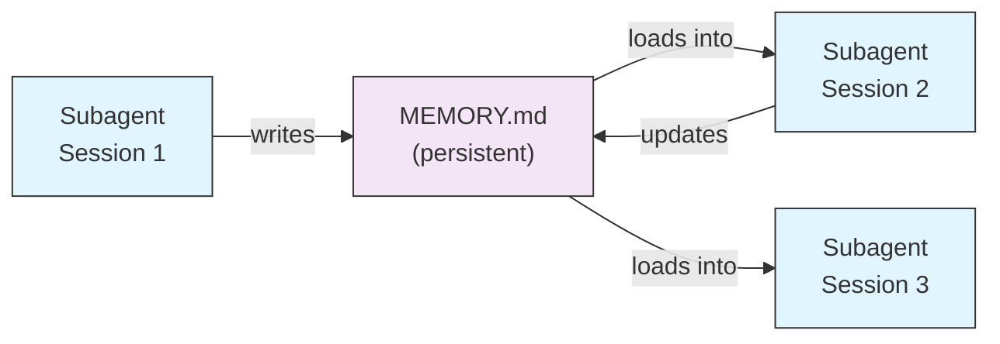
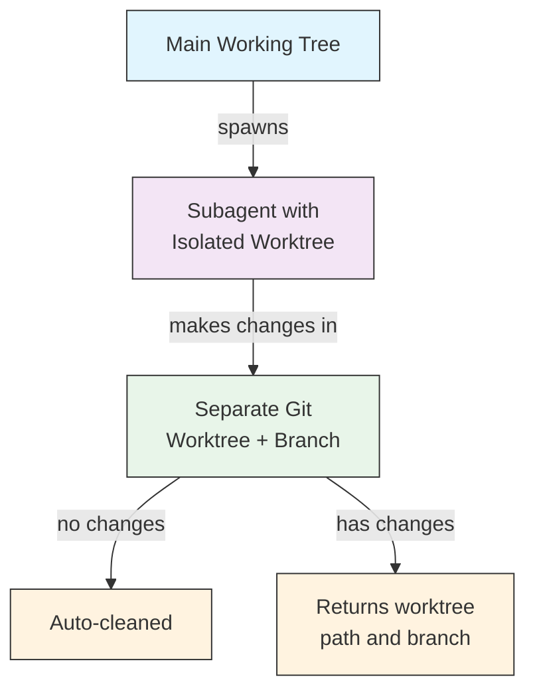
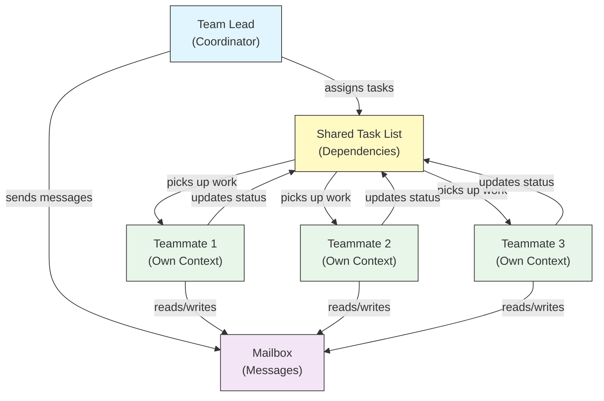
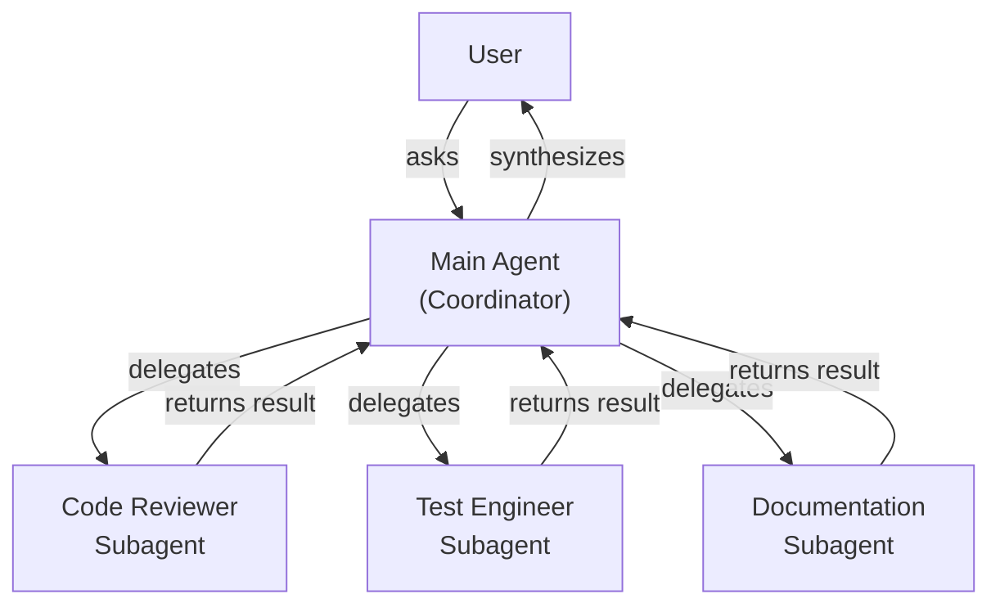
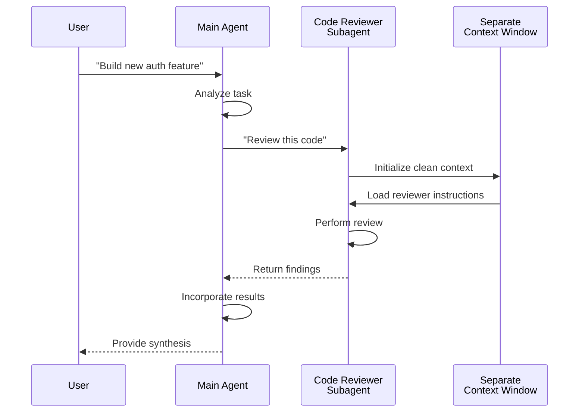
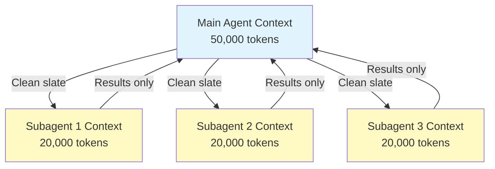
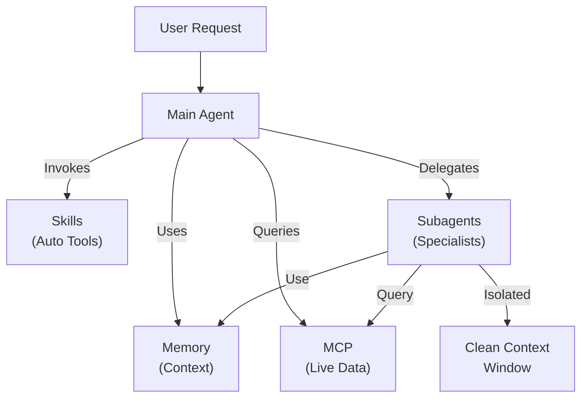

<picture>
  <source media="(prefers-color-scheme: dark)" srcset="../resources/logos/claude-howto-logo-dark.svg">
  
</picture>

# Subagents - 완전 참고 가이드

Subagents는 Claude Code가 작업을 위임할 수 있는 특화된 AI 어시스턴트입니다. 각 subagent는 고유한 목적을 가지며, 메인 대화와 분리된 독립적인 컨텍스트 윈도우를 사용하고, 특정 도구와 커스텀 시스템 프롬프트로 설정할 수 있습니다.

## 목차

1. [개요](#overview)
2. [주요 이점](#key-benefits)
3. [파일 위치](#file-locations)
4. [설정](#configuration)
5. [내장 Subagents](#built-in-subagents)
6. [Subagents 관리](#managing-subagents)
7. [Subagents 사용](#using-subagents)
8. [재개 가능한 에이전트](#resumable-agents)
9. [Subagents 체이닝](#chaining-subagents)
10. [Subagents의 영구 메모리](#persistent-memory-for-subagents)
11. [백그라운드 Subagents](#background-subagents)
12. [Worktree 격리](#worktree-isolation)
13. [생성 가능한 Subagents 제한](#restrict-spawnable-subagents)
14. [`claude agents` CLI 명령어](#claude-agents-cli-command)
15. [에이전트 팀 (실험적)](#agent-teams-experimental)
16. [플러그인 Subagent 보안](#plugin-subagent-security)
17. [아키텍처](#architecture)
18. [컨텍스트 관리](#context-management)
19. [Subagents를 사용해야 할 때](#when-to-use-subagents)
20. [모범 사례](#best-practices)
21. [이 폴더의 예시 Subagents](#example-subagents-in-this-folder)
22. [설치 방법](#installation-instructions)
23. [관련 개념](#related-concepts)

---

## 개요

Subagents는 Claude Code에서 위임 방식의 작업 실행을 가능하게 합니다:

- 별도의 컨텍스트 윈도우를 가진 **격리된 AI 어시스턴트** 생성
- 전문적인 역량을 위한 **맞춤형 시스템 프롬프트** 제공
- 기능을 제한하는 **도구 접근 제어** 적용
- 복잡한 작업으로 인한 **컨텍스트 오염 방지**
- 여러 전문화된 작업의 **병렬 실행** 지원

각 subagent는 깨끗한 상태로 독립적으로 동작하며, 해당 작업에 필요한 특정 컨텍스트만 받아 처리한 후 결과를 메인 에이전트에 반환하여 종합합니다.

**빠른 시작**: `/agents` 명령어를 사용하여 subagents를 대화형으로 생성, 조회, 편집, 관리하세요.

---

## 주요 이점

| 이점 | 설명 |
|---------|-------------|
| **컨텍스트 보존** | 별도의 컨텍스트에서 동작하여 메인 대화의 오염 방지 |
| **전문화된 역량** | 특정 도메인에 최적화되어 더 높은 성공률 제공 |
| **재사용성** | 여러 프로젝트에서 사용하고 팀과 공유 가능 |
| **유연한 권한** | 서로 다른 subagent 유형에 다른 도구 접근 수준 적용 |
| **확장성** | 여러 에이전트가 서로 다른 측면을 동시에 처리 |

---

## 파일 위치

Subagent 파일은 범위에 따라 여러 위치에 저장할 수 있습니다:

| 우선순위 | 유형 | 위치 | 범위 |
|----------|------|----------|-------|
| 1 (최상위) | **CLI 정의** | `--agents` 플래그(JSON)를 통해 | 세션 전용 |
| 2 | **프로젝트 subagents** | `.claude/agents/` | 현재 프로젝트 |
| 3 | **사용자 subagents** | `~/.claude/agents/` | 모든 프로젝트 |
| 4 (최하위) | **플러그인 에이전트** | 플러그인 `agents/` 디렉토리 | 플러그인을 통해 |

중복되는 이름이 있을 경우, 우선순위가 높은 소스가 우선됩니다.

---

## 설정

### 파일 형식

Subagents는 YAML frontmatter에 정의되고, 이후 마크다운으로 시스템 프롬프트가 이어집니다:

```yaml
---
name: your-sub-agent-name
description: 이 subagent를 언제 호출할지에 대한 설명
tools: tool1, tool2, tool3  # 선택 사항 - 생략 시 모든 도구 상속
disallowedTools: tool4  # 선택 사항 - 명시적으로 비허용할 도구
model: sonnet  # 선택 사항 - sonnet, opus, haiku, 또는 inherit
permissionMode: default  # 선택 사항 - 권한 모드
maxTurns: 20  # 선택 사항 - 에이전트 턴 수 제한
skills: skill1, skill2  # 선택 사항 - 컨텍스트에 미리 로드할 skills
mcpServers: server1  # 선택 사항 - subagent에서 사용 가능한 MCP 서버
memory: user  # 선택 사항 - 영구 메모리 범위 (user, project, local)
background: false  # 선택 사항 - 백그라운드 작업으로 실행
effort: high  # 선택 사항 - 추론 노력 수준 (low, medium, high, max)
isolation: worktree  # 선택 사항 - git worktree 격리
initialPrompt: "Start by analyzing the codebase"  # 선택 사항 - 메인 에이전트로 실행 시 자동 제출되는 첫 번째 턴
hooks:  # 선택 사항 - 컴포넌트 범위 hooks
  PreToolUse:
    - matcher: "Bash"
      hooks:
        - type: command
          command: "./scripts/security-check.sh"
---

Subagent의 시스템 프롬프트를 여기에 작성합니다. 여러 단락으로 구성할 수 있으며,
subagent의 역할, 기능, 문제 해결 방식을 명확하게 정의해야 합니다.
```

### 설정 필드

| 필드 | 필수 여부 | 설명 |
|-------|----------|-------------|
| `name` | 필수 | 고유 식별자 (소문자와 하이픈만 사용) |
| `description` | 필수 | 목적에 대한 자연어 설명. 자동 호출을 유도하려면 "use PROACTIVELY" 포함 |
| `tools` | 선택 | 특정 도구의 쉼표로 구분된 목록. 생략 시 모든 도구 상속. 생성 가능한 subagents 제한을 위한 `Agent(agent_name)` 문법 지원 |
| `disallowedTools` | 선택 | subagent가 사용해서는 안 되는 도구의 쉼표로 구분된 목록 |
| `model` | 선택 | 사용할 모델: `sonnet`, `opus`, `haiku`, 전체 모델 ID, 또는 `inherit`. 기본값은 설정된 subagent 모델 |
| `permissionMode` | 선택 | `default`, `acceptEdits`, `dontAsk`, `bypassPermissions`, `plan` |
| `maxTurns` | 선택 | subagent가 수행할 수 있는 최대 에이전트 턴 수 |
| `skills` | 선택 | 미리 로드할 skills의 쉼표로 구분된 목록. 시작 시 subagent의 컨텍스트에 전체 skill 내용을 주입 |
| `mcpServers` | 선택 | subagent에서 사용 가능하게 할 MCP 서버 |
| `hooks` | 선택 | 컴포넌트 범위 hooks (PreToolUse, PostToolUse, Stop) |
| `memory` | 선택 | 영구 메모리 디렉토리 범위: `user`, `project`, 또는 `local` |
| `background` | 선택 | 해당 subagent를 항상 백그라운드 작업으로 실행하려면 `true`로 설정 |
| `effort` | 선택 | 추론 노력 수준: `low`, `medium`, `high`, 또는 `max` |
| `isolation` | 선택 | subagent에 자체 git worktree를 부여하려면 `worktree`로 설정 |
| `initialPrompt` | 선택 | subagent가 메인 에이전트로 실행될 때 자동 제출되는 첫 번째 턴 |

### 도구 설정 옵션

**옵션 1: 모든 도구 상속 (필드 생략)**
```yaml
---
name: full-access-agent
description: 모든 사용 가능한 도구를 갖춘 에이전트
---
```

**옵션 2: 개별 도구 지정**
```yaml
---
name: limited-agent
description: 특정 도구만 갖춘 에이전트
tools: Read, Grep, Glob, Bash
---
```

**옵션 3: 조건부 도구 접근**
```yaml
---
name: conditional-agent
description: 필터링된 도구 접근 권한을 가진 에이전트
tools: Read, Bash(npm:*), Bash(test:*)
---
```

### CLI 기반 설정

`--agents` 플래그와 JSON 형식을 사용하여 단일 세션에서 subagents를 정의합니다:

```bash
claude --agents '{
  "code-reviewer": {
    "description": "Expert code reviewer. Use proactively after code changes.",
    "prompt": "You are a senior code reviewer. Focus on code quality, security, and best practices.",
    "tools": ["Read", "Grep", "Glob", "Bash"],
    "model": "sonnet"
  }
}'
```

**`--agents` 플래그의 JSON 형식:**

```json
{
  "agent-name": {
    "description": "필수: 이 에이전트를 언제 호출할지",
    "prompt": "필수: 에이전트의 시스템 프롬프트",
    "tools": ["선택 사항", "도구", "배열"],
    "model": "선택 사항: sonnet|opus|haiku"
  }
}
```

**에이전트 정의 우선순위:**

에이전트 정의는 다음 우선순위 순서로 로드됩니다 (첫 번째 일치 항목 우선):
1. **CLI 정의** - `--agents` 플래그 (세션 전용, JSON)
2. **프로젝트 수준** - `.claude/agents/` (현재 프로젝트)
3. **사용자 수준** - `~/.claude/agents/` (모든 프로젝트)
4. **플러그인 수준** - 플러그인 `agents/` 디렉토리

이를 통해 CLI 정의가 단일 세션에서 다른 모든 소스를 재정의할 수 있습니다.

---

## 내장 Subagents

Claude Code는 항상 사용 가능한 몇 가지 내장 subagents를 포함합니다:

| 에이전트 | 모델 | 목적 |
|-------|-------|---------|
| **general-purpose** | 상속 | 복잡하고 다단계 작업 |
| **Plan** | 상속 | 플랜 모드를 위한 리서치 |
| **Explore** | Haiku | 읽기 전용 코드베이스 탐색 (quick/medium/very thorough) |
| **Bash** | 상속 | 별도 컨텍스트에서 터미널 명령 실행 |
| **statusline-setup** | Sonnet | 상태 표시줄 설정 |
| **Claude Code Guide** | Haiku | Claude Code 기능 관련 질문 답변 |

### General-Purpose Subagent

| 속성 | 값 |
|----------|-------|
| **모델** | 부모에서 상속 |
| **도구** | 모든 도구 |
| **목적** | 복잡한 리서치 작업, 다단계 작업, 코드 수정 |

**사용 시점**: 복잡한 추론이 필요한 탐색과 수정 작업 모두에 해당할 때.

### Plan Subagent

| 속성 | 값 |
|----------|-------|
| **모델** | 부모에서 상속 |
| **도구** | Read, Glob, Grep, Bash |
| **목적** | 코드베이스 리서치를 위해 플랜 모드에서 자동으로 사용 |

**사용 시점**: Claude가 계획을 제시하기 전에 코드베이스를 이해해야 할 때.

### Explore Subagent

| 속성 | 값 |
|----------|-------|
| **모델** | Haiku (빠르고 낮은 지연 시간) |
| **모드** | 엄격한 읽기 전용 |
| **도구** | Glob, Grep, Read, Bash (읽기 전용 명령만) |
| **목적** | 빠른 코드베이스 검색 및 분석 |

**사용 시점**: 변경 없이 코드를 검색하거나 이해해야 할 때.

**탐색 수준** - 탐색 깊이를 지정합니다:
- **"quick"** - 최소한의 탐색으로 빠른 검색, 특정 패턴을 찾는 데 적합
- **"medium"** - 속도와 철저함의 균형을 맞춘 적당한 탐색, 기본 방식
- **"very thorough"** - 여러 위치와 명명 규칙에 걸친 포괄적인 분석, 시간이 더 걸릴 수 있음

### Bash Subagent

| 속성 | 값 |
|----------|-------|
| **모델** | 부모에서 상속 |
| **도구** | Bash |
| **목적** | 별도의 컨텍스트 윈도우에서 터미널 명령 실행 |

**사용 시점**: 격리된 컨텍스트가 이점이 되는 쉘 명령을 실행할 때.

### Statusline Setup Subagent

| 속성 | 값 |
|----------|-------|
| **모델** | Sonnet |
| **도구** | Read, Write, Bash |
| **목적** | Claude Code 상태 표시줄 디스플레이 설정 |

**사용 시점**: 상태 표시줄을 설정하거나 커스터마이징할 때.

### Claude Code Guide Subagent

| 속성 | 값 |
|----------|-------|
| **모델** | Haiku (빠르고 낮은 지연 시간) |
| **도구** | 읽기 전용 |
| **목적** | Claude Code 기능 및 사용법에 대한 질문 답변 |

**사용 시점**: 사용자가 Claude Code의 작동 방식이나 특정 기능 사용법에 대해 질문할 때.

---

## Subagents 관리

### `/agents` 명령어 사용 (권장)

```bash
/agents
```

이 명령어는 다음을 위한 대화형 메뉴를 제공합니다:
- 모든 사용 가능한 subagents 조회 (내장, 사용자, 프로젝트)
- 가이드형 설정으로 새 subagents 생성
- 기존 커스텀 subagents 및 도구 접근 편집
- 커스텀 subagents 삭제
- 중복이 있을 때 활성화된 subagents 확인

### 직접 파일 관리

```bash
# 프로젝트 subagent 생성
mkdir -p .claude/agents
cat > .claude/agents/test-runner.md << 'EOF'
---
name: test-runner
description: Use proactively to run tests and fix failures
---

You are a test automation expert. When you see code changes, proactively
run the appropriate tests. If tests fail, analyze the failures and fix
them while preserving the original test intent.
EOF

# 사용자 subagent 생성 (모든 프로젝트에서 사용 가능)
mkdir -p ~/.claude/agents
```

---

## Subagents 사용

### 자동 위임

Claude는 다음을 기반으로 작업을 자동으로 위임합니다:
- 요청의 작업 설명
- subagent 설정의 `description` 필드
- 현재 컨텍스트와 사용 가능한 도구

자동 호출을 유도하려면 `description` 필드에 "use PROACTIVELY" 또는 "MUST BE USED"를 포함하세요:

```yaml
---
name: code-reviewer
description: Expert code review specialist. Use PROACTIVELY after writing or modifying code.
---
```

### 명시적 호출

특정 subagent를 직접 요청할 수 있습니다:

```
> Use the test-runner subagent to fix failing tests
> Have the code-reviewer subagent look at my recent changes
> Ask the debugger subagent to investigate this error
```

### @-멘션 호출

`@` 접두사를 사용하여 특정 subagent가 호출되도록 보장합니다 (자동 위임 휴리스틱 우회):

```
> @"code-reviewer (agent)" review the auth module
```

### 세션 전체 에이전트

특정 에이전트를 메인 에이전트로 사용하여 전체 세션을 실행합니다:

```bash
# CLI 플래그를 통해
claude --agent code-reviewer

# settings.json을 통해
{
  "agent": "code-reviewer"
}
```

### 사용 가능한 에이전트 목록 조회

`claude agents` 명령어를 사용하여 모든 소스에서 설정된 에이전트 목록을 확인합니다:

```bash
claude agents
```

---

## 재개 가능한 에이전트

Subagents는 전체 컨텍스트를 보존한 채로 이전 대화를 이어갈 수 있습니다:

```bash
# 최초 호출
> Use the code-analyzer agent to start reviewing the authentication module
# agentId: "abc123" 반환

# 나중에 에이전트 재개
> Resume agent abc123 and now analyze the authorization logic as well
```

**활용 사례**:
- 여러 세션에 걸친 장기 리서치
- 컨텍스트를 잃지 않는 반복적 개선
- 컨텍스트를 유지하는 다단계 워크플로

---

## Subagents 체이닝

여러 subagents를 순서대로 실행합니다:

```bash
> First use the code-analyzer subagent to find performance issues,
  then use the optimizer subagent to fix them
```

이를 통해 하나의 subagent 출력이 다른 subagent의 입력이 되는 복잡한 워크플로가 가능합니다.

---

## Subagents의 영구 메모리

`memory` 필드는 subagents에게 대화 간에 유지되는 영구 디렉토리를 제공합니다. 이를 통해 subagents가 시간이 지남에 따라 지식을 축적하고, 세션 간에 유지되는 메모, 발견 사항, 컨텍스트를 저장할 수 있습니다.

### 메모리 범위

| 범위 | 디렉토리 | 활용 사례 |
|-------|-----------|----------|
| `user` | `~/.claude/agent-memory/<name>/` | 모든 프로젝트에 걸친 개인 메모 및 설정 |
| `project` | `.claude/agent-memory/<name>/` | 팀과 공유되는 프로젝트별 지식 |
| `local` | `.claude/agent-memory-local/<name>/` | 버전 관리에 커밋되지 않는 로컬 프로젝트 지식 |

### 작동 방식

- 메모리 디렉토리의 `MEMORY.md`의 첫 200줄이 subagent의 시스템 프롬프트에 자동으로 로드됩니다
- subagent가 메모리 파일을 관리할 수 있도록 `Read`, `Write`, `Edit` 도구가 자동으로 활성화됩니다
- subagent는 필요에 따라 메모리 디렉토리에 추가 파일을 생성할 수 있습니다

### 설정 예시

```yaml
---
name: researcher
memory: user
---

You are a research assistant. Use your memory directory to store findings,
track progress across sessions, and build up knowledge over time.

Check your MEMORY.md file at the start of each session to recall previous context.
```



---

## 백그라운드 Subagents

Subagents는 백그라운드에서 실행되어 메인 대화를 다른 작업에 자유롭게 사용할 수 있습니다.

### 설정

frontmatter에 `background: true`를 설정하면 subagent를 항상 백그라운드 작업으로 실행합니다:

```yaml
---
name: long-runner
background: true
description: Performs long-running analysis tasks in the background
---
```

### 키보드 단축키

| 단축키 | 동작 |
|----------|--------|
| `Ctrl+B` | 현재 실행 중인 subagent 작업을 백그라운드로 전환 |
| `Ctrl+F` | 모든 백그라운드 에이전트 종료 (확인을 위해 두 번 누름) |

### 백그라운드 작업 비활성화

환경 변수를 설정하여 백그라운드 작업 지원을 완전히 비활성화합니다:

```bash
export CLAUDE_CODE_DISABLE_BACKGROUND_TASKS=1
```

---

## Worktree 격리

`isolation: worktree` 설정은 subagent에게 자체 git worktree를 제공하여 메인 작업 트리에 영향을 주지 않고 독립적으로 변경할 수 있게 합니다.

### 설정

```yaml
---
name: feature-builder
isolation: worktree
description: Implements features in an isolated git worktree
tools: Read, Write, Edit, Bash, Grep, Glob
---
```

### 작동 방식



- subagent는 별도 브랜치의 자체 git worktree에서 동작합니다
- subagent가 변경을 하지 않으면 worktree는 자동으로 정리됩니다
- 변경 사항이 있으면 worktree 경로와 브랜치 이름이 메인 에이전트에 반환되어 검토하거나 병합할 수 있습니다

---

## 생성 가능한 Subagents 제한

`tools` 필드에서 `Agent(agent_type)` 문법을 사용하여 특정 subagent가 생성할 수 있는 subagents를 제어할 수 있습니다. 이를 통해 위임을 위한 특정 subagents를 허용 목록에 추가할 수 있습니다.

> **참고**: v2.1.63에서 `Task` 도구가 `Agent`로 이름이 변경되었습니다. 기존의 `Task(...)` 참조는 여전히 별칭으로 작동합니다.

### 예시

```yaml
---
name: coordinator
description: Coordinates work between specialized agents
tools: Agent(worker, researcher), Read, Bash
---

You are a coordinator agent. You can delegate work to the "worker" and
"researcher" subagents only. Use Read and Bash for your own exploration.
```

이 예시에서 `coordinator` subagent는 `worker`와 `researcher` subagents만 생성할 수 있습니다. 다른 곳에 정의되어 있더라도 다른 subagents는 생성할 수 없습니다.

---

## `claude agents` CLI 명령어

`claude agents` 명령어는 소스별로 그룹화된 모든 설정된 에이전트를 나열합니다 (내장, 사용자 수준, 프로젝트 수준):

```bash
claude agents
```

이 명령어는:
- 모든 소스에서 사용 가능한 모든 에이전트를 표시합니다
- 에이전트를 소스 위치별로 그룹화합니다
- 상위 우선순위 에이전트가 하위 우선순위 에이전트를 가릴 때 **재정의**를 표시합니다 (예: 사용자 수준 에이전트와 같은 이름을 가진 프로젝트 수준 에이전트)

---

## 에이전트 팀 (실험적)

에이전트 팀은 복잡한 작업을 처리하는 여러 Claude Code 인스턴스가 함께 조율하는 기능입니다. subagents (결과를 반환하는 위임된 하위 작업)와 달리, 팀원들은 자체 컨텍스트로 독립적으로 작업하며 공유된 메일박스 시스템을 통해 직접 소통합니다.

> **참고**: 에이전트 팀은 실험적 기능으로 Claude Code v2.1.32 이상이 필요합니다. 사용 전에 활성화하세요.

### Subagents vs 에이전트 팀

| 측면 | Subagents | 에이전트 팀 |
|--------|-----------|-------------|
| **위임 모델** | 부모가 하위 작업을 위임하고 결과를 기다림 | 팀 리더가 작업을 할당하고 팀원들이 독립적으로 실행 |
| **컨텍스트** | 하위 작업별 새로운 컨텍스트, 결과가 메인으로 압축 반환 | 각 팀원이 자체 영구 컨텍스트 유지 |
| **조율** | 부모가 관리하는 순차적 또는 병렬 방식 | 자동 의존성 관리가 있는 공유 작업 목록 |
| **통신** | 반환 값만 | 메일박스를 통한 에이전트 간 메시지 |
| **세션 재개** | 지원됨 | 인프로세스 팀원은 미지원 |
| **최적 용도** | 집중적이고 잘 정의된 하위 작업 | 병렬 작업이 필요한 대규모 다중 파일 프로젝트 |

### 에이전트 팀 활성화

환경 변수를 설정하거나 `settings.json`에 추가합니다:

```bash
export CLAUDE_CODE_EXPERIMENTAL_AGENT_TEAMS=1
```

또는 `settings.json`에서:

```json
{
  "env": {
    "CLAUDE_CODE_EXPERIMENTAL_AGENT_TEAMS": "1"
  }
}
```

### 팀 시작하기

활성화된 후, 프롬프트에서 팀원과 함께 작업하도록 Claude에 요청합니다:

```
User: Build the authentication module. Use a team — one teammate for the API endpoints,
      one for the database schema, and one for the test suite.
```

Claude가 팀을 구성하고, 작업을 할당하며, 자동으로 작업을 조율합니다.

### 디스플레이 모드

팀원 활동 표시 방식을 제어합니다:

| 모드 | 플래그 | 설명 |
|------|------|-------------|
| **Auto** | `--teammate-mode auto` | 터미널에 가장 적합한 디스플레이 모드를 자동 선택 |
| **In-process** | `--teammate-mode in-process` | 현재 터미널에 팀원 출력을 인라인으로 표시 (기본값) |
| **Split-panes** | `--teammate-mode tmux` | 각 팀원을 별도의 tmux 또는 iTerm2 창에 표시 |

```bash
claude --teammate-mode tmux
```

`settings.json`에서도 디스플레이 모드를 설정할 수 있습니다:

```json
{
  "teammateMode": "tmux"
}
```

> **참고**: Split-pane 모드는 tmux 또는 iTerm2가 필요합니다. VS Code 터미널, Windows Terminal, Ghostty에서는 사용할 수 없습니다.

### 내비게이션

Split-pane 모드에서 팀원 간 이동하려면 `Shift+Down`을 사용합니다.

### 팀 설정

팀 설정은 `~/.claude/teams/{team-name}/config.json`에 저장됩니다.

### 아키텍처



**핵심 구성 요소**:

- **Team Lead**: 팀을 생성하고, 작업을 할당하며, 조율하는 메인 Claude Code 세션
- **Shared Task List**: 자동 의존성 추적이 있는 동기화된 작업 목록
- **Mailbox**: 팀원들이 상태를 전달하고 조율하기 위한 에이전트 간 메시지 시스템
- **Teammates**: 각자 자체 컨텍스트 윈도우를 가진 독립적인 Claude Code 인스턴스

### 작업 할당 및 메시지 전달

팀 리더는 작업을 세분화하여 팀원에게 할당합니다. 공유 작업 목록은 다음을 처리합니다:

- **자동 의존성 관리** — 작업은 의존 작업이 완료될 때까지 대기
- **상태 추적** — 팀원들이 작업하면서 작업 상태를 업데이트
- **에이전트 간 메시지** — 팀원들이 조율을 위해 메일박스를 통해 메시지 전송 (예: "데이터베이스 스키마가 준비되었으니 쿼리 작성을 시작할 수 있습니다")

### 계획 승인 워크플로

복잡한 작업의 경우 팀 리더는 팀원들이 작업을 시작하기 전에 실행 계획을 생성합니다. 사용자가 계획을 검토하고 승인하여 코드 변경이 이루어지기 전에 팀의 접근 방식이 기대와 일치하는지 확인합니다.

### 팀을 위한 Hook 이벤트

에이전트 팀은 두 가지 추가적인 [hook 이벤트](../06-hooks/)를 도입합니다:

| 이벤트 | 발생 시점 | 활용 사례 |
|-------|-----------|----------|
| `TeammateIdle` | 팀원이 현재 작업을 완료하고 대기 작업이 없을 때 | 알림 트리거, 후속 작업 할당 |
| `TaskCompleted` | 공유 작업 목록의 작업이 완료로 표시될 때 | 검증 실행, 대시보드 업데이트, 의존 작업 체이닝 |

### 모범 사례

- **팀 규모**: 최적의 조율을 위해 팀원을 3-5명으로 유지
- **작업 크기**: 각 작업이 5-15분 소요되도록 분할 — 병렬화하기에 충분히 작고, 의미 있을 만큼 충분히 큰 크기
- **파일 충돌 방지**: 병합 충돌을 방지하기 위해 서로 다른 팀원에게 다른 파일이나 디렉토리 할당
- **간단하게 시작**: 첫 팀은 in-process 모드로 시작하고, 익숙해지면 split-panes로 전환
- **명확한 작업 설명**: 팀원들이 독립적으로 작업할 수 있도록 구체적이고 실행 가능한 작업 설명 제공

### 제한 사항

- **실험적**: 향후 릴리스에서 기능 동작이 변경될 수 있음
- **세션 재개 불가**: 인프로세스 팀원은 세션 종료 후 재개 불가
- **세션당 하나의 팀**: 단일 세션에서 중첩 팀이나 여러 팀을 생성할 수 없음
- **고정된 리더십**: 팀 리더 역할은 팀원에게 이전 불가
- **Split-pane 제한**: tmux/iTerm2 필요; VS Code 터미널, Windows Terminal, Ghostty에서 사용 불가
- **크로스 세션 팀 없음**: 팀원은 현재 세션 내에서만 존재

> **경고**: 에이전트 팀은 실험적입니다. 중요하지 않은 작업으로 먼저 테스트하고 예상치 못한 동작을 위해 팀원 조율을 모니터링하세요.

---

## 플러그인 Subagent 보안

플러그인에서 제공하는 subagents는 보안을 위해 frontmatter 기능이 제한되어 있습니다. 다음 필드는 플러그인 subagent 정의에서 **허용되지 않습니다**:

- `hooks` - 라이프사이클 hooks 정의 불가
- `mcpServers` - MCP 서버 설정 불가
- `permissionMode` - 권한 설정 재정의 불가

이를 통해 플러그인이 subagent hooks를 통해 권한을 상승시키거나 임의의 명령을 실행하는 것을 방지합니다.

---

## 아키텍처

### 고수준 아키텍처



### Subagent 라이프사이클



---

## 컨텍스트 관리



### 핵심 사항

- 각 subagent는 메인 대화 기록 없이 **새로운 컨텍스트 윈도우**를 갖습니다
- 특정 작업에 필요한 **관련 컨텍스트만** subagent에 전달됩니다
- 결과는 메인 에이전트로 **압축**되어 반환됩니다
- 이를 통해 긴 프로젝트에서 **컨텍스트 토큰 고갈**을 방지합니다

### 성능 고려 사항

- **컨텍스트 효율성** - 에이전트가 메인 컨텍스트를 보존하여 더 긴 세션 가능
- **지연 시간** - Subagents는 새로운 컨텍스트로 시작하므로 초기 컨텍스트 수집 시 지연이 발생할 수 있음

### 주요 동작

- **중첩 생성 불가** - Subagents는 다른 subagents를 생성할 수 없습니다
- **백그라운드 권한** - 백그라운드 subagents는 미리 승인되지 않은 권한을 자동으로 거부합니다
- **백그라운드 전환** - `Ctrl+B`를 눌러 현재 실행 중인 작업을 백그라운드로 전환합니다
- **트랜스크립트** - Subagent 트랜스크립트는 `~/.claude/projects/{project}/{sessionId}/subagents/agent-{agentId}.jsonl`에 저장됩니다
- **자동 압축** - Subagent 컨텍스트는 용량의 ~95%에서 자동으로 압축됩니다 (`CLAUDE_AUTOCOMPACT_PCT_OVERRIDE` 환경 변수로 재정의 가능)

---

## Subagents를 사용해야 할 때

| 시나리오 | Subagent 사용 여부 | 이유 |
|----------|--------------|-----|
| 많은 단계가 있는 복잡한 기능 | 예 | 관심사 분리, 컨텍스트 오염 방지 |
| 빠른 코드 리뷰 | 아니오 | 불필요한 오버헤드 |
| 병렬 작업 실행 | 예 | 각 subagent가 자체 컨텍스트 보유 |
| 전문화된 역량 필요 | 예 | 커스텀 시스템 프롬프트 |
| 장기 실행 분석 | 예 | 메인 컨텍스트 고갈 방지 |
| 단일 작업 | 아니오 | 불필요하게 지연 발생 |

---

## 모범 사례

### 설계 원칙

**해야 할 것:**
- Claude가 생성한 에이전트로 시작하기 - Claude로 초기 subagent를 생성한 후 반복적으로 커스터마이징
- 집중된 subagents 설계 - 모든 것을 하는 하나보다 단일하고 명확한 책임
- 자세한 프롬프트 작성 - 구체적인 지시, 예시, 제약 조건 포함
- 도구 접근 제한 - subagent의 목적에 필요한 도구만 부여
- 버전 관리 - 팀 협업을 위해 프로젝트 subagents를 버전 관리에 커밋

**하지 말아야 할 것:**
- 같은 역할을 가진 겹치는 subagents 생성
- subagents에 불필요한 도구 접근 권한 부여
- 간단한 단일 단계 작업에 subagents 사용
- 하나의 subagent 프롬프트에 여러 관심사 혼합
- 필요한 컨텍스트 전달을 잊지 않기

### 시스템 프롬프트 모범 사례

1. **역할을 구체적으로 명시**
   ```
   You are an expert code reviewer specializing in [specific areas]
   ```

2. **우선순위 명확하게 정의**
   ```
   Review priorities (in order):
   1. Security Issues
   2. Performance Problems
   3. Code Quality
   ```

3. **출력 형식 지정**
   ```
   For each issue provide: Severity, Category, Location, Description, Fix, Impact
   ```

4. **실행 단계 포함**
   ```
   When invoked:
   1. Run git diff to see recent changes
   2. Focus on modified files
   3. Begin review immediately
   ```

### 도구 접근 전략

1. **제한적으로 시작**: 필수 도구만으로 시작
2. **필요할 때만 확장**: 요구 사항이 생겼을 때만 도구 추가
3. **가능하면 읽기 전용**: 분석 에이전트에는 Read/Grep 사용
4. **샌드박스 실행**: Bash 명령을 특정 패턴으로 제한

---

## 이 폴더의 예시 Subagents

이 폴더에는 바로 사용할 수 있는 예시 subagents가 포함되어 있습니다:

### 1. Code Reviewer (`code-reviewer.md`)

**목적**: 코드 품질 및 유지보수성에 대한 포괄적 분석

**도구**: Read, Grep, Glob, Bash

**전문 분야**:
- 보안 취약점 감지
- 성능 최적화 식별
- 코드 유지보수성 평가
- 테스트 커버리지 분석

**사용 시점**: 품질과 보안에 초점을 맞춘 자동화된 코드 리뷰가 필요할 때

---

### 2. Test Engineer (`test-engineer.md`)

**목적**: 테스트 전략, 커버리지 분석, 자동화 테스트

**도구**: Read, Write, Bash, Grep

**전문 분야**:
- 단위 테스트 생성
- 통합 테스트 설계
- 엣지 케이스 식별
- 커버리지 분석 (>80% 목표)

**사용 시점**: 포괄적인 테스트 스위트 생성이나 커버리지 분석이 필요할 때

---

### 3. Documentation Writer (`documentation-writer.md`)

**목적**: 기술 문서, API 문서, 사용자 가이드

**도구**: Read, Write, Grep

**전문 분야**:
- API 엔드포인트 문서화
- 사용자 가이드 작성
- 아키텍처 문서화
- 코드 주석 개선

**사용 시점**: 프로젝트 문서를 생성하거나 업데이트해야 할 때

---

### 4. Secure Reviewer (`secure-reviewer.md`)

**목적**: 최소 권한으로 보안에 초점을 맞춘 코드 리뷰

**도구**: Read, Grep

**전문 분야**:
- 보안 취약점 감지
- 인증/인가 문제
- 데이터 노출 위험
- 인젝션 공격 식별

**사용 시점**: 수정 기능 없이 보안 감사가 필요할 때

---

### 5. Implementation Agent (`implementation-agent.md`)

**목적**: 기능 개발을 위한 전체 구현 기능

**도구**: Read, Write, Edit, Bash, Grep, Glob

**전문 분야**:
- 기능 구현
- 코드 생성
- 빌드 및 테스트 실행
- 코드베이스 수정

**사용 시점**: subagent가 기능을 처음부터 끝까지 구현해야 할 때

---

### 6. Debugger (`debugger.md`)

**목적**: 오류, 테스트 실패, 예상치 못한 동작을 위한 디버깅 전문가

**도구**: Read, Edit, Bash, Grep, Glob

**전문 분야**:
- 근본 원인 분석
- 오류 조사
- 테스트 실패 해결
- 최소한의 수정 구현

**사용 시점**: 버그, 오류, 예상치 못한 동작이 발생할 때

---

### 7. Data Scientist (`data-scientist.md`)

**목적**: SQL 쿼리 및 데이터 인사이트를 위한 데이터 분석 전문가

**도구**: Bash, Read, Write

**전문 분야**:
- SQL 쿼리 최적화
- BigQuery 작업
- 데이터 분석 및 시각화
- 통계적 인사이트

**사용 시점**: 데이터 분석, SQL 쿼리, BigQuery 작업이 필요할 때

---

## 설치 방법

### 방법 1: /agents 명령어 사용 (권장)

```bash
/agents
```

이후:
1. 'Create New Agent' 선택
2. 프로젝트 수준 또는 사용자 수준 선택
3. subagent를 상세하게 설명
4. 접근 권한을 부여할 도구 선택 (또는 빈칸으로 두어 모두 상속)
5. 저장 후 사용

### 방법 2: 프로젝트에 복사

에이전트 파일을 프로젝트의 `.claude/agents/` 디렉토리에 복사합니다:

```bash
# 프로젝트로 이동
cd /path/to/your/project

# agents 디렉토리가 없으면 생성
mkdir -p .claude/agents

# 이 폴더의 모든 에이전트 파일 복사
cp /path/to/04-subagents/*.md .claude/agents/

# README 제거 (.claude/agents에는 불필요)
rm .claude/agents/README.md
```

### 방법 3: 사용자 디렉토리에 복사

모든 프로젝트에서 사용 가능한 에이전트의 경우:

```bash
# 사용자 에이전트 디렉토리 생성
mkdir -p ~/.claude/agents

# 에이전트 복사
cp /path/to/04-subagents/code-reviewer.md ~/.claude/agents/
cp /path/to/04-subagents/debugger.md ~/.claude/agents/
# ... 필요에 따라 나머지 복사
```

### 확인

설치 후 에이전트가 인식되는지 확인합니다:

```bash
/agents
```

설치된 에이전트가 내장 에이전트와 함께 나열되어야 합니다.

---

## 파일 구조

```
project/
├── .claude/
│   └── agents/
│       ├── code-reviewer.md
│       ├── test-engineer.md
│       ├── documentation-writer.md
│       ├── secure-reviewer.md
│       ├── implementation-agent.md
│       ├── debugger.md
│       └── data-scientist.md
└── ...
```

---

## 관련 개념

### 관련 기능

- **[Slash Commands](../01-slash-commands/)** - 사용자가 빠르게 호출하는 단축키
- **[Memory](../02-memory/)** - 세션 간 영구 컨텍스트
- **[Skills](../03-skills/)** - 재사용 가능한 자율 기능
- **[MCP Protocol](../05-mcp/)** - 실시간 외부 데이터 접근
- **[Hooks](../06-hooks/)** - 이벤트 기반 쉘 명령 자동화
- **[Plugins](../07-plugins/)** - 번들된 확장 패키지

### 다른 기능과의 비교

| 기능 | 사용자 호출 | 자동 호출 | 영구성 | 외부 접근 | 격리된 컨텍스트 |
|---------|--------------|--------------|-----------|------------------|------------------|
| **Slash Commands** | 예 | 아니오 | 아니오 | 아니오 | 아니오 |
| **Subagents** | 예 | 예 | 아니오 | 아니오 | 예 |
| **Memory** | 자동 | 자동 | 예 | 아니오 | 아니오 |
| **MCP** | 자동 | 예 | 아니오 | 예 | 아니오 |
| **Skills** | 예 | 예 | 아니오 | 아니오 | 아니오 |

### 통합 패턴



---

## 추가 자료

- [공식 Subagents 문서](https://code.claude.com/docs/en/sub-agents)
- [CLI 레퍼런스](https://code.claude.com/docs/en/cli-reference) - `--agents` 플래그 및 기타 CLI 옵션
- [Plugins 가이드](../07-plugins/) - 에이전트를 다른 기능과 번들링
- [Skills 가이드](../03-skills/) - 자동 호출 기능
- [Memory 가이드](../02-memory/) - 영구 컨텍스트
- [Hooks 가이드](../06-hooks/) - 이벤트 기반 자동화

---

*최종 업데이트: 2026년 3월*

*이 가이드는 Claude Code의 완전한 subagent 설정, 위임 패턴, 모범 사례를 다룹니다.*
