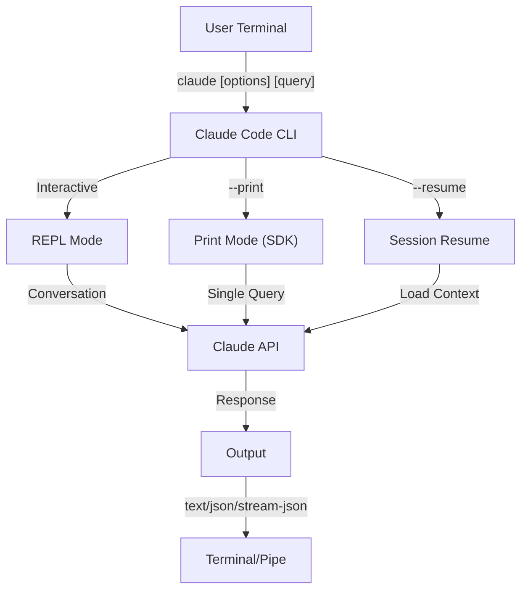
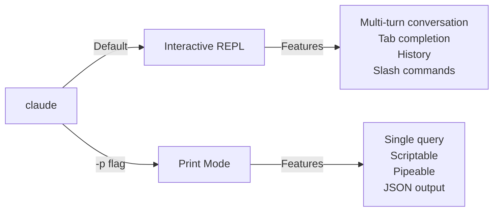

<picture>
  <source media="(prefers-color-scheme: dark)" srcset="../resources/logos/claude-howto-logo-dark.svg">
  
</picture>

# CLI 레퍼런스

## 개요

Claude Code CLI(커맨드 라인 인터페이스)는 Claude Code와 상호작용하는 주요 수단입니다. 쿼리 실행, 세션 관리, 모델 설정, 개발 워크플로우 통합 등을 위한 강력한 옵션을 제공합니다.

## 아키텍처



## CLI 명령어

| 명령어 | 설명 | 예시 |
|--------|------|------|
| `claude` | 대화형 REPL 시작 | `claude` |
| `claude "query"` | 초기 프롬프트와 함께 REPL 시작 | `claude "explain this project"` |
| `claude -p "query"` | Print mode - 쿼리 실행 후 종료 | `claude -p "explain this function"` |
| `cat file \| claude -p "query"` | 파이프로 전달된 내용 처리 | `cat logs.txt \| claude -p "explain"` |
| `claude -c` | 가장 최근 대화 이어가기 | `claude -c` |
| `claude -c -p "query"` | print mode로 대화 이어가기 | `claude -c -p "check for type errors"` |
| `claude -r "<session>" "query"` | ID 또는 이름으로 세션 재개 | `claude -r "auth-refactor" "finish this PR"` |
| `claude update` | 최신 버전으로 업데이트 | `claude update` |
| `claude mcp` | MCP 서버 설정 | [MCP 문서](../05-mcp/) 참조 |
| `claude mcp serve` | Claude Code를 MCP 서버로 실행 | `claude mcp serve` |
| `claude agents` | 설정된 모든 Subagents 목록 표시 | `claude agents` |
| `claude auto-mode defaults` | 자동 모드 기본 규칙을 JSON으로 출력 | `claude auto-mode defaults` |
| `claude remote-control` | Remote Control 서버 시작 | `claude remote-control` |
| `claude plugin` | 플러그인 관리 (설치, 활성화, 비활성화) | `claude plugin install my-plugin` |
| `claude auth login` | 로그인 (`--email`, `--sso` 지원) | `claude auth login --email user@example.com` |
| `claude auth logout` | 현재 계정 로그아웃 | `claude auth logout` |
| `claude auth status` | 인증 상태 확인 (로그인 시 exit 0, 미로그인 시 1) | `claude auth status` |

## 핵심 플래그

| 플래그 | 설명 | 예시 |
|--------|------|------|
| `-p, --print` | 대화형 모드 없이 응답 출력 | `claude -p "query"` |
| `-c, --continue` | 가장 최근 대화 불러오기 | `claude --continue` |
| `-r, --resume` | ID 또는 이름으로 특정 세션 재개 | `claude --resume auth-refactor` |
| `-v, --version` | 버전 번호 출력 | `claude -v` |
| `-w, --worktree` | 격리된 git worktree에서 시작 | `claude -w` |
| `-n, --name` | 세션 표시 이름 | `claude -n "auth-refactor"` |
| `--from-pr <number>` | GitHub PR에 연결된 세션 재개 | `claude --from-pr 42` |
| `--remote "task"` | claude.ai에 웹 세션 생성 | `claude --remote "implement API"` |
| `--remote-control, --rc` | Remote Control을 통한 대화형 세션 | `claude --rc` |
| `--teleport` | 웹 세션을 로컬로 재개 | `claude --teleport` |
| `--teammate-mode` | 에이전트 팀 표시 모드 | `claude --teammate-mode tmux` |
| `--bare` | 최소 모드 (hooks, skills, plugins, MCP, 자동 메모리, CLAUDE.md 건너뜀) | `claude --bare` |
| `--enable-auto-mode` | 자동 권한 모드 활성화 | `claude --enable-auto-mode` |
| `--channels` | MCP 채널 플러그인 구독 | `claude --channels discord,telegram` |
| `--chrome` / `--no-chrome` | Chrome 브라우저 통합 활성화/비활성화 | `claude --chrome` |
| `--effort` | 사고 노력 수준 설정 | `claude --effort high` |
| `--init` / `--init-only` | 초기화 hooks 실행 | `claude --init` |
| `--maintenance` | 유지 관리 hooks 실행 후 종료 | `claude --maintenance` |
| `--disable-slash-commands` | 모든 skills 및 슬래시 명령어 비활성화 | `claude --disable-slash-commands` |
| `--no-session-persistence` | 세션 저장 비활성화 (print mode) | `claude -p --no-session-persistence "query"` |

### 대화형 모드 vs Print Mode



**대화형 모드** (기본값):
```bash
# 대화형 세션 시작
claude

# 초기 프롬프트와 함께 시작
claude "explain the authentication flow"
```

**Print Mode** (비대화형):
```bash
# 단일 쿼리 후 종료
claude -p "what does this function do?"

# 파일 내용 처리
cat error.log | claude -p "explain this error"

# 다른 도구와 연결
claude -p "list todos" | grep "URGENT"
```

## 모델 및 설정

| 플래그 | 설명 | 예시 |
|--------|------|------|
| `--model` | 모델 설정 (sonnet, opus, haiku 또는 전체 이름) | `claude --model opus` |
| `--fallback-model` | 과부하 시 자동 모델 폴백 | `claude -p --fallback-model sonnet "query"` |
| `--agent` | 세션에 사용할 에이전트 지정 | `claude --agent my-custom-agent` |
| `--agents` | JSON으로 커스텀 Subagents 정의 | [에이전트 설정](#에이전트-설정) 참조 |
| `--effort` | 노력 수준 설정 (low, medium, high, max) | `claude --effort high` |

### 모델 선택 예시

```bash
# 복잡한 작업에 Opus 4.6 사용
claude --model opus "design a caching strategy"

# 빠른 작업에 Haiku 4.5 사용
claude --model haiku -p "format this JSON"

# 전체 모델 이름 사용
claude --model claude-sonnet-4-6-20250929 "review this code"

# 안정성을 위한 폴백 사용
claude -p --model opus --fallback-model sonnet "analyze architecture"

# opusplan 사용 (Opus가 계획, Sonnet이 실행)
claude --model opusplan "design and implement the caching layer"
```

## 시스템 프롬프트 커스터마이징

| 플래그 | 설명 | 예시 |
|--------|------|------|
| `--system-prompt` | 전체 기본 프롬프트 교체 | `claude --system-prompt "You are a Python expert"` |
| `--system-prompt-file` | 파일에서 프롬프트 불러오기 (print mode) | `claude -p --system-prompt-file ./prompt.txt "query"` |
| `--append-system-prompt` | 기본 프롬프트에 추가 | `claude --append-system-prompt "Always use TypeScript"` |

### 시스템 프롬프트 예시

```bash
# 완전한 커스텀 페르소나
claude --system-prompt "You are a senior security engineer. Focus on vulnerabilities."

# 특정 지침 추가
claude --append-system-prompt "Always include unit tests with code examples"

# 파일에서 복잡한 프롬프트 불러오기
claude -p --system-prompt-file ./prompts/code-reviewer.txt "review main.py"
```

### 시스템 프롬프트 플래그 비교

| 플래그 | 동작 | 대화형 | Print |
|--------|------|--------|-------|
| `--system-prompt` | 전체 기본 시스템 프롬프트 교체 | ✅ | ✅ |
| `--system-prompt-file` | 파일의 프롬프트로 교체 | ❌ | ✅ |
| `--append-system-prompt` | 기본 시스템 프롬프트에 추가 | ✅ | ✅ |

**`--system-prompt-file`은 print mode에서만 사용하세요. 대화형 모드에서는 `--system-prompt` 또는 `--append-system-prompt`를 사용하세요.**

## 도구 및 권한 관리

| 플래그 | 설명 | 예시 |
|--------|------|------|
| `--tools` | 사용 가능한 내장 도구 제한 | `claude -p --tools "Bash,Edit,Read" "query"` |
| `--allowedTools` | 확인 없이 실행되는 도구 | `"Bash(git log:*)" "Read"` |
| `--disallowedTools` | 컨텍스트에서 제거된 도구 | `"Bash(rm:*)" "Edit"` |
| `--dangerously-skip-permissions` | 모든 권한 확인 건너뜀 | `claude --dangerously-skip-permissions` |
| `--permission-mode` | 지정된 권한 모드로 시작 | `claude --permission-mode auto` |
| `--permission-prompt-tool` | 권한 처리를 위한 MCP 도구 | `claude -p --permission-prompt-tool mcp_auth "query"` |
| `--enable-auto-mode` | 자동 권한 모드 활성화 | `claude --enable-auto-mode` |

### 권한 예시

```bash
# 코드 리뷰용 읽기 전용 모드
claude --permission-mode plan "review this codebase"

# 안전한 도구만 사용하도록 제한
claude --tools "Read,Grep,Glob" -p "find all TODO comments"

# 특정 git 명령어 확인 없이 허용
claude --allowedTools "Bash(git status:*)" "Bash(git log:*)"

# 위험한 작업 차단
claude --disallowedTools "Bash(rm -rf:*)" "Bash(git push --force:*)"
```

## 출력 및 형식

| 플래그 | 설명 | 옵션 | 예시 |
|--------|------|------|------|
| `--output-format` | 출력 형식 지정 (print mode) | `text`, `json`, `stream-json` | `claude -p --output-format json "query"` |
| `--input-format` | 입력 형식 지정 (print mode) | `text`, `stream-json` | `claude -p --input-format stream-json` |
| `--verbose` | 상세 로깅 활성화 | | `claude --verbose` |
| `--include-partial-messages` | 스트리밍 이벤트 포함 | `stream-json` 필요 | `claude -p --output-format stream-json --include-partial-messages "query"` |
| `--json-schema` | 스키마에 맞는 검증된 JSON 출력 | | `claude -p --json-schema '{"type":"object"}' "query"` |
| `--max-budget-usd` | print mode의 최대 지출 한도 | | `claude -p --max-budget-usd 5.00 "query"` |

### 출력 형식 예시

```bash
# 일반 텍스트 (기본값)
claude -p "explain this code"

# 프로그래밍 방식 사용을 위한 JSON
claude -p --output-format json "list all functions in main.py"

# 실시간 처리를 위한 스트리밍 JSON
claude -p --output-format stream-json "generate a long report"

# 스키마 검증이 포함된 구조화된 출력
claude -p --json-schema '{"type":"object","properties":{"bugs":{"type":"array"}}}' \
  "find bugs in this code and return as JSON"
```

## 작업 공간 및 디렉토리

| 플래그 | 설명 | 예시 |
|--------|------|------|
| `--add-dir` | 추가 작업 디렉토리 지정 | `claude --add-dir ../apps ../lib` |
| `--setting-sources` | 쉼표로 구분된 설정 소스 | `claude --setting-sources user,project` |
| `--settings` | 파일 또는 JSON에서 설정 불러오기 | `claude --settings ./settings.json` |
| `--plugin-dir` | 디렉토리에서 플러그인 불러오기 (반복 가능) | `claude --plugin-dir ./my-plugin` |

### 다중 디렉토리 예시

```bash
# 여러 프로젝트 디렉토리에 걸쳐 작업
claude --add-dir ../frontend ../backend ../shared "find all API endpoints"

# 커스텀 설정 불러오기
claude --settings '{"model":"opus","verbose":true}' "complex task"
```

## MCP 설정

| 플래그 | 설명 | 예시 |
|--------|------|------|
| `--mcp-config` | JSON에서 MCP 서버 불러오기 | `claude --mcp-config ./mcp.json` |
| `--strict-mcp-config` | 지정된 MCP 설정만 사용 | `claude --strict-mcp-config --mcp-config ./mcp.json` |
| `--channels` | MCP 채널 플러그인 구독 | `claude --channels discord,telegram` |

### MCP 예시

```bash
# GitHub MCP 서버 불러오기
claude --mcp-config ./github-mcp.json "list open PRs"

# 엄격 모드 - 지정된 서버만 사용
claude --strict-mcp-config --mcp-config ./production-mcp.json "deploy to staging"
```

## 세션 관리

| 플래그 | 설명 | 예시 |
|--------|------|------|
| `--session-id` | 특정 세션 ID(UUID) 사용 | `claude --session-id "550e8400-..."` |
| `--fork-session` | 재개 시 새 세션 생성 | `claude --resume abc123 --fork-session` |

### 세션 예시

```bash
# 마지막 대화 이어가기
claude -c

# 이름 지정된 세션 재개
claude -r "feature-auth" "continue implementing login"

# 실험을 위한 세션 포크
claude --resume feature-auth --fork-session "try alternative approach"

# 특정 세션 ID 사용
claude --session-id "550e8400-e29b-41d4-a716-446655440000" "continue"
```

### 세션 포크

실험을 위해 기존 세션에서 분기 생성:

```bash
# 다른 접근 방식을 시도하기 위해 세션 포크
claude --resume abc123 --fork-session "try alternative implementation"

# 커스텀 메시지로 포크
claude -r "feature-auth" --fork-session "test with different architecture"
```

**활용 사례:**
- 원래 세션을 유지하면서 대안 구현 시도
- 병렬로 다양한 접근 방식 실험
- 성공한 작업에서 변형을 위한 분기 생성
- 메인 세션에 영향 없이 파괴적인 변경 사항 테스트

원래 세션은 변경되지 않으며, 포크는 독립적인 새 세션이 됩니다.

## 고급 기능

| 플래그 | 설명 | 예시 |
|--------|------|------|
| `--chrome` | Chrome 브라우저 통합 활성화 | `claude --chrome` |
| `--no-chrome` | Chrome 브라우저 통합 비활성화 | `claude --no-chrome` |
| `--ide` | 사용 가능한 경우 IDE에 자동 연결 | `claude --ide` |
| `--max-turns` | 에이전트 턴 수 제한 (비대화형) | `claude -p --max-turns 3 "query"` |
| `--debug` | 필터링 포함 디버그 모드 활성화 | `claude --debug "api,mcp"` |
| `--enable-lsp-logging` | 상세 LSP 로깅 활성화 | `claude --enable-lsp-logging` |
| `--betas` | API 요청을 위한 베타 헤더 | `claude --betas interleaved-thinking` |
| `--plugin-dir` | 디렉토리에서 플러그인 불러오기 (반복 가능) | `claude --plugin-dir ./my-plugin` |
| `--enable-auto-mode` | 자동 권한 모드 활성화 | `claude --enable-auto-mode` |
| `--effort` | 사고 노력 수준 설정 | `claude --effort high` |
| `--bare` | 최소 모드 (hooks, skills, plugins, MCP, 자동 메모리, CLAUDE.md 건너뜀) | `claude --bare` |
| `--channels` | MCP 채널 플러그인 구독 | `claude --channels discord` |
| `--fork-session` | 재개 시 새 세션 ID 생성 | `claude --resume abc --fork-session` |
| `--max-budget-usd` | 최대 지출 한도 (print mode) | `claude -p --max-budget-usd 5.00 "query"` |
| `--json-schema` | 검증된 JSON 출력 | `claude -p --json-schema '{"type":"object"}' "q"` |

### 고급 예시

```bash
# 자율 작업 수 제한
claude -p --max-turns 5 "refactor this module"

# API 호출 디버깅
claude --debug "api" "test query"

# IDE 통합 활성화
claude --ide "help me with this file"
```

## 에이전트 설정

`--agents` 플래그는 세션을 위한 커스텀 Subagents를 정의하는 JSON 객체를 받습니다.

### 에이전트 JSON 형식

```json
{
  "agent-name": {
    "description": "필수: 이 에이전트를 호출할 시점",
    "prompt": "필수: 에이전트의 시스템 프롬프트",
    "tools": ["선택", "도구", "배열"],
    "model": "선택: sonnet|opus|haiku"
  }
}
```

**필수 필드:**
- `description` - 이 에이전트를 사용할 시점에 대한 자연어 설명
- `prompt` - 에이전트의 역할과 동작을 정의하는 시스템 프롬프트

**선택 필드:**
- `tools` - 사용 가능한 도구 배열 (생략 시 모든 도구 상속)
  - 형식: `["Read", "Grep", "Glob", "Bash"]`
- `model` - 사용할 모델: `sonnet`, `opus`, 또는 `haiku`

### 에이전트 전체 예시

```json
{
  "code-reviewer": {
    "description": "Expert code reviewer. Use proactively after code changes.",
    "prompt": "You are a senior code reviewer. Focus on code quality, security, and best practices.",
    "tools": ["Read", "Grep", "Glob", "Bash"],
    "model": "sonnet"
  },
  "debugger": {
    "description": "Debugging specialist for errors and test failures.",
    "prompt": "You are an expert debugger. Analyze errors, identify root causes, and provide fixes.",
    "tools": ["Read", "Edit", "Bash", "Grep"],
    "model": "opus"
  },
  "documenter": {
    "description": "Documentation specialist for generating guides.",
    "prompt": "You are a technical writer. Create clear, comprehensive documentation.",
    "tools": ["Read", "Write"],
    "model": "haiku"
  }
}
```

### 에이전트 명령어 예시

```bash
# 인라인으로 커스텀 에이전트 정의
claude --agents '{
  "security-auditor": {
    "description": "Security specialist for vulnerability analysis",
    "prompt": "You are a security expert. Find vulnerabilities and suggest fixes.",
    "tools": ["Read", "Grep", "Glob"],
    "model": "opus"
  }
}' "audit this codebase for security issues"

# 파일에서 에이전트 불러오기
claude --agents "$(cat ~/.claude/agents.json)" "review the auth module"

# 다른 플래그와 조합
claude -p --agents "$(cat agents.json)" --model sonnet "analyze performance"
```

### 에이전트 우선순위

여러 에이전트 정의가 존재하는 경우 다음 우선순위로 불러옵니다:
1. **CLI 정의** (`--agents` 플래그) - 세션 전용
2. **사용자 수준** (`~/.claude/agents/`) - 모든 프로젝트
3. **프로젝트 수준** (`.claude/agents/`) - 현재 프로젝트

CLI에서 정의된 에이전트는 세션의 사용자 및 프로젝트 에이전트보다 우선합니다.

---

## 주요 활용 사례

### 1. CI/CD 통합

자동화된 코드 리뷰, 테스트, 문서화를 위해 CI/CD 파이프라인에 Claude Code를 활용하세요.

**GitHub Actions 예시:**

```yaml
name: AI Code Review

on: [pull_request]

jobs:
  review:
    runs-on: ubuntu-latest
    steps:
      - uses: actions/checkout@v4

      - name: Install Claude Code
        run: npm install -g @anthropic-ai/claude-code

      - name: Run Code Review
        env:
          ANTHROPIC_API_KEY: ${{ secrets.ANTHROPIC_API_KEY }}
        run: |
          claude -p --output-format json \
            --max-turns 1 \
            "Review the changes in this PR for:
            - Security vulnerabilities
            - Performance issues
            - Code quality
            Output as JSON with 'issues' array" > review.json

      - name: Post Review Comment
        uses: actions/github-script@v7
        with:
          script: |
            const fs = require('fs');
            const review = JSON.parse(fs.readFileSync('review.json', 'utf8'));
            // Process and post review comments
```

**Jenkins 파이프라인:**

```groovy
pipeline {
    agent any
    stages {
        stage('AI Review') {
            steps {
                sh '''
                    claude -p --output-format json \
                      --max-turns 3 \
                      "Analyze test coverage and suggest missing tests" \
                      > coverage-analysis.json
                '''
            }
        }
    }
}
```

### 2. 스크립트 파이핑

분석을 위해 파일, 로그, 데이터를 Claude로 파이핑하세요.

**로그 분석:**

```bash
# 에러 로그 분석
tail -1000 /var/log/app/error.log | claude -p "summarize these errors and suggest fixes"

# 접근 로그에서 패턴 찾기
cat access.log | claude -p "identify suspicious access patterns"

# git 히스토리 분석
git log --oneline -50 | claude -p "summarize recent development activity"
```

**코드 처리:**

```bash
# 특정 파일 리뷰
cat src/auth.ts | claude -p "review this authentication code for security issues"

# 문서 생성
cat src/api/*.ts | claude -p "generate API documentation in markdown"

# TODO 찾기 및 우선순위 지정
grep -r "TODO" src/ | claude -p "prioritize these TODOs by importance"
```

### 3. 다중 세션 워크플로우

복잡한 프로젝트를 여러 대화 스레드로 관리하세요.

```bash
# 기능 브랜치 세션 시작
claude -r "feature-auth" "let's implement user authentication"

# 이후, 세션 이어가기
claude -r "feature-auth" "add password reset functionality"

# 대안 접근 방식을 위한 포크
claude --resume feature-auth --fork-session "try OAuth instead"

# 다른 기능 세션 간 전환
claude -r "feature-payments" "continue with Stripe integration"
```

### 4. 커스텀 에이전트 설정

팀 워크플로우에 맞는 전문화된 에이전트를 정의하세요.

```bash
# 에이전트 설정을 파일에 저장
cat > ~/.claude/agents.json << 'EOF'
{
  "reviewer": {
    "description": "Code reviewer for PR reviews",
    "prompt": "Review code for quality, security, and maintainability.",
    "model": "opus"
  },
  "documenter": {
    "description": "Documentation specialist",
    "prompt": "Generate clear, comprehensive documentation.",
    "model": "sonnet"
  },
  "refactorer": {
    "description": "Code refactoring expert",
    "prompt": "Suggest and implement clean code refactoring.",
    "tools": ["Read", "Edit", "Glob"]
  }
}
EOF

# 세션에서 에이전트 사용
claude --agents "$(cat ~/.claude/agents.json)" "review the auth module"
```

### 5. 일괄 처리

일관된 설정으로 여러 쿼리를 처리하세요.

```bash
# 여러 파일 처리
for file in src/*.ts; do
  echo "Processing $file..."
  claude -p --model haiku "summarize this file: $(cat $file)" >> summaries.md
done

# 일괄 코드 리뷰
find src -name "*.py" -exec sh -c '
  echo "## $1" >> review.md
  cat "$1" | claude -p "brief code review" >> review.md
' _ {} \;

# 모든 모듈에 대한 테스트 생성
for module in $(ls src/modules/); do
  claude -p "generate unit tests for src/modules/$module" > "tests/$module.test.ts"
done
```

### 6. 보안 중심 개발

안전한 운영을 위해 권한 제어를 활용하세요.

```bash
# 읽기 전용 보안 감사
claude --permission-mode plan \
  --tools "Read,Grep,Glob" \
  "audit this codebase for security vulnerabilities"

# 위험한 명령어 차단
claude --disallowedTools "Bash(rm:*)" "Bash(curl:*)" "Bash(wget:*)" \
  "help me clean up this project"

# 제한된 자동화
claude -p --max-turns 2 \
  --allowedTools "Read" "Glob" \
  "find all hardcoded credentials"
```

### 7. JSON API 통합

`jq` 파싱을 통해 Claude를 프로그래머블 API로 활용하세요.

```bash
# 구조화된 분석 가져오기
claude -p --output-format json \
  --json-schema '{"type":"object","properties":{"functions":{"type":"array"},"complexity":{"type":"string"}}}' \
  "analyze main.py and return function list with complexity rating"

# 처리를 위해 jq와 연동
claude -p --output-format json "list all API endpoints" | jq '.endpoints[]'

# 스크립트에서 활용
RESULT=$(claude -p --output-format json "is this code secure? answer with {secure: boolean, issues: []}" < code.py)
if echo "$RESULT" | jq -e '.secure == false' > /dev/null; then
  echo "Security issues found!"
  echo "$RESULT" | jq '.issues[]'
fi
```

### jq 파싱 예시

`jq`를 사용하여 Claude의 JSON 출력을 파싱하고 처리하세요:

```bash
# 특정 필드 추출
claude -p --output-format json "analyze this code" | jq '.result'

# 배열 요소 필터링
claude -p --output-format json "list issues" | jq -r '.issues[] | select(.severity=="high")'

# 여러 필드 추출
claude -p --output-format json "describe the project" | jq -r '.{name, version, description}'

# CSV로 변환
claude -p --output-format json "list functions" | jq -r '.functions[] | [.name, .lineCount] | @csv'

# 조건부 처리
claude -p --output-format json "check security" | jq 'if .vulnerabilities | length > 0 then "UNSAFE" else "SAFE" end'

# 중첩된 값 추출
claude -p --output-format json "analyze performance" | jq '.metrics.cpu.usage'

# 전체 배열 처리
claude -p --output-format json "find todos" | jq '.todos | length'

# 출력 변환
claude -p --output-format json "list improvements" | jq 'map({title: .title, priority: .priority})'
```

---

## 모델

Claude Code는 다양한 기능을 가진 여러 모델을 지원합니다:

| 모델 | ID | 컨텍스트 윈도우 | 비고 |
|------|----|----------------|------|
| Opus 4.6 | `claude-opus-4-6` | 1M 토큰 | 가장 강력, 적응형 노력 수준 지원 |
| Sonnet 4.6 | `claude-sonnet-4-6` | 1M 토큰 | 속도와 성능의 균형 |
| Haiku 4.5 | `claude-haiku-4-5` | 1M 토큰 | 가장 빠름, 빠른 작업에 최적 |

### 모델 선택

```bash
# 짧은 이름 사용
claude --model opus "complex architectural review"
claude --model sonnet "implement this feature"
claude --model haiku -p "format this JSON"

# opusplan 별칭 사용 (Opus가 계획, Sonnet이 실행)
claude --model opusplan "design and implement the API"

# 세션 중 빠른 모드 전환
/fast
```

### 노력 수준 (Opus 4.6)

Opus 4.6은 노력 수준에 따른 적응형 추론을 지원합니다:

```bash
# CLI 플래그로 노력 수준 설정
claude --effort high "complex review"

# 슬래시 명령어로 노력 수준 설정
/effort high

# 환경 변수로 노력 수준 설정
export CLAUDE_CODE_EFFORT_LEVEL=high   # low, medium, high, 또는 max (Opus 4.6 전용)
```

프롬프트에 "ultrathink" 키워드를 사용하면 심층 추론이 활성화됩니다. `max` 노력 수준은 Opus 4.6 전용입니다.

---

## 주요 환경 변수

| 변수 | 설명 |
|------|------|
| `ANTHROPIC_API_KEY` | 인증을 위한 API 키 |
| `ANTHROPIC_MODEL` | 기본 모델 재정의 |
| `ANTHROPIC_CUSTOM_MODEL_OPTION` | API용 커스텀 모델 옵션 |
| `ANTHROPIC_DEFAULT_OPUS_MODEL` | 기본 Opus 모델 ID 재정의 |
| `ANTHROPIC_DEFAULT_SONNET_MODEL` | 기본 Sonnet 모델 ID 재정의 |
| `ANTHROPIC_DEFAULT_HAIKU_MODEL` | 기본 Haiku 모델 ID 재정의 |
| `MAX_THINKING_TOKENS` | 확장 사고 토큰 예산 설정 |
| `CLAUDE_CODE_EFFORT_LEVEL` | 노력 수준 설정 (`low`/`medium`/`high`/`max`) |
| `CLAUDE_CODE_SIMPLE` | 최소 모드, `--bare` 플래그로 설정됨 |
| `CLAUDE_CODE_DISABLE_AUTO_MEMORY` | CLAUDE.md 자동 업데이트 비활성화 |
| `CLAUDE_CODE_DISABLE_BACKGROUND_TASKS` | 백그라운드 작업 실행 비활성화 |
| `CLAUDE_CODE_DISABLE_CRON` | 예약/크론 작업 비활성화 |
| `CLAUDE_CODE_DISABLE_GIT_INSTRUCTIONS` | git 관련 지침 비활성화 |
| `CLAUDE_CODE_DISABLE_TERMINAL_TITLE` | 터미널 타이틀 업데이트 비활성화 |
| `CLAUDE_CODE_DISABLE_1M_CONTEXT` | 1M 토큰 컨텍스트 윈도우 비활성화 |
| `CLAUDE_CODE_DISABLE_NONSTREAMING_FALLBACK` | 논스트리밍 폴백 비활성화 |
| `CLAUDE_CODE_ENABLE_TASKS` | 작업 목록 기능 활성화 |
| `CLAUDE_CODE_TASK_LIST_ID` | 세션 간 공유되는 이름 지정 작업 디렉토리 |
| `CLAUDE_CODE_ENABLE_PROMPT_SUGGESTION` | 프롬프트 제안 전환 (`true`/`false`) |
| `CLAUDE_CODE_EXPERIMENTAL_AGENT_TEAMS` | 실험적 에이전트 팀 활성화 |
| `CLAUDE_CODE_NEW_INIT` | 새 초기화 흐름 사용 |
| `CLAUDE_CODE_SUBAGENT_MODEL` | Subagent 실행 모델 |
| `CLAUDE_CODE_PLUGIN_SEED_DIR` | 플러그인 시드 파일 디렉토리 |
| `CLAUDE_CODE_SUBPROCESS_ENV_SCRUB` | 서브프로세스에서 제거할 환경 변수 |
| `CLAUDE_AUTOCOMPACT_PCT_OVERRIDE` | 자동 압축 비율 재정의 |
| `CLAUDE_STREAM_IDLE_TIMEOUT_MS` | 스트림 유휴 타임아웃 (밀리초) |
| `SLASH_COMMAND_TOOL_CHAR_BUDGET` | 슬래시 명령어 도구의 문자 예산 |
| `ENABLE_TOOL_SEARCH` | 도구 검색 기능 활성화 |
| `MAX_MCP_OUTPUT_TOKENS` | MCP 도구 출력 최대 토큰 수 |

---

## 빠른 참조

### 가장 자주 사용하는 명령어

```bash
# 대화형 세션
claude

# 빠른 질문
claude -p "how do I..."

# 대화 이어가기
claude -c

# 파일 처리
cat file.py | claude -p "review this"

# 스크립트용 JSON 출력
claude -p --output-format json "query"
```

### 플래그 조합

| 활용 사례 | 명령어 |
|-----------|--------|
| 빠른 코드 리뷰 | `cat file \| claude -p "review"` |
| 구조화된 출력 | `claude -p --output-format json "query"` |
| 안전한 탐색 | `claude --permission-mode plan` |
| 안전 장치가 있는 자율 실행 | `claude --enable-auto-mode --permission-mode auto` |
| CI/CD 통합 | `claude -p --max-turns 3 --output-format json` |
| 작업 재개 | `claude -r "session-name"` |
| 커스텀 모델 | `claude --model opus "complex task"` |
| 최소 모드 | `claude --bare "quick query"` |
| 예산 제한 실행 | `claude -p --max-budget-usd 2.00 "analyze code"` |

---

## 문제 해결

### 명령어를 찾을 수 없음

**문제:** `claude: command not found`

**해결 방법:**
- Claude Code 설치: `npm install -g @anthropic-ai/claude-code`
- PATH에 npm 전역 bin 디렉토리가 포함되어 있는지 확인
- 전체 경로로 실행 시도: `npx claude`

### API 키 문제

**문제:** 인증 실패

**해결 방법:**
- API 키 설정: `export ANTHROPIC_API_KEY=your-key`
- 키가 유효하고 충분한 크레딧이 있는지 확인
- 요청한 모델에 대한 키 권한 확인

### 세션을 찾을 수 없음

**문제:** 세션을 재개할 수 없음

**해결 방법:**
- 사용 가능한 세션 목록에서 올바른 이름/ID 확인
- 비활성 기간 후 세션이 만료될 수 있음
- `-c`를 사용하여 가장 최근 세션 이어가기

### 출력 형식 문제

**문제:** JSON 출력이 올바르지 않음

**해결 방법:**
- `--json-schema`를 사용하여 구조 강제
- 프롬프트에 명시적인 JSON 지침 추가
- `--output-format json` 사용 (프롬프트에서 JSON만 요청하는 것과 구별)

### 권한 거부

**문제:** 도구 실행이 차단됨

**해결 방법:**
- `--permission-mode` 설정 확인
- `--allowedTools` 및 `--disallowedTools` 플래그 검토
- 자동화를 위해 `--dangerously-skip-permissions` 사용 (주의하여 사용)

---

## 추가 리소스

- **[공식 CLI 레퍼런스](https://code.claude.com/docs/en/cli-reference)** - 전체 명령어 레퍼런스
- **[Headless Mode 문서](https://code.claude.com/docs/en/headless)** - 자동화 실행
- **[슬래시 명령어](../01-slash-commands/)** - Claude 내의 커스텀 단축키
- **[메모리 가이드](../02-memory/)** - CLAUDE.md를 통한 영속적 컨텍스트
- **[MCP 프로토콜](../05-mcp/)** - 외부 도구 통합
- **[고급 기능](../09-advanced-features/)** - 계획 모드, 확장 사고
- **[Subagents 가이드](../04-subagents/)** - 위임된 작업 실행

---

*[Claude How To](../) 가이드 시리즈의 일부입니다*
