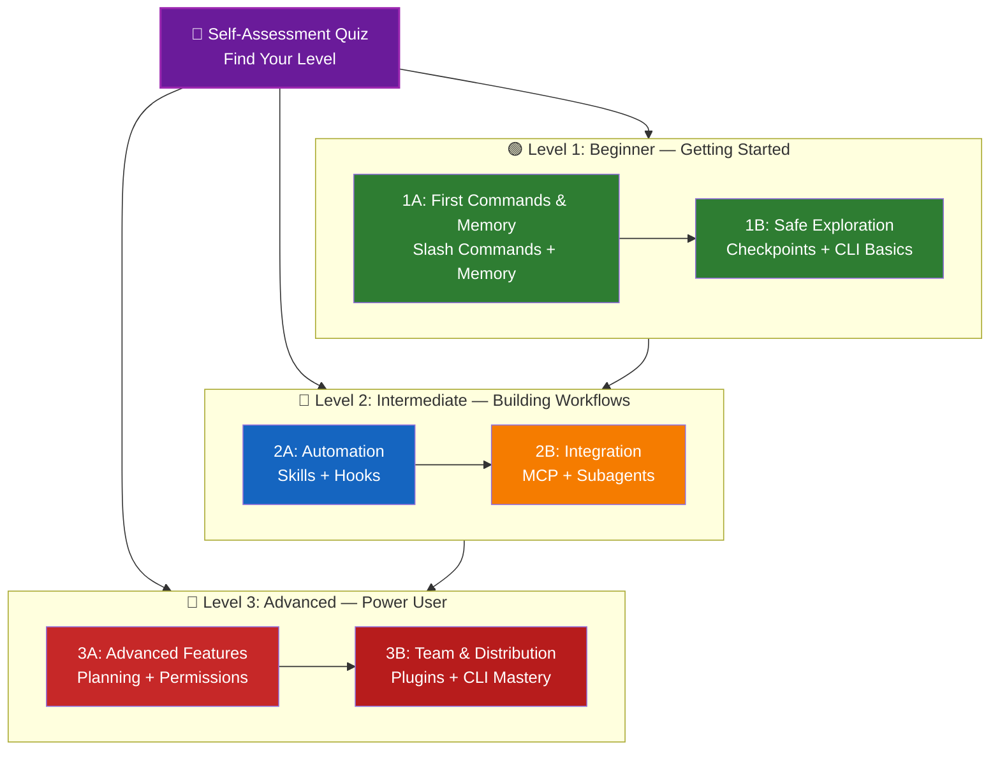

<picture>
  <source media="(prefers-color-scheme: dark)" srcset="resources/logos/claude-howto-logo-dark.svg">
  
</picture>

# 📚 Claude Code 학습 로드맵

**Claude Code가 처음이신가요?** 이 가이드는 자신의 속도에 맞춰 Claude Code 기능을 마스터할 수 있도록 도와줍니다. 완전한 초보자이든 경험 많은 개발자이든, 아래의 자가 평가 퀴즈로 시작하여 자신에게 맞는 경로를 찾아보세요.

---

## 🧭 나의 수준 찾기

모든 사람이 같은 출발점에서 시작하지는 않습니다. 이 간단한 자가 평가를 통해 적합한 시작점을 찾아보세요.

**다음 질문에 솔직하게 답해보세요:**

- [ ] Claude Code를 시작하고 대화를 나눌 수 있다 (`claude`)
- [ ] CLAUDE.md 파일을 생성하거나 편집한 적이 있다
- [ ] 내장 slash command를 3개 이상 사용한 적이 있다 (예: /help, /compact, /model)
- [ ] 커스텀 slash command 또는 skill(SKILL.md)을 만든 적이 있다
- [ ] MCP 서버를 설정한 적이 있다 (예: GitHub, 데이터베이스)
- [ ] ~/.claude/settings.json에 hooks를 설정한 적이 있다
- [ ] 커스텀 subagents(.claude/agents/)를 만들거나 사용한 적이 있다
- [ ] 스크립팅 또는 CI/CD에 print mode(`claude -p`)를 사용한 적이 있다

**나의 수준:**

| 체크 수 | 수준 | 시작 지점 | 완료 예상 시간 |
|--------|-------|----------|------------------|
| 0-2 | **Level 1: 초급** — 시작하기 | [Milestone 1A](#milestone-1a-first-commands--memory) | 약 3시간 |
| 3-5 | **Level 2: 중급** — 워크플로 구축 | [Milestone 2A](#milestone-2a-automation-skills--hooks) | 약 5시간 |
| 6-8 | **Level 3: 고급** — 파워 유저 & 팀 리더 | [Milestone 3A](#milestone-3a-advanced-features) | 약 5시간 |

> **팁**: 확실하지 않다면 한 단계 낮은 수준에서 시작하세요. 친숙한 내용을 빠르게 복습하는 것이 기초 개념을 놓치는 것보다 낫습니다.

> **인터랙티브 버전**: Claude Code에서 `/self-assessment`를 실행하면 10개 기능 영역 전체에 걸친 숙련도를 평가하고 개인 맞춤형 학습 경로를 생성해 주는 안내식 인터랙티브 퀴즈를 진행할 수 있습니다.

---

## 🎯 학습 철학

이 저장소의 폴더들은 세 가지 핵심 원칙에 따라 **권장 학습 순서**로 번호가 매겨져 있습니다:

1. **의존성** - 기초 개념이 먼저 옵니다
2. **복잡도** - 쉬운 기능을 고급 기능보다 먼저 다룹니다
3. **사용 빈도** - 가장 자주 쓰이는 기능을 먼저 가르칩니다

이 방식은 즉각적인 생산성 향상을 누리면서 탄탄한 기초를 쌓을 수 있도록 합니다.

---

## 🗺️ 나의 학습 경로



**색상 범례:**
- 💜 보라: 자가 평가 퀴즈
- 🟢 초록: Level 1 — 초급 경로
- 🔵 파랑 / 🟡 골드: Level 2 — 중급 경로
- 🔴 빨강: Level 3 — 고급 경로

---

## 📊 전체 로드맵 표

| 단계 | 기능 | 복잡도 | 시간 | 수준 | 의존성 | 학습 이유 | 주요 이점 |
|------|---------|-----------|------|-------|--------------|----------------|--------------|
| **1** | [Slash Commands](01-slash-commands/) | ⭐ 초급 | 30분 | Level 1 | 없음 | 즉각적인 생산성 향상 (55개 이상 내장 + 5개 번들 skills) | 즉시 자동화, 팀 표준 |
| **2** | [Memory](02-memory/) | ⭐⭐ 초급+ | 45분 | Level 1 | 없음 | 모든 기능의 기본 | 지속적인 컨텍스트, 선호 설정 |
| **3** | [Checkpoints](08-checkpoints/) | ⭐⭐ 중급 | 45분 | Level 1 | 세션 관리 | 안전한 탐색 | 실험, 복구 |
| **4** | [CLI 기초](10-cli/) | ⭐⭐ 초급+ | 30분 | Level 1 | 없음 | 핵심 CLI 사용법 | 인터랙티브 & print mode |
| **5** | [Skills](03-skills/) | ⭐⭐ 중급 | 1시간 | Level 2 | Slash Commands | 자동 전문성 | 재사용 가능한 기능, 일관성 |
| **6** | [Hooks](06-hooks/) | ⭐⭐ 중급 | 1시간 | Level 2 | 도구, 명령어 | 워크플로 자동화 (25개 이벤트, 4가지 타입) | 유효성 검사, 품질 게이트 |
| **7** | [MCP](05-mcp/) | ⭐⭐⭐ 중급+ | 1시간 | Level 2 | 설정 | 실시간 데이터 접근 | 실시간 통합, API |
| **8** | [Subagents](04-subagents/) | ⭐⭐⭐ 중급+ | 1.5시간 | Level 2 | Memory, Commands | 복잡한 작업 처리 (Bash 포함 내장 6개) | 위임, 전문화된 전문성 |
| **9** | [고급 기능](09-advanced-features/) | ⭐⭐⭐⭐⭐ 고급 | 2-3시간 | Level 3 | 이전 전체 | 파워 유저 도구 | 계획, Auto Mode, Channels, Voice Dictation, 권한 |
| **10** | [Plugins](07-plugins/) | ⭐⭐⭐⭐ 고급 | 2시간 | Level 3 | 이전 전체 | 완성된 솔루션 | 팀 온보딩, 배포 |
| **11** | [CLI 마스터](10-cli/) | ⭐⭐⭐ 고급 | 1시간 | Level 3 | 권장: 전체 | 커맨드라인 사용법 마스터 | 스크립팅, CI/CD, 자동화 |

**총 학습 시간**: 약 11-13시간 (또는 자신의 수준으로 바로 이동하여 시간 절약)

---

## 🟢 Level 1: 초급 — 시작하기

**대상**: 퀴즈 체크 수 0-2개인 사용자
**시간**: 약 3시간
**집중 사항**: 즉각적인 생산성, 기초 이해
**목표**: 편안한 일상 사용자가 되어 Level 2 준비 완료

### Milestone 1A: 첫 번째 명령어 & Memory

**주제**: Slash Commands + Memory
**시간**: 1-2시간
**복잡도**: ⭐ 초급
**목표**: 커스텀 명령어와 지속적인 컨텍스트로 즉각적인 생산성 향상

#### 달성 목표
✅ 반복 작업을 위한 커스텀 slash command 만들기
✅ 팀 표준을 위한 프로젝트 memory 설정
✅ 개인 선호 설정 구성
✅ Claude가 컨텍스트를 자동으로 불러오는 방식 이해

#### 실습 연습

```bash
# 연습 1: 첫 번째 slash command 설치
mkdir -p .claude/commands
cp 01-slash-commands/optimize.md .claude/commands/

# 연습 2: 프로젝트 memory 만들기
cp 02-memory/project-CLAUDE.md ./CLAUDE.md

# 연습 3: 직접 사용해보기
# Claude Code에서: /optimize 입력
```

#### 성공 기준
- [ ] `/optimize` 명령어를 성공적으로 실행
- [ ] Claude가 CLAUDE.md에서 프로젝트 표준을 기억함
- [ ] slash command와 memory를 언제 사용할지 이해함

#### 다음 단계
완료 후 읽어보기:
- [01-slash-commands/README.md](01-slash-commands/README.md)
- [02-memory/README.md](02-memory/README.md)

> **이해도 확인**: Claude Code에서 `/lesson-quiz slash-commands` 또는 `/lesson-quiz memory`를 실행하여 학습 내용을 테스트하세요.

---

### Milestone 1B: 안전한 탐색

**주제**: Checkpoints + CLI 기초
**시간**: 1시간
**복잡도**: ⭐⭐ 초급+
**목표**: 안전하게 실험하는 방법을 배우고 핵심 CLI 명령어 사용

#### 달성 목표
✅ 안전한 실험을 위한 checkpoints 생성 및 복원
✅ 인터랙티브 모드와 print mode 이해
✅ 기본 CLI 플래그 및 옵션 사용
✅ 파이핑을 통한 파일 처리

#### 실습 연습

```bash
# 연습 1: checkpoint 워크플로 시도
# Claude Code에서:
# 실험적인 변경을 한 후 Esc+Esc를 누르거나 /rewind 사용
# 실험 전 checkpoint를 선택
# "코드와 대화 복원"을 선택하여 되돌아가기

# 연습 2: 인터랙티브 모드 vs Print mode
claude "explain this project"           # 인터랙티브 모드
claude -p "explain this function"       # Print mode (비인터랙티브)

# 연습 3: 파이핑을 통한 파일 콘텐츠 처리
cat error.log | claude -p "explain this error"
```

#### 성공 기준
- [ ] checkpoint를 생성하고 복원함
- [ ] 인터랙티브 모드와 print mode를 모두 사용함
- [ ] 파일을 Claude에 파이핑하여 분석함
- [ ] 안전한 실험을 위해 checkpoints를 언제 사용하는지 이해함

#### 다음 단계
- 읽기: [08-checkpoints/README.md](08-checkpoints/README.md)
- 읽기: [10-cli/README.md](10-cli/README.md)
- **Level 2 준비 완료!** [Milestone 2A](#milestone-2a-automation-skills--hooks)로 진행

> **이해도 확인**: `/lesson-quiz checkpoints` 또는 `/lesson-quiz cli`를 실행하여 Level 2 준비가 되었는지 확인하세요.

---

## 🔵 Level 2: 중급 — 워크플로 구축

**대상**: 퀴즈 체크 수 3-5개인 사용자
**시간**: 약 5시간
**집중 사항**: 자동화, 통합, 작업 위임
**목표**: 자동화된 워크플로, 외부 통합, Level 3 준비 완료

### 사전 요건 확인

Level 2를 시작하기 전에 다음 Level 1 개념에 익숙한지 확인하세요:

- [ ] slash command를 만들고 사용할 수 있다 ([01-slash-commands/](01-slash-commands/))
- [ ] CLAUDE.md를 통해 프로젝트 memory를 설정했다 ([02-memory/](02-memory/))
- [ ] checkpoints를 만들고 복원하는 방법을 안다 ([08-checkpoints/](08-checkpoints/))
- [ ] 커맨드라인에서 `claude`와 `claude -p`를 사용할 수 있다 ([10-cli/](10-cli/))

> **부족한 부분이 있나요?** 계속 진행하기 전에 위 링크의 튜토리얼을 복습하세요.

---

### Milestone 2A: 자동화 (Skills + Hooks)

**주제**: Skills + Hooks
**시간**: 2-3시간
**복잡도**: ⭐⭐ 중급
**목표**: 일반적인 워크플로와 품질 검사 자동화

#### 달성 목표
✅ YAML frontmatter로 전문화된 기능 자동 호출 (`effort` 및 `shell` 필드 포함)
✅ 25개 hook 이벤트에 걸쳐 이벤트 기반 자동화 설정
✅ 4가지 hook 타입 모두 사용 (command, http, prompt, agent)
✅ 코드 품질 기준 적용
✅ 워크플로에 맞는 커스텀 hooks 생성

#### 실습 연습

```bash
# 연습 1: skill 설치
cp -r 03-skills/code-review ~/.claude/skills/

# 연습 2: hooks 설정
mkdir -p ~/.claude/hooks
cp 06-hooks/pre-tool-check.sh ~/.claude/hooks/
chmod +x ~/.claude/hooks/pre-tool-check.sh

# 연습 3: settings에서 hooks 구성
# ~/.claude/settings.json에 추가:
{
  "hooks": {
    "PreToolUse": [
      {
        "matcher": "Bash",
        "hooks": [
          {
            "type": "command",
            "command": "~/.claude/hooks/pre-tool-check.sh"
          }
        ]
      }
    ]
  }
}
```

#### 성공 기준
- [ ] 관련 시점에 코드 리뷰 skill이 자동으로 호출됨
- [ ] 도구 실행 전 PreToolUse hook이 실행됨
- [ ] skill 자동 호출과 hook 이벤트 트리거의 차이를 이해함

#### 다음 단계
- 자신만의 커스텀 skill 만들기
- 워크플로에 맞는 추가 hooks 설정
- 읽기: [03-skills/README.md](03-skills/README.md)
- 읽기: [06-hooks/README.md](06-hooks/README.md)

> **이해도 확인**: 다음 단계로 넘어가기 전에 `/lesson-quiz skills` 또는 `/lesson-quiz hooks`를 실행하여 지식을 테스트하세요.

---

### Milestone 2B: 통합 (MCP + Subagents)

**주제**: MCP + Subagents
**시간**: 2-3시간
**복잡도**: ⭐⭐⭐ 중급+
**목표**: 외부 서비스 통합 및 복잡한 작업 위임

#### 달성 목표
✅ GitHub, 데이터베이스 등에서 실시간 데이터 접근
✅ 전문화된 AI 에이전트에 작업 위임
✅ MCP와 subagents를 언제 사용할지 이해
✅ 통합된 워크플로 구축

#### 실습 연습

```bash
# 연습 1: GitHub MCP 설정
export GITHUB_TOKEN="your_github_token"
claude mcp add github -- npx -y @modelcontextprotocol/server-github

# 연습 2: MCP 통합 테스트
# Claude Code에서: /mcp__github__list_prs

# 연습 3: subagents 설치
mkdir -p .claude/agents
cp 04-subagents/*.md .claude/agents/
```

#### 통합 연습
다음 전체 워크플로를 시도해보세요:
1. MCP를 사용하여 GitHub PR 가져오기
2. Claude가 코드 리뷰를 code-reviewer subagent에 위임하도록 하기
3. hooks를 사용하여 테스트 자동 실행

#### 성공 기준
- [ ] MCP를 통해 GitHub 데이터를 성공적으로 조회
- [ ] Claude가 복잡한 작업을 subagents에 위임함
- [ ] MCP와 subagents의 차이를 이해함
- [ ] 워크플로에서 MCP + subagents + hooks를 결합함

#### 다음 단계
- 추가 MCP 서버 설정 (데이터베이스, Slack 등)
- 자신의 도메인에 맞는 커스텀 subagents 만들기
- 읽기: [05-mcp/README.md](05-mcp/README.md)
- 읽기: [04-subagents/README.md](04-subagents/README.md)
- **Level 3 준비 완료!** [Milestone 3A](#milestone-3a-advanced-features)로 진행

> **이해도 확인**: `/lesson-quiz mcp` 또는 `/lesson-quiz subagents`를 실행하여 Level 3 준비가 되었는지 확인하세요.

---

## 🔴 Level 3: 고급 — 파워 유저 & 팀 리더

**대상**: 퀴즈 체크 수 6-8개인 사용자
**시간**: 약 5시간
**집중 사항**: 팀 도구, CI/CD, 엔터프라이즈 기능, 플러그인 개발
**목표**: 파워 유저, 팀 워크플로 및 CI/CD 설정 가능

### 사전 요건 확인

Level 3를 시작하기 전에 다음 Level 2 개념에 익숙한지 확인하세요:

- [ ] 자동 호출이 포함된 skills를 만들고 사용할 수 있다 ([03-skills/](03-skills/))
- [ ] 이벤트 기반 자동화를 위한 hooks를 설정했다 ([06-hooks/](06-hooks/))
- [ ] 외부 데이터를 위한 MCP 서버를 설정할 수 있다 ([05-mcp/](05-mcp/))
- [ ] 작업 위임을 위한 subagents 사용 방법을 안다 ([04-subagents/](04-subagents/))

> **부족한 부분이 있나요?** 계속 진행하기 전에 위 링크의 튜토리얼을 복습하세요.

---

### Milestone 3A: 고급 기능

**주제**: 고급 기능 (계획, 권한, Extended Thinking, Auto Mode, Channels, Voice Dictation, Remote/Desktop/Web)
**시간**: 2-3시간
**복잡도**: ⭐⭐⭐⭐⭐ 고급
**목표**: 고급 워크플로와 파워 유저 도구 마스터

#### 달성 목표
✅ 복잡한 기능을 위한 계획 모드
✅ 6가지 모드의 세밀한 권한 제어 (default, acceptEdits, plan, auto, dontAsk, bypassPermissions)
✅ Alt+T / Option+T 토글을 통한 Extended thinking
✅ 백그라운드 작업 관리
✅ 학습된 선호 설정을 위한 Auto Memory
✅ 백그라운드 안전 분류기를 갖춘 Auto Mode
✅ 구조화된 멀티 세션 워크플로를 위한 Channels
✅ 핸즈프리 상호작용을 위한 Voice Dictation
✅ 원격 제어, 데스크톱 앱, 웹 세션
✅ 멀티 에이전트 협업을 위한 Agent Teams

#### 실습 연습

```bash
# 연습 1: 계획 모드 사용
/plan Implement user authentication system

# 연습 2: 권한 모드 시도 (6가지 제공: default, acceptEdits, plan, auto, dontAsk, bypassPermissions)
claude --permission-mode plan "analyze this codebase"
claude --permission-mode acceptEdits "refactor the auth module"
claude --permission-mode auto "implement the feature"

# 연습 3: extended thinking 활성화
# 세션 중 Alt+T (macOS에서는 Option+T)를 눌러 토글

# 연습 4: 고급 checkpoint 워크플로
# 1. "깨끗한 상태" checkpoint 생성
# 2. 계획 모드를 사용하여 기능 설계
# 3. subagent 위임으로 구현
# 4. 백그라운드에서 테스트 실행
# 5. 테스트 실패 시 checkpoint로 되감기
# 6. 대안적 접근 시도

# 연습 5: auto mode 시도 (백그라운드 안전 분류기)
claude --permission-mode auto "implement user settings page"

# 연습 6: agent teams 활성화
export CLAUDE_AGENT_TEAMS=1
# Claude에게 요청: "팀 방식으로 기능 X를 구현해줘"

# 연습 7: 예약된 작업
/loop 5m /check-status
# 또는 지속적인 예약 작업을 위해 CronCreate 사용

# 연습 8: 멀티 세션 워크플로를 위한 Channels
# Channels를 사용하여 세션 간 작업 정리

# 연습 9: Voice Dictation
# Claude Code와의 핸즈프리 상호작용을 위한 음성 입력 사용
```

#### 성공 기준
- [ ] 복잡한 기능에 계획 모드를 사용함
- [ ] 권한 모드를 구성함 (plan, acceptEdits, auto, dontAsk)
- [ ] Alt+T / Option+T로 extended thinking을 토글함
- [ ] 백그라운드 안전 분류기와 함께 auto mode를 사용함
- [ ] 긴 작업에 백그라운드 작업을 사용함
- [ ] 멀티 세션 워크플로를 위한 Channels를 탐색함
- [ ] 핸즈프리 입력을 위한 Voice Dictation을 시도함
- [ ] Remote Control, Desktop App, 웹 세션을 이해함
- [ ] 협업 작업을 위해 Agent Teams를 활성화하고 사용함
- [ ] 반복 작업이나 예약된 모니터링을 위해 `/loop`를 사용함

#### 다음 단계
- 읽기: [09-advanced-features/README.md](09-advanced-features/README.md)

> **이해도 확인**: `/lesson-quiz advanced`를 실행하여 파워 유저 기능에 대한 숙련도를 테스트하세요.

---

### Milestone 3B: 팀 & 배포 (Plugins + CLI 마스터)

**주제**: Plugins + CLI 마스터 + CI/CD
**시간**: 2-3시간
**복잡도**: ⭐⭐⭐⭐ 고급
**목표**: 팀 도구 구축, 플러그인 생성, CI/CD 통합 마스터

#### 달성 목표
✅ 완전한 번들 plugins 설치 및 생성
✅ 스크립팅 및 자동화를 위한 CLI 마스터
✅ `claude -p`로 CI/CD 통합 설정
✅ 자동화 파이프라인을 위한 JSON 출력
✅ 세션 관리 및 배치 처리

#### 실습 연습

```bash
# 연습 1: 완전한 plugin 설치
# Claude Code에서: /plugin install pr-review

# 연습 2: CI/CD를 위한 print mode
claude -p "Run all tests and generate report"

# 연습 3: 스크립트를 위한 JSON 출력
claude -p --output-format json "list all functions"

# 연습 4: 세션 관리 및 재개
claude -r "feature-auth" "continue implementation"

# 연습 5: 제약 조건이 있는 CI/CD 통합
claude -p --max-turns 3 --output-format json "review code"

# 연습 6: 배치 처리
for file in *.md; do
  claude -p --output-format json "summarize this: $(cat $file)" > ${file%.md}.summary.json
done
```

#### CI/CD 통합 연습
간단한 CI/CD 스크립트 만들기:
1. `claude -p`를 사용하여 변경된 파일 검토
2. 결과를 JSON으로 출력
3. 특정 문제를 위해 `jq`로 처리
4. GitHub Actions 워크플로에 통합

#### 성공 기준
- [ ] plugin을 설치하고 사용함
- [ ] 팀을 위한 plugin을 만들거나 수정함
- [ ] CI/CD에서 print mode(`claude -p`)를 사용함
- [ ] 스크립팅을 위한 JSON 출력을 생성함
- [ ] 이전 세션을 성공적으로 재개함
- [ ] 배치 처리 스크립트를 만듦
- [ ] Claude를 CI/CD 워크플로에 통합함

#### CLI의 실제 활용 사례
- **코드 리뷰 자동화**: CI/CD 파이프라인에서 코드 리뷰 실행
- **로그 분석**: 오류 로그 및 시스템 출력 분석
- **문서 생성**: 문서를 배치로 자동 생성
- **테스트 인사이트**: 테스트 실패 분석
- **성능 분석**: 성능 지표 검토
- **데이터 처리**: 데이터 파일 변환 및 분석

#### 다음 단계
- 읽기: [07-plugins/README.md](07-plugins/README.md)
- 읽기: [10-cli/README.md](10-cli/README.md)
- 팀 전체 CLI 단축키 및 plugins 만들기
- 배치 처리 스크립트 설정

> **이해도 확인**: `/lesson-quiz plugins` 또는 `/lesson-quiz cli`를 실행하여 숙련도를 확인하세요.

---

## 🧪 지식 테스트

이 저장소에는 Claude Code에서 언제든지 사용하여 이해도를 평가할 수 있는 두 가지 인터랙티브 skills이 포함되어 있습니다:

| Skill | 명령어 | 목적 |
|-------|---------|---------|
| **Self-Assessment** | `/self-assessment` | 10개 기능 전반에 걸친 전반적인 숙련도를 평가합니다. Quick (2분) 또는 Deep (5분) 모드를 선택하여 개인 맞춤형 스킬 프로파일 및 학습 경로를 얻으세요. |
| **Lesson Quiz** | `/lesson-quiz [lesson]` | 10개의 질문으로 특정 레슨의 이해도를 테스트합니다. 레슨 전 (사전 테스트), 진행 중 (진도 확인), 또는 이후 (숙련도 검증)에 사용하세요. |

**예시:**
```
/self-assessment                  # 전반적인 수준 확인
/lesson-quiz hooks                # 레슨 06 Hooks 퀴즈
/lesson-quiz 03                   # 레슨 03 Skills 퀴즈
/lesson-quiz advanced-features    # 레슨 09 퀴즈
```

---

## ⚡ 빠른 시작 경로

### 15분밖에 없다면
**목표**: 첫 번째 성과 달성

1. slash command 복사: `cp 01-slash-commands/optimize.md .claude/commands/`
2. Claude Code에서 시도: `/optimize`
3. 읽기: [01-slash-commands/README.md](01-slash-commands/README.md)

**결과**: 작동하는 slash command를 갖게 되고 기본을 이해하게 됩니다

---

### 1시간이 있다면
**목표**: 필수 생산성 도구 설정

1. **Slash commands** (15분): `/optimize` 및 `/pr` 복사 및 테스트
2. **프로젝트 memory** (15분): 프로젝트 표준으로 CLAUDE.md 만들기
3. **Skill 설치** (15분): code-review skill 설정
4. **함께 사용해보기** (15분): 세 가지가 어떻게 조화롭게 작동하는지 확인

**결과**: 명령어, memory, auto-skills를 통한 기본 생산성 향상

---

### 주말이 있다면
**목표**: 대부분의 기능에 능숙해지기

**토요일 오전** (3시간):
- Milestone 1A 완료: Slash Commands + Memory
- Milestone 1B 완료: Checkpoints + CLI 기초

**토요일 오후** (3시간):
- Milestone 2A 완료: Skills + Hooks
- Milestone 2B 완료: MCP + Subagents

**일요일** (4시간):
- Milestone 3A 완료: 고급 기능
- Milestone 3B 완료: Plugins + CLI 마스터 + CI/CD
- 팀을 위한 커스텀 plugin 만들기

**결과**: 다른 사람을 교육하고 복잡한 워크플로를 자동화할 준비가 된 Claude Code 파워 유저가 됩니다

---

## 💡 학습 팁

### ✅ 해야 할 것

- **먼저 퀴즈를 풀어** 시작점을 찾으세요
- **각 milestone의 실습 연습을 완료**하세요
- **간단하게 시작**하고 점진적으로 복잡성을 높이세요
- **다음으로 넘어가기 전에 각 기능을 테스트**하세요
- **메모를 작성**하여 워크플로에 맞는 내용을 기록하세요
- **고급 주제를 배울 때 이전 개념을 참조**하세요
- **checkpoints를 사용하여 안전하게 실험**하세요
- **팀과 지식을 공유**하세요

### ❌ 하지 말아야 할 것

- **높은 수준으로 건너뛸 때 사전 요건 확인을 건너뛰지** 마세요
- **모든 것을 한꺼번에 배우려 하지** 마세요 — 압도됩니다
- **이해 없이 설정을 복사하지** 마세요 — 디버깅 방법을 모르게 됩니다
- **테스트를 잊지** 마세요 — 항상 기능이 작동하는지 확인하세요
- **milestone을 서두르지** 마세요 — 이해할 시간을 가지세요
- **문서를 무시하지** 마세요 — 각 README에는 중요한 세부 정보가 있습니다
- **혼자 작업하지** 마세요 — 팀원과 논의하세요

---

## 🎓 학습 스타일

### 시각적 학습자
- 각 README의 Mermaid 다이어그램을 공부하세요
- 명령어 실행 흐름을 관찰하세요
- 자신만의 워크플로 다이어그램을 그려보세요
- 위의 시각적 학습 경로를 활용하세요

### 실습형 학습자
- 모든 실습 연습을 완료하세요
- 변형을 실험해보세요
- 망가뜨리고 고쳐보세요 (checkpoints를 사용하세요!)
- 자신만의 예시를 만들어보세요

### 읽기형 학습자
- 각 README를 꼼꼼히 읽으세요
- 코드 예시를 공부하세요
- 비교 표를 검토하세요
- 리소스에 링크된 블로그 포스트를 읽으세요

### 소셜형 학습자
- 페어 프로그래밍 세션을 설정하세요
- 팀원에게 개념을 가르쳐보세요
- Claude Code 커뮤니티 토론에 참여하세요
- 커스텀 설정을 공유하세요

---

## 📈 진도 추적

다음 체크리스트를 사용하여 수준별 진도를 추적하세요. 언제든지 `/self-assessment`를 실행하여 업데이트된 스킬 프로파일을 얻거나, 각 튜토리얼 후 `/lesson-quiz [lesson]`를 실행하여 이해도를 확인하세요.

### 🟢 Level 1: 초급
- [ ] [01-slash-commands](01-slash-commands/) 완료
- [ ] [02-memory](02-memory/) 완료
- [ ] 첫 번째 커스텀 slash command 생성
- [ ] 프로젝트 memory 설정
- [ ] **Milestone 1A 달성**
- [ ] [08-checkpoints](08-checkpoints/) 완료
- [ ] [10-cli](10-cli/) 기초 완료
- [ ] checkpoint 생성 및 복원
- [ ] 인터랙티브 모드와 print mode 사용
- [ ] **Milestone 1B 달성**

### 🔵 Level 2: 중급
- [ ] [03-skills](03-skills/) 완료
- [ ] [06-hooks](06-hooks/) 완료
- [ ] 첫 번째 skill 설치
- [ ] PreToolUse hook 설정
- [ ] **Milestone 2A 달성**
- [ ] [05-mcp](05-mcp/) 완료
- [ ] [04-subagents](04-subagents/) 완료
- [ ] GitHub MCP 연결
- [ ] 커스텀 subagent 생성
- [ ] 워크플로에서 통합 기능 결합
- [ ] **Milestone 2B 달성**

### 🔴 Level 3: 고급
- [ ] [09-advanced-features](09-advanced-features/) 완료
- [ ] 계획 모드를 성공적으로 사용
- [ ] 권한 모드 구성 (auto 포함 6가지 모드)
- [ ] 안전 분류기와 함께 auto mode 사용
- [ ] extended thinking 토글 사용
- [ ] Channels 및 Voice Dictation 탐색
- [ ] **Milestone 3A 달성**
- [ ] [07-plugins](07-plugins/) 완료
- [ ] [10-cli](10-cli/) 고급 사용 완료
- [ ] print mode(`claude -p`) CI/CD 설정
- [ ] 자동화를 위한 JSON 출력 생성
- [ ] Claude를 CI/CD 파이프라인에 통합
- [ ] 팀 plugin 생성
- [ ] **Milestone 3B 달성**

---

## 🆘 일반적인 학습 과제

### 과제 1: "한꺼번에 너무 많은 개념"
**해결책**: 한 번에 하나의 milestone에 집중하세요. 다음으로 넘어가기 전에 모든 연습을 완료하세요.

### 과제 2: "어떤 기능을 언제 사용할지 모르겠다"
**해결책**: 메인 README의 [사용 사례 매트릭스](README.md#use-case-matrix)를 참조하세요.

### 과제 3: "설정이 작동하지 않는다"
**해결책**: [문제 해결](README.md#troubleshooting) 섹션을 확인하고 파일 위치를 검증하세요.

### 과제 4: "개념이 겹치는 것 같다"
**해결책**: [기능 비교](README.md#feature-comparison) 표를 검토하여 차이점을 이해하세요.

### 과제 5: "모든 것을 기억하기 어렵다"
**해결책**: 자신만의 치트 시트를 만드세요. 안전한 실험을 위해 checkpoints를 사용하세요.

### 과제 6: "경험은 있지만 어디서 시작할지 모르겠다"
**해결책**: 위의 [자가 평가 퀴즈](#-find-your-level)를 풀어보세요. 자신의 수준으로 건너뛰고 사전 요건 확인을 통해 부족한 부분을 파악하세요.

---

## 🎯 완료 후 다음은?

모든 milestone을 완료한 후:

1. **팀 문서 작성** — 팀의 Claude Code 설정 문서화
2. **커스텀 plugins 구축** — 팀의 워크플로 패키징
3. **Remote Control 탐색** — 외부 도구에서 프로그래밍 방식으로 Claude Code 세션 제어
4. **Web Sessions 시도** — 원격 개발을 위한 브라우저 기반 인터페이스로 Claude Code 사용
5. **Desktop App 사용** — 네이티브 데스크톱 애플리케이션을 통한 Claude Code 기능 접근
6. **Auto Mode 사용** — 백그라운드 안전 분류기로 Claude가 자율적으로 작업하도록 하기
7. **Auto Memory 활용** — 시간이 지남에 따라 Claude가 선호 설정을 자동으로 학습하도록 하기
8. **Agent Teams 설정** — 복잡하고 다면적인 작업에서 여러 에이전트 조율
9. **Channels 사용** — 구조화된 멀티 세션 워크플로 전반에 걸쳐 작업 정리
10. **Voice Dictation 시도** — Claude Code와의 상호작용에 핸즈프리 음성 입력 사용
11. **예약된 작업 사용** — `/loop`와 cron 도구로 반복적인 체크 자동화
12. **예시 기여** — 커뮤니티와 공유
13. **다른 사람 멘토링** — 팀원 학습 지원
14. **워크플로 최적화** — 사용 패턴에 따라 지속적으로 개선
15. **최신 정보 유지** — Claude Code 릴리스 및 새 기능 팔로우

---

## 📚 추가 리소스

### 공식 문서
- [Claude Code 문서](https://code.claude.com/docs/en/overview)
- [Anthropic 문서](https://docs.anthropic.com)
- [MCP 프로토콜 사양](https://modelcontextprotocol.io)

### 블로그 포스트
- [Discovering Claude Code Slash Commands](https://medium.com/@luongnv89/discovering-claude-code-slash-commands-cdc17f0dfb29)

### 커뮤니티
- [Anthropic Cookbook](https://github.com/anthropics/anthropic-cookbook)
- [MCP Servers 저장소](https://github.com/modelcontextprotocol/servers)

---

## 💬 피드백 & 지원

- **문제를 발견하셨나요?** 저장소에 이슈를 생성하세요
- **제안이 있으신가요?** 풀 리퀘스트를 제출하세요
- **도움이 필요하신가요?** 문서를 확인하거나 커뮤니티에 질문하세요

---

**마지막 업데이트**: 2026년 3월
**관리자**: Claude How-To Contributors
**라이선스**: 교육 목적, 자유롭게 사용 및 수정 가능

---

[← 메인 README로 돌아가기](README.md)
