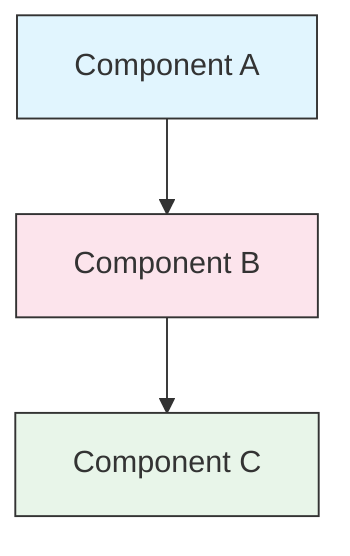

<picture>
  <source media="(prefers-color-scheme: dark)" srcset="resources/logos/claude-howto-logo-dark.svg">
  
</picture>

# Style Guide

> Claude How To 기여를 위한 컨벤션과 포맷 규칙. 이 가이드를 따라 콘텐츠를 일관성 있고 전문적이며 유지보수하기 쉽게 유지하세요.

---

## 목차

- [파일 및 폴더 이름](#file-and-folder-naming)
- [문서 구조](#document-structure)
- [제목](#headings)
- [텍스트 서식](#text-formatting)
- [목록](#lists)
- [표](#tables)
- [코드 블록](#code-blocks)
- [링크 및 교차 참조](#links-and-cross-references)
- [다이어그램](#diagrams)
- [이모지 사용](#emoji-usage)
- [YAML Frontmatter](#yaml-frontmatter)
- [이미지 및 미디어](#images-and-media)
- [어조와 문체](#tone-and-voice)
- [커밋 메시지](#commit-messages)
- [작성자 체크리스트](#checklist-for-authors)

---

## 파일 및 폴더 이름

### 레슨 폴더

레슨 폴더는 **두 자리 숫자 접두사** 뒤에 **kebab-case** 설명어를 사용합니다:

```
01-slash-commands/
02-memory/
03-skills/
04-subagents/
05-mcp/
```

숫자는 초급부터 고급까지의 학습 경로 순서를 반영합니다.

### 파일 이름

| 유형 | 컨벤션 | 예시 |
|------|-----------|----------|
| **레슨 README** | `README.md` | `01-slash-commands/README.md` |
| **기능 파일** | Kebab-case `.md` | `code-reviewer.md`, `generate-api-docs.md` |
| **셸 스크립트** | Kebab-case `.sh` | `format-code.sh`, `validate-input.sh` |
| **설정 파일** | 표준 이름 | `.mcp.json`, `settings.json` |
| **메모리 파일** | 범위 접두사 | `project-CLAUDE.md`, `personal-CLAUDE.md` |
| **최상위 문서** | UPPER_CASE `.md` | `CATALOG.md`, `QUICK_REFERENCE.md`, `CONTRIBUTING.md` |
| **이미지 자산** | Kebab-case | `pr-slash-command.png`, `claude-howto-logo.svg` |

### 규칙

- 모든 파일 및 폴더 이름에 **소문자** 사용 (`README.md`, `CATALOG.md` 등 최상위 문서 제외)
- 단어 구분자로 **하이픈** (`-`) 사용, 밑줄이나 공백 금지
- 이름을 설명적이지만 간결하게 유지

---

## 문서 구조

### 루트 README

루트 `README.md`는 다음 순서를 따릅니다:

1. 로고 (다크/라이트 변형이 있는 `<picture>` 요소)
2. H1 제목
3. 소개 인용구 (한 줄 가치 제안)
4. "왜 이 가이드인가?" 섹션 (비교 표 포함)
5. 수평선 (`---`)
6. 목차
7. 기능 카탈로그
8. 빠른 탐색
9. 학습 경로
10. 기능 섹션
11. 시작하기
12. 모범 사례 / 문제 해결
13. 기여 / 라이선스

### 레슨 README

각 레슨 `README.md`는 다음 순서를 따릅니다:

1. H1 제목 (예: `# Slash Commands`)
2. 간략한 개요 단락
3. 빠른 참조 표 (선택)
4. 아키텍처 다이어그램 (Mermaid)
5. 상세 섹션 (H2)
6. 실용적인 예제 (번호 매기기, 4-6개)
7. 모범 사례 (Do's and Don'ts 표)
8. 문제 해결
9. 관련 가이드 / 공식 문서
10. 문서 메타데이터 푸터

### 기능/예제 파일

개별 기능 파일 (예: `optimize.md`, `pr.md`):

1. YAML frontmatter (해당하는 경우)
2. H1 제목
3. 목적 / 설명
4. 사용 지침
5. 코드 예제
6. 커스터마이징 팁

### 섹션 구분선

주요 문서 영역을 구분하는 데 수평선 (`---`)을 사용하세요:

```markdown
---

## 새 주요 섹션
```

소개 인용구 뒤와 논리적으로 구별되는 문서 부분 사이에 배치하세요.

---

## 제목

### 계층 구조

| 레벨 | 사용 | 예시 |
|-------|-----|---------|
| `#` H1 | 페이지 제목 (문서당 하나) | `# Slash Commands` |
| `##` H2 | 주요 섹션 | `## Best Practices` |
| `###` H3 | 하위 섹션 | `### Adding a Skill` |
| `####` H4 | 하위 하위 섹션 (드물게) | `#### Configuration Options` |

### 규칙

- **문서당 H1 하나** — 페이지 제목만
- **레벨을 건너뛰지 말 것** — H2에서 H4로 점프 금지
- **제목을 간결하게** — 2-5단어 목표
- **문장 대소문자 사용** — 첫 단어와 고유 명사만 대문자 (기능 이름은 그대로 유지)
- **루트 README 섹션 헤더에만 이모지 접두사 추가** ([이모지 사용](#emoji-usage) 참고)

---

## 텍스트 서식

### 강조

| 스타일 | 사용 시점 | 예시 |
|-------|------------|---------|
| **굵게** (`**text**`) | 핵심 용어, 표의 레이블, 중요한 개념 | `**Installation**:` |
| *기울임* (`*text*`) | 기술 용어 첫 등장, 책/문서 제목 | `*frontmatter*` |
| `코드` (`` `text` ``) | 파일 이름, 명령어, 설정 값, 코드 참조 | `` `CLAUDE.md` `` |

### 콜아웃을 위한 인용구

중요한 메모에는 굵은 접두사가 있는 인용구를 사용하세요:

```markdown
> **Note**: Custom slash commands have been merged into skills since v2.0.

> **Important**: Never commit API keys or credentials.

> **Tip**: Combine memory with skills for maximum effectiveness.
```

지원되는 콜아웃 유형: **Note**, **Important**, **Tip**, **Warning**.

### 단락

- 단락을 짧게 유지 (2-4문장)
- 단락 사이에 빈 줄 추가
- 핵심 내용을 먼저, 그 다음 문맥 제공
- "무엇"이 아닌 "왜"를 설명

---

## 목록

### 순서 없는 목록

중첩에는 2칸 들여쓰기로 대시 (`-`)를 사용하세요:

```markdown
- 첫 번째 항목
- 두 번째 항목
  - 중첩 항목
  - 또 다른 중첩 항목
    - 깊은 중첩 (3단계 이상 피할 것)
- 세 번째 항목
```

### 순서 있는 목록

순차적 단계, 지침, 순위 항목에는 번호 목록을 사용하세요:

```markdown
1. 첫 번째 단계
2. 두 번째 단계
   - 하위 세부 사항
   - 또 다른 하위 내용
3. 세 번째 단계
```

### 설명 목록

키-값 스타일 목록에는 굵은 레이블을 사용하세요:

```markdown
- **성능 병목** - O(n^2) 연산, 비효율적인 루프 식별
- **메모리 누수** - 해제되지 않은 리소스, 순환 참조 찾기
- **알고리즘 개선** - 더 나은 알고리즘이나 데이터 구조 제안
```

### 규칙

- 일관된 들여쓰기 유지 (레벨당 2칸)
- 목록 앞뒤에 빈 줄 추가
- 목록 항목은 구조가 병렬을 이루도록 유지 (모두 동사로 시작하거나, 모두 명사이거나 등)
- 3단계 이상 중첩 금지

---

## 표

### 표준 형식

```markdown
| 열 1 | 열 2 | 열 3 |
|----------|----------|----------|
| 데이터   | 데이터   | 데이터   |
```

### 일반적인 표 패턴

**기능 비교 (3-4열):**

```markdown
| Feature | Invocation | Persistence | Best For |
|---------|-----------|------------|----------|
| **Slash Commands** | Manual (`/cmd`) | Session only | Quick shortcuts |
| **Memory** | Auto-loaded | Cross-session | Long-term learning |
```

**Do's and Don'ts:**

```markdown
| Do | Don't |
|----|-------|
| Use descriptive names | Use vague names |
| Keep files focused | Overload a single file |
```

**빠른 참조:**

```markdown
| Aspect | Details |
|--------|---------|
| **Purpose** | Generate API documentation |
| **Scope** | Project-level |
| **Complexity** | Intermediate |
```

### 규칙

- 첫 번째 열이 행 레이블인 경우 **표 헤더를 굵게**
- 소스에서 파이프를 정렬하여 가독성 향상 (선택이지만 권장)
- 셀 내용을 간결하게 유지; 세부 사항에는 링크 사용
- 셀 내 명령어와 파일 경로에 `코드 형식` 사용

---

## 코드 블록

### 언어 태그

구문 강조를 위해 항상 언어 태그를 지정하세요:

| 언어 | 태그 | 사용 대상 |
|----------|-----|---------|
| Shell | `bash` | CLI 명령어, 스크립트 |
| Python | `python` | Python 코드 |
| JavaScript | `javascript` | JS 코드 |
| TypeScript | `typescript` | TS 코드 |
| JSON | `json` | 설정 파일 |
| YAML | `yaml` | Frontmatter, 설정 |
| Markdown | `markdown` | 마크다운 예제 |
| SQL | `sql` | 데이터베이스 쿼리 |
| 일반 텍스트 | (태그 없음) | 예상 출력, 디렉토리 트리 |

### 컨벤션

```bash
# 명령어가 하는 것을 설명하는 주석
claude mcp add notion --transport http https://mcp.notion.com/mcp
```

- 명확하지 않은 명령어 앞에 **주석 줄** 추가
- 모든 예제를 **복사-붙여넣기 바로 사용 가능**하게 만들기
- 관련 있을 때 **단순한 버전과 고급 버전 모두** 제시
- 이해에 도움이 될 때 **예상 출력 포함** (태그 없는 코드 블록 사용)

### 설치 블록

설치 지침에는 다음 패턴을 사용하세요:

```bash
# 프로젝트에 파일 복사
cp 01-slash-commands/*.md .claude/commands/
```

### 다단계 워크플로우

```bash
# 1단계: 디렉토리 생성
mkdir -p .claude/commands

# 2단계: 템플릿 복사
cp 01-slash-commands/*.md .claude/commands/

# 3단계: 설치 확인
ls .claude/commands/
```

---

## 링크 및 교차 참조

### 내부 링크 (상대 경로)

모든 내부 링크에는 상대 경로를 사용하세요:

```markdown
[Slash Commands](01-slash-commands/)
[Skills Guide](03-skills/)
[Memory Architecture](02-memory/#memory-architecture)
```

레슨 폴더에서 루트 또는 형제 폴더로:

```markdown
[Back to main guide](../README.md)
[Related: Skills](../03-skills/)
```

### 외부 링크 (절대 경로)

설명적인 앵커 텍스트와 함께 전체 URL을 사용하세요:

```markdown
[Anthropic's official documentation](https://code.claude.com/docs/en/overview)
```

- "여기를 클릭" 또는 "이 링크"를 앵커 텍스트로 사용하지 말 것
- 문맥 없이도 의미가 통하는 설명적인 텍스트 사용

### 섹션 앵커

GitHub 스타일 앵커를 사용하여 같은 문서 내 섹션으로 링크하세요:

```markdown
[Feature Catalog](#-feature-catalog)
[Best Practices](#best-practices)
```

### 관련 가이드 패턴

레슨 마지막에 관련 가이드 섹션을 추가하세요:

```markdown
## Related Guides

- [Slash Commands](../01-slash-commands/) - Quick shortcuts
- [Memory](../02-memory/) - Persistent context
- [Skills](../03-skills/) - Reusable capabilities
```

---

## 다이어그램

### Mermaid

모든 다이어그램에 Mermaid를 사용하세요. 지원되는 유형:

- `graph TB` / `graph LR` — 아키텍처, 계층 구조, 흐름
- `sequenceDiagram` — 상호 작용 흐름
- `timeline` — 시간 순서 시퀀스

### 스타일 컨벤션

스타일 블록을 사용하여 일관된 색상을 적용하세요:



**색상 팔레트:**

| 색상 | Hex | 사용 대상 |
|-------|-----|---------|
| 연한 파랑 | `#e1f5fe` | 주요 컴포넌트, 입력 |
| 연한 분홍 | `#fce4ec` | 처리, 미들웨어 |
| 연한 초록 | `#e8f5e9` | 출력, 결과 |
| 연한 노랑 | `#fff9c4` | 설정, 선택 사항 |
| 연한 보라 | `#f3e5f5` | 사용자 대면, UI |

### 규칙

- 노드 레이블에 `["Label text"]` 사용 (특수 문자 허용)
- 레이블 내 줄 바꿈에 `<br/>` 사용
- 다이어그램을 단순하게 유지 (최대 10-12개 노드)
- 접근성을 위해 다이어그램 아래에 간략한 텍스트 설명 추가
- 계층 구조에는 위-아래 (`TB`), 워크플로우에는 왼-오른 (`LR`) 사용

---

## 이모지 사용

### 이모지를 사용하는 곳

이모지는 **아껴서 목적에 맞게** 사용합니다 — 특정 컨텍스트에서만:

| 컨텍스트 | 이모지 | 예시 |
|---------|--------|---------|
| 루트 README 섹션 헤더 | 카테고리 아이콘 | `## 📚 Learning Path` |
| 스킬 레벨 표시 | 색상 원 | 🟢 Beginner, 🔵 Intermediate, 🔴 Advanced |
| Do's and Don'ts | 체크/엑스 표시 | ✅ Do this, ❌ Don't do this |
| 복잡도 등급 | 별 | ⭐⭐⭐ |

### 표준 이모지 세트

| 이모지 | 의미 |
|-------|---------|
| 📚 | 학습, 가이드, 문서 |
| ⚡ | 시작하기, 빠른 참조 |
| 🎯 | 기능, 빠른 참조 |
| 🎓 | 학습 경로 |
| 📊 | 통계, 비교 |
| 🚀 | 설치, 빠른 명령어 |
| 🟢 | 초급 레벨 |
| 🔵 | 중급 레벨 |
| 🔴 | 고급 레벨 |
| ✅ | 권장 관행 |
| ❌ | 피할 것 / 안티패턴 |
| ⭐ | 복잡도 등급 단위 |

### 규칙

- **본문 텍스트나 단락에 이모지 사용 금지**
- **루트 README의 헤더에만** 이모지 사용 (레슨 README 제외)
- **장식용 이모지 추가 금지** — 모든 이모지는 의미를 전달해야 함
- 이모지 사용을 위의 표와 일관되게 유지

---

## YAML Frontmatter

### 기능 파일 (Skills, Commands, Agents)

```yaml
---
name: unique-identifier
description: What this feature does and when to use it
allowed-tools: Bash, Read, Grep
---
```

### 선택적 필드

```yaml
---
name: my-feature
description: Brief description
argument-hint: "[file-path] [options]"
allowed-tools: Bash, Read, Grep, Write, Edit
model: opus                        # opus, sonnet, or haiku
disable-model-invocation: true     # 사용자만 호출 가능
user-invocable: false              # 사용자 메뉴에서 숨김
context: fork                      # 격리된 subagent에서 실행
agent: Explore                     # context: fork를 위한 에이전트 유형
---
```

### 규칙

- Frontmatter를 파일 최상단에 배치
- `name` 필드에 **kebab-case** 사용
- `description`은 한 문장으로
- 필요한 필드만 포함

---

## 이미지 및 미디어

### 로고 패턴

로고로 시작하는 모든 문서는 다크/라이트 모드 지원을 위한 `<picture>` 요소를 사용합니다:

```html
<picture>
  <source media="(prefers-color-scheme: dark)" srcset="resources/logos/claude-howto-logo-dark.svg">
  
</picture>
```

### 스크린샷

- 관련 레슨 폴더에 저장 (예: `01-slash-commands/pr-slash-command.png`)
- kebab-case 파일 이름 사용
- 설명적인 대체 텍스트 포함
- 다이어그램은 SVG, 스크린샷은 PNG 선호

### 규칙

- 이미지에 항상 대체 텍스트 제공
- 이미지 파일 크기를 적절히 유지 (PNG는 500KB 미만)
- 이미지 참조에 상대 경로 사용
- 이미지를 참조하는 문서와 같은 디렉토리에 저장, 또는 공유 이미지의 경우 `assets/`에 저장

---

## 어조와 문체

### 작성 스타일

- **전문적이지만 접근하기 쉽게** — 전문 용어 남발 없는 기술적 정확성
- **능동태** — "파일을 생성하세요" (not "파일이 생성되어야 합니다")
- **직접적인 지시** — "이 명령어를 실행하세요" (not "이 명령어를 실행하고 싶을 수도 있습니다")
- **초보자 친화적** — 독자가 Claude Code는 처음이지만 프로그래밍은 처음이 아님을 가정

### 콘텐츠 원칙

| 원칙 | 예시 |
|-----------|---------|
| **보여주기, 말하지 말기** | 추상적인 설명이 아닌 작동하는 예제 제공 |
| **점진적 복잡도** | 단순하게 시작하고 후반 섹션에서 깊이 추가 |
| **"왜"를 설명** | "메모리를 사용하는 이유..." 뿐만 아니라 "메모리를 사용하세요, 왜냐하면..." |
| **복사-붙여넣기 바로 사용 가능** | 모든 코드 블록은 직접 붙여넣기 시 작동해야 함 |
| **실제 세계 컨텍스트** | 작위적인 예제 대신 실용적인 시나리오 사용 |

### 어휘

- "Claude Code" 사용 ("Claude CLI" 또는 "the tool" 금지)
- "skill" 사용 ("custom command" 금지 — 레거시 용어)
- 번호 섹션에는 "lesson" 또는 "guide" 사용
- 개별 기능 파일에는 "example" 사용

---

## 커밋 메시지

[Conventional Commits](https://www.conventionalcommits.org/)를 따르세요:

```
type(scope): description
```

### 유형

| 유형 | 사용 대상 |
|------|---------|
| `feat` | 새 기능, 예제, 또는 가이드 |
| `fix` | 버그 수정, 교정, 끊어진 링크 |
| `docs` | 문서 개선 |
| `refactor` | 동작 변경 없는 재구성 |
| `style` | 포맷 변경만 |
| `test` | 테스트 추가 또는 변경 |
| `chore` | 빌드, 의존성, CI |

### 범위

레슨 이름 또는 파일 영역을 범위로 사용하세요:

```
feat(slash-commands): Add API documentation generator
docs(memory): Improve personal preferences example
fix(README): Correct table of contents link
docs(skills): Add comprehensive code review skill
```

---

## 문서 메타데이터 푸터

레슨 README는 메타데이터 블록으로 끝납니다:

```markdown
---
**Last Updated**: March 2026
**Claude Code Version**: 2.1+
**Compatible Models**: Claude Sonnet 4.6, Claude Opus 4.6, Claude Haiku 4.5
```

- 월 + 연도 형식 사용 (예: "March 2026")
- 기능이 변경되면 버전 업데이트
- 호환 가능한 모든 모델 나열

---

## 작성자 체크리스트

콘텐츠를 제출하기 전에 확인하세요:

- [ ] 파일/폴더 이름이 kebab-case 사용
- [ ] 문서가 H1 제목으로 시작 (파일당 하나)
- [ ] 제목 계층 구조가 올바름 (레벨 건너뛰기 없음)
- [ ] 모든 코드 블록에 언어 태그 있음
- [ ] 코드 예제가 복사-붙여넣기 바로 사용 가능
- [ ] 내부 링크가 상대 경로 사용
- [ ] 외부 링크에 설명적인 앵커 텍스트 있음
- [ ] 표가 올바르게 포맷됨
- [ ] 이모지가 표준 세트를 따름 (사용된 경우)
- [ ] Mermaid 다이어그램이 표준 색상 팔레트 사용
- [ ] 민감한 정보 없음 (API 키, 인증 정보)
- [ ] YAML frontmatter가 유효함 (해당하는 경우)
- [ ] 이미지에 대체 텍스트 있음
- [ ] 단락이 짧고 집중되어 있음
- [ ] 관련 가이드 섹션이 관련 레슨으로 링크
- [ ] 커밋 메시지가 Conventional Commits 형식 준수
