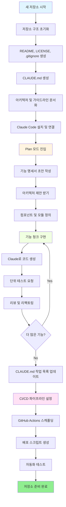
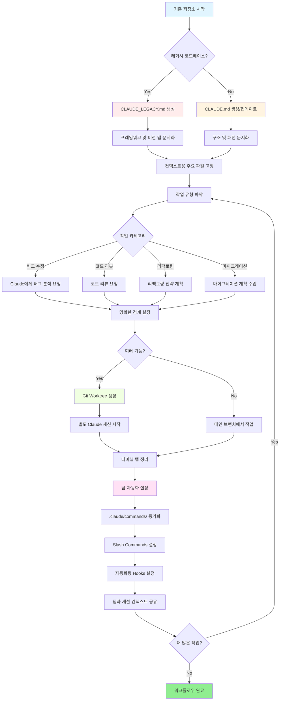

<picture>
  <source media="(prefers-color-scheme: dark)" srcset="resources/logos/claude-howto-logo-dark.svg">
  
</picture>

# 유용한 리소스 목록

## 공식 문서

| 리소스 | 설명 | 링크 |
|----------|-------------|------|
| Claude Code Docs | Claude Code 공식 문서 | [code.claude.com/docs/en/overview](https://code.claude.com/docs/en/overview) |
| Anthropic Docs | Anthropic 전체 문서 | [docs.anthropic.com](https://docs.anthropic.com) |
| MCP Protocol | Model Context Protocol 명세 | [modelcontextprotocol.io](https://modelcontextprotocol.io) |
| MCP Servers | 공식 MCP 서버 구현 | [github.com/modelcontextprotocol/servers](https://github.com/modelcontextprotocol/servers) |
| Anthropic Cookbook | 코드 예제 및 튜토리얼 | [github.com/anthropics/anthropic-cookbook](https://github.com/anthropics/anthropic-cookbook) |
| Claude Code Skills | 커뮤니티 Skills 저장소 | [github.com/anthropics/skills](https://github.com/anthropics/skills) |
| Agent Teams | 멀티 에이전트 조율 및 협업 | [code.claude.com/docs/en/agent-teams](https://code.claude.com/docs/en/agent-teams) |
| Scheduled Tasks | /loop 및 cron을 이용한 반복 작업 | [code.claude.com/docs/en/scheduled-tasks](https://code.claude.com/docs/en/scheduled-tasks) |
| Chrome Integration | 브라우저 자동화 | [code.claude.com/docs/en/chrome](https://code.claude.com/docs/en/chrome) |
| Keybindings | 키보드 단축키 커스터마이즈 | [code.claude.com/docs/en/keybindings](https://code.claude.com/docs/en/keybindings) |
| Desktop App | Claude Code 네이티브 데스크탑 앱 | [code.claude.com/docs/en/desktop](https://code.claude.com/docs/en/desktop) |
| Remote Control | 원격 세션 제어 | [code.claude.com/docs/en/remote-control](https://code.claude.com/docs/en/remote-control) |
| Auto Mode | 자동 권한 관리 | [code.claude.com/docs/en/permissions](https://code.claude.com/docs/en/permissions) |
| Channels | 멀티 채널 통신 | [code.claude.com/docs/en/channels](https://code.claude.com/docs/en/channels) |
| Voice Dictation | Claude Code 음성 입력 | [code.claude.com/docs/en/voice-dictation](https://code.claude.com/docs/en/voice-dictation) |

## Anthropic 엔지니어링 블로그

| 글 | 설명 | 링크 |
|---------|-------------|------|
| Code Execution with MCP | 코드 실행을 사용해 MCP 컨텍스트 블로트 해결 — 토큰 98.7% 절감 | [anthropic.com/engineering/code-execution-with-mcp](https://www.anthropic.com/engineering/code-execution-with-mcp) |

---

## 30분 만에 Claude Code 마스터하기

_영상_: https://www.youtube.com/watch?v=6eBSHbLKuN0

_**전체 팁**_
- **고급 기능 및 단축키 탐색**
  - Claude의 릴리스 노트를 통해 새로운 코드 편집 및 컨텍스트 기능을 정기적으로 확인하세요.
  - 채팅, 파일, 편집기 뷰 간에 빠르게 전환할 수 있는 키보드 단축키를 익히세요.

- **효율적인 설정**
  - 명확한 이름/설명으로 프로젝트별 세션을 만들어 쉽게 찾아볼 수 있도록 하세요.
  - Claude가 언제든 접근할 수 있도록 자주 사용하는 파일이나 폴더를 고정하세요.
  - GitHub, 인기 IDE 등 Claude의 연동을 설정해 코딩 프로세스를 간소화하세요.

- **효과적인 코드베이스 Q&A**
  - 아키텍처, 디자인 패턴, 특정 모듈에 대해 Claude에게 자세하게 질문하세요.
  - 질문에 파일과 줄 번호 참조를 사용하세요 (예: "`app/models/user.py`의 로직은 무엇을 하나요?").
  - 대규모 코드베이스의 경우, Claude가 집중할 수 있도록 요약이나 매니페스트를 제공하세요.
  - **예제 프롬프트**: _"src/auth/AuthService.ts:45-120에 구현된 인증 흐름을 설명해 주세요. src/middleware/auth.ts의 미들웨어와 어떻게 통합되나요?"_

- **코드 편집 및 리팩토링**
  - 코드 블록의 인라인 주석이나 요청을 사용해 집중적인 편집을 받으세요 ("이 함수를 명확하게 리팩토링해 주세요").
  - 변경 전/후 비교를 요청하세요.
  - 품질 보증을 위해 주요 편집 후 Claude에게 테스트나 문서를 생성하게 하세요.
  - **예제 프롬프트**: _"api/users.js의 getUserData 함수를 Promise 대신 async/await를 사용하도록 리팩토링해 주세요. 변경 전/후 비교를 보여주고 리팩토링된 버전의 단위 테스트를 생성해 주세요."_

- **컨텍스트 관리**
  - 현재 작업과 관련된 코드/컨텍스트만 붙여넣으세요.
  - 최상의 성능을 위해 구조화된 프롬프트를 사용하세요 ("파일 A가 있고, 함수 B가 있으며, 질문은 X입니다").
  - 컨텍스트 한도 초과를 피하기 위해 프롬프트 창에서 큰 파일을 제거하거나 접으세요.
  - **예제 프롬프트**: _"models/User.js의 User 모델과 utils/validation.js의 validateUser 함수가 있습니다. 하위 호환성을 유지하면서 이메일 유효성 검사를 추가하려면 어떻게 해야 하나요?"_

- **팀 도구 연동**
  - Claude 세션을 팀의 저장소와 문서에 연결하세요.
  - 반복적인 엔지니어링 작업에는 내장 템플릿을 사용하거나 커스텀 템플릿을 만드세요.
  - 세션 기록과 프롬프트를 팀원들과 공유해 협업하세요.

- **성능 향상**
  - Claude에게 명확하고 목표 지향적인 지시를 주세요 (예: "이 클래스를 다섯 가지 핵심 포인트로 요약해 주세요").
  - 컨텍스트 창에서 불필요한 주석과 보일러플레이트를 제거하세요.
  - Claude의 출력이 잘못된 방향이라면, 컨텍스트를 초기화하거나 질문을 다시 표현해 정렬을 맞추세요.
  - **예제 프롬프트**: _"src/db/Manager.ts의 DatabaseManager 클래스를 다섯 가지 핵심 포인트로 요약해 주세요. 주요 책임과 핵심 메서드에 집중해 주세요."_

- **실용적인 사용 예제**
  - 디버깅: 에러와 스택 트레이스를 붙여넣고 가능한 원인과 수정 방법을 질문하세요.
  - 테스트 생성: 복잡한 로직에 대한 속성 기반, 단위, 통합 테스트를 요청하세요.
  - 코드 리뷰: Claude에게 위험한 변경 사항, 엣지 케이스, 코드 스멜을 찾아달라고 하세요.
  - **예제 프롬프트**:
    - _"components/UserList.jsx의 42번째 줄에서 'TypeError: Cannot read property 'map' of undefined' 에러가 발생합니다. 스택 트레이스와 관련 코드입니다. 원인이 무엇이고 어떻게 수정할 수 있나요?"_
    - _"PaymentProcessor 클래스의 포괄적인 단위 테스트를 생성해 주세요. 실패한 트랜잭션, 타임아웃, 잘못된 입력에 대한 엣지 케이스를 포함해 주세요."_
    - _"이 Pull Request diff를 검토하고 잠재적인 보안 이슈, 성능 병목, 코드 스멜을 찾아주세요."_

- **워크플로우 자동화**
  - Claude 프롬프트를 사용해 반복적인 작업(포맷팅, 정리, 반복적인 이름 변경 등)을 스크립트로 만드세요.
  - 코드 diff를 기반으로 PR 설명, 릴리스 노트, 문서를 Claude가 초안 작성하게 하세요.
  - **예제 프롬프트**: _"git diff를 기반으로 변경 사항 요약, 수정된 파일 목록, 테스트 단계, 잠재적 영향을 포함한 상세한 PR 설명을 만들어 주세요. 또한 버전 2.3.0의 릴리스 노트도 생성해 주세요."_

**팁**: 최상의 결과를 위해 이 방법들을 여러 가지 조합해 사용하세요 — 핵심 파일을 고정하고 목표를 요약하는 것부터 시작한 다음, 집중적인 프롬프트와 Claude의 리팩토링 도구를 사용해 코드베이스와 자동화를 점진적으로 개선하세요.

**Claude Code와의 권장 워크플로우**

### Claude Code와의 권장 워크플로우

#### 새 저장소의 경우

1. **저장소 및 Claude 연동 초기화**
   - README, LICENSE, .gitignore, 루트 설정 등 필수 구조로 새 저장소를 설정하세요.
   - 아키텍처, 상위 수준 목표, 코딩 가이드라인을 설명하는 `CLAUDE.md` 파일을 만드세요.
   - Claude Code를 설치하고 저장소에 연결해 코드 제안, 테스트 스캐폴딩, 워크플로우 자동화를 활용하세요.

2. **Plan 모드 및 명세서 사용**
   - 기능을 구현하기 전에 plan 모드(`shift-tab` 또는 `/plan`)를 사용해 상세한 명세서를 초안 작성하세요.
   - 아키텍처 제안 및 초기 프로젝트 레이아웃을 Claude에게 요청하세요.
   - 명확하고 목표 지향적인 프롬프트 시퀀스를 유지하세요 — 컴포넌트 개요, 주요 모듈, 책임을 요청하세요.

3. **반복적인 개발 및 리뷰**
   - 핵심 기능을 작은 단위로 구현하고, 코드 생성, 리팩토링, 문서화를 위해 Claude에게 프롬프트하세요.
   - 각 단계 후 단위 테스트와 예제를 요청하세요.
   - CLAUDE.md에 실행 중인 작업 목록을 유지하세요.

4. **CI/CD 및 배포 자동화**
   - Claude를 사용해 GitHub Actions, npm/yarn 스크립트, 배포 워크플로우를 스캐폴딩하세요.
   - CLAUDE.md를 업데이트하고 해당 명령어/스크립트를 요청해 파이프라인을 쉽게 적응시키세요.

#### 기존 저장소의 경우

1. **저장소 및 컨텍스트 설정**
   - `CLAUDE.md`를 추가하거나 업데이트해 저장소 구조, 코딩 패턴, 주요 파일을 문서화하세요. 레거시 저장소의 경우 프레임워크, 버전 맵, 지시사항, 버그, 업그레이드 노트를 포함한 `CLAUDE_LEGACY.md`를 사용하세요.
   - Claude가 컨텍스트로 사용해야 할 주요 파일을 고정하거나 강조하세요.

2. **맥락적 코드 Q&A**
   - 특정 파일/함수를 참조하며 코드 리뷰, 버그 설명, 리팩토링, 마이그레이션 계획을 Claude에게 요청하세요.
   - Claude에게 명확한 경계를 설정해 주세요 (예: "이 파일들만 수정하세요" 또는 "새 의존성 없이").

3. **브랜치, Worktree, 다중 세션 관리**
   - 독립된 기능이나 버그 수정을 위해 여러 git worktree를 사용하고, 각 worktree마다 별도의 Claude 세션을 시작하세요.
   - 병렬 워크플로우를 위해 브랜치나 기능별로 터미널 탭/창을 정리하세요.

4. **팀 도구 및 자동화**
   - 팀 간 일관성을 위해 `.claude/commands/`를 통해 커스텀 명령어를 동기화하세요.
   - Claude의 Slash Commands나 Hooks를 통해 반복적인 작업, PR 생성, 코드 포맷팅을 자동화하세요.
   - 협업 문제 해결 및 리뷰를 위해 세션과 컨텍스트를 팀원들과 공유하세요.

**팁**:
- 모든 새 기능이나 수정을 명세서와 plan 모드 프롬프트로 시작하세요.
- 레거시 및 복잡한 저장소의 경우 CLAUDE.md/CLAUDE_LEGACY.md에 상세한 가이드를 저장하세요.
- 명확하고 집중적인 지시를 제공하고 복잡한 작업을 여러 단계의 계획으로 나누세요.
- 세션 정리, 컨텍스트 가지치기, 완료된 worktree 제거를 정기적으로 수행해 혼란을 방지하세요.

이 단계들은 새 코드베이스와 기존 코드베이스 모두에서 Claude Code와 원활한 워크플로우를 위한 핵심 권고 사항을 담고 있습니다.

---

## 새로운 기능 및 기능 (2026년 3월)

### 주요 기능 리소스

| 기능 | 설명 | 더 알아보기 |
|---------|-------------|------------|
| **Auto Memory** | Claude가 세션 간 사용자 설정을 자동으로 학습하고 기억 | [Memory 가이드](02-memory/) |
| **Remote Control** | 외부 도구와 스크립트에서 Claude Code 세션을 프로그래밍 방식으로 제어 | [Advanced Features](09-advanced-features/) |
| **Web Sessions** | 원격 개발을 위한 브라우저 기반 인터페이스로 Claude Code 접근 | [CLI Reference](10-cli/) |
| **Desktop App** | 향상된 UI의 Claude Code 네이티브 데스크탑 앱 | [Claude Code Docs](https://code.claude.com/docs/en/desktop) |
| **Extended Thinking** | `Alt+T`/`Option+T` 또는 `MAX_THINKING_TOKENS` 환경 변수로 토글하는 심층 추론 | [Advanced Features](09-advanced-features/) |
| **Permission Modes** | 세밀한 제어: default, acceptEdits, plan, auto, dontAsk, bypassPermissions | [Advanced Features](09-advanced-features/) |
| **7-Tier Memory** | Managed Policy, Project, Project Rules, User, User Rules, Local, Auto Memory | [Memory 가이드](02-memory/) |
| **Hook Events** | 25개 이벤트: PreToolUse, PostToolUse, PostToolUseFailure, Stop, StopFailure, SubagentStart, SubagentStop, Notification, Elicitation 등 | [Hooks 가이드](06-hooks/) |
| **Agent Teams** | 복잡한 작업에서 여러 에이전트가 함께 작동하도록 조율 | [Subagents 가이드](04-subagents/) |
| **Scheduled Tasks** | `/loop` 및 cron 도구로 반복 작업 설정 | [Advanced Features](09-advanced-features/) |
| **Chrome Integration** | 헤드리스 Chromium을 이용한 브라우저 자동화 | [Advanced Features](09-advanced-features/) |
| **Keyboard Customization** | 코드 시퀀스를 포함한 키바인딩 커스터마이즈 | [Advanced Features](09-advanced-features/) |
